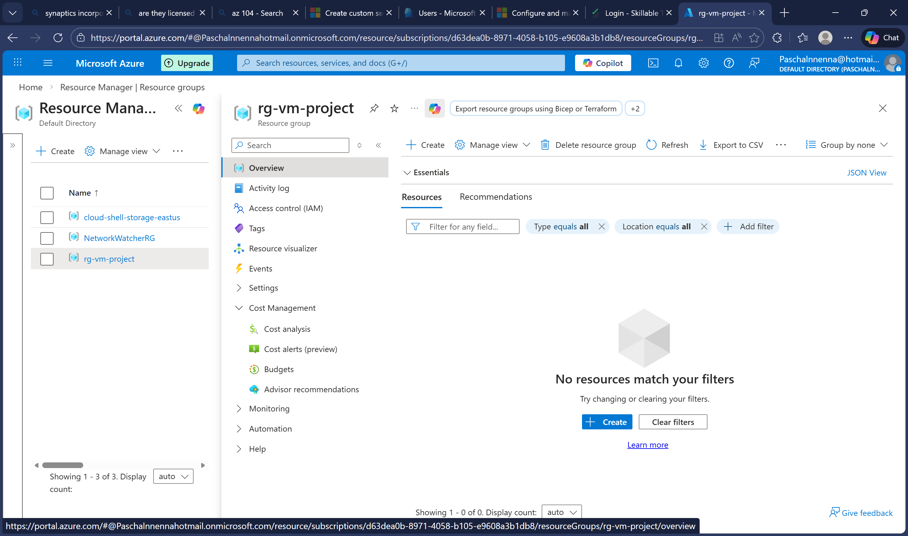
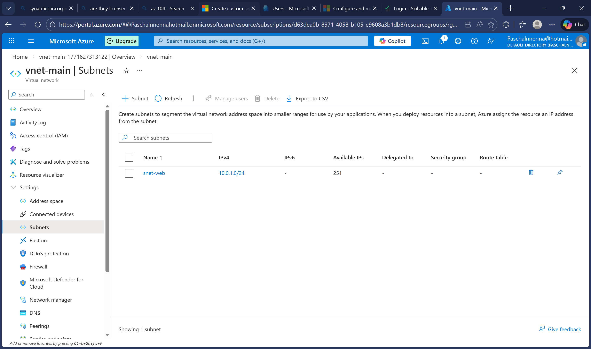
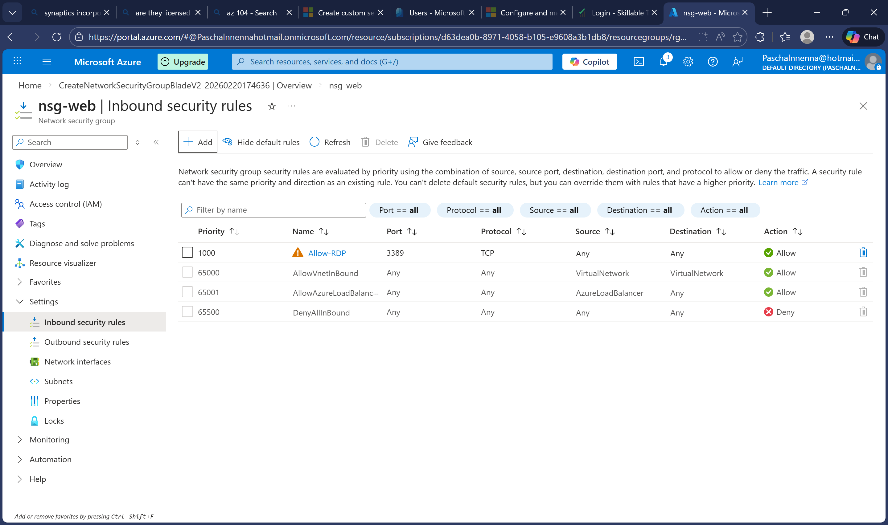
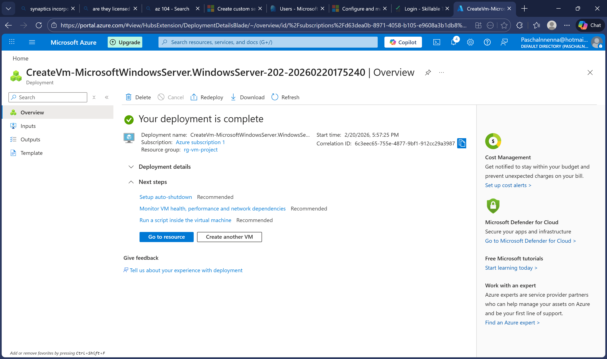
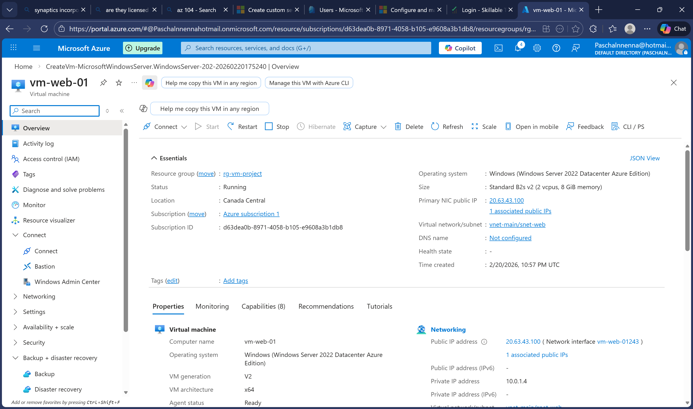
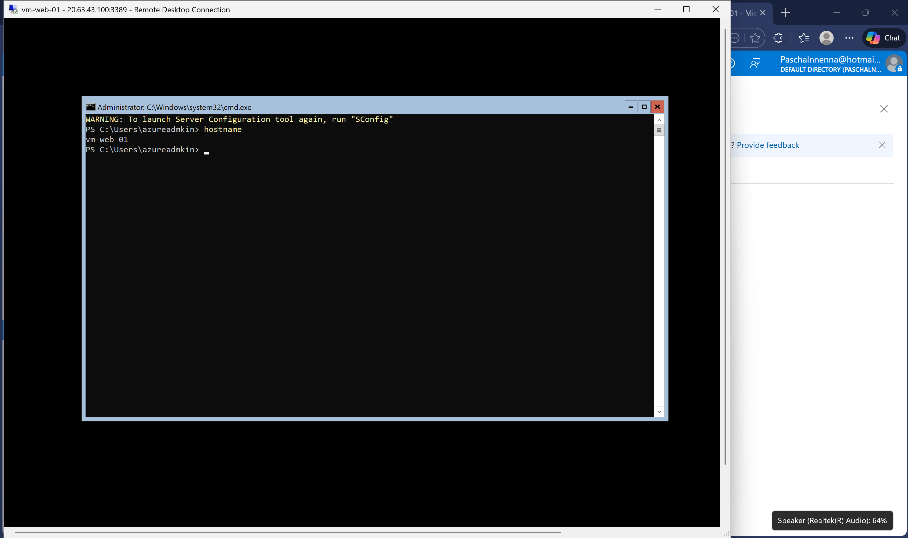

# Project 1: Azure VM Deployment

## 📋 Overview
Deploy a Windows Server virtual machine in Azure using the Azure Portal and ARM templates. This project demonstrates core infrastructure deployment skills including compute, networking, and security configuration.

## 🎯 Problem Statement
A company needs to deploy a Windows server in Azure for hosting internal applications. The server must be properly networked, secured with appropriate firewall rules, and accessible for remote administration.

## 🏗️ Architecture
```
┌─────────────────────────────────────────────────┐
│              Resource Group                      │
│                                                  │
│  ┌─────────────┐         ┌─────────────┐        │
│  │   VNet      │         │     VM      │        │
│  │ 10.0.0.0/16 │         │  Windows    │        │
│  │             │         │  Server     │        │
│  │ ┌─────────┐ │         │  2022       │        │
│  │ │ Subnet  │◄─────────►│             │        │
│  │ │10.0.1.0 │ │         │ Public IP   │        │
│  │ │  /24    │ │         │ NSG (RDP)   │        │
│  │ └─────────┘ │         └─────────────┘        │
│  └─────────────┘                                 │
└─────────────────────────────────────────────────┘
```

## 🛠️ Technologies Used
- Azure Virtual Machines
- Azure Virtual Network (VNet)
- Network Security Group (NSG)
- Public IP Address
- Azure Portal
- ARM Templates (Infrastructure as Code)
- PowerShell

## 📝 Steps Completed

### Step 1: Create Resource Group
- Created a resource group to organize all project resources
- Location: Canada Central

### Step 2: Create Virtual Network
- VNet Address Space: 10.0.0.0/16
- Subnet: 10.0.1.0/24

### Step 3: Configure Network Security Group
- Created NSG with inbound rule for RDP (port 3389)
- Associated NSG with subnet

### Step 4: Deploy Virtual Machine
- Image: Windows Server 2022 Datacenter
- Size: Standard_B2s
- Authentication: Username and password
- Attached to VNet subnet

### Step 5: Verify Connectivity
- Obtained public IP address
- Connected via Remote Desktop (RDP)
- Confirmed VM is operational

## 🔑 Key Learnings
- How to design basic Azure network architecture
- Importance of NSGs for securing inbound traffic
- VM deployment options (Portal vs ARM vs PowerShell)
- Resource organization using resource groups

## 📊 Results
- ✅ Successfully deployed Windows Server VM
- ✅ Configured secure network access
- ✅ Verified RDP connectivity

## 📸 Screenshots

### Resource Group Created


### Virtual Network and Subnet


### NSG with RDP Rule


### VM Deployment Complete


### VM Running


### Connected via RDP


## 🔗 Related Certification Topics
- AZ-104: Deploy and manage Azure compute resources
- AZ-104: Configure and manage virtual networking
