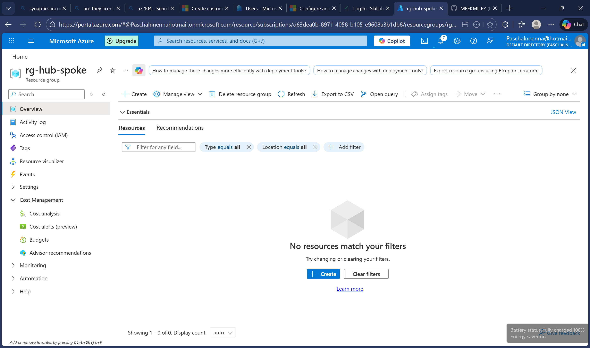
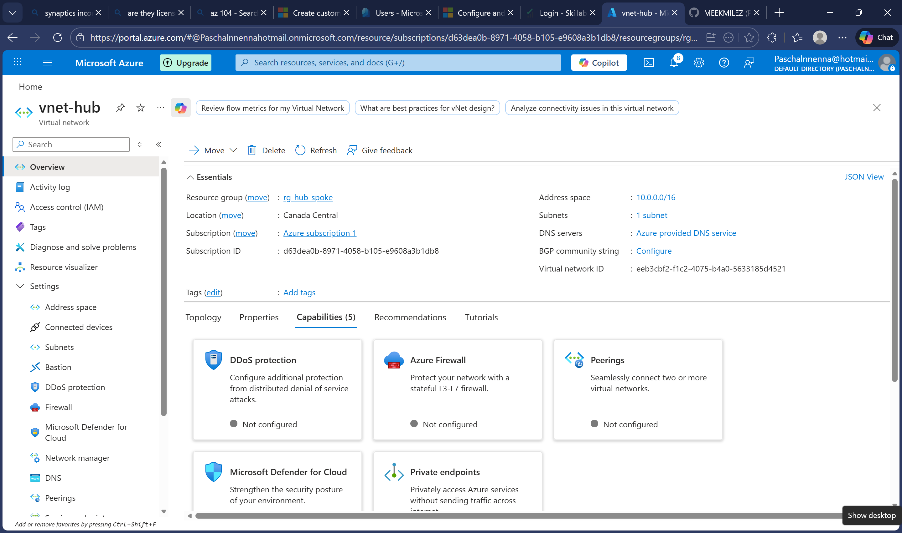
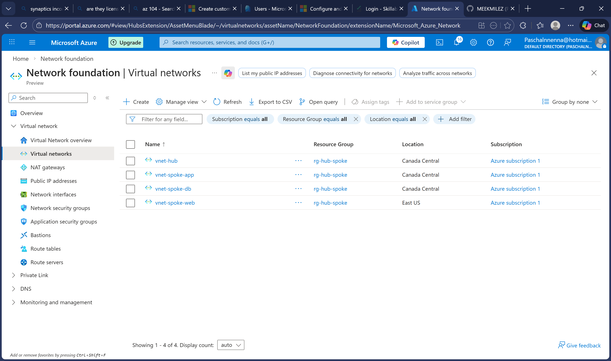
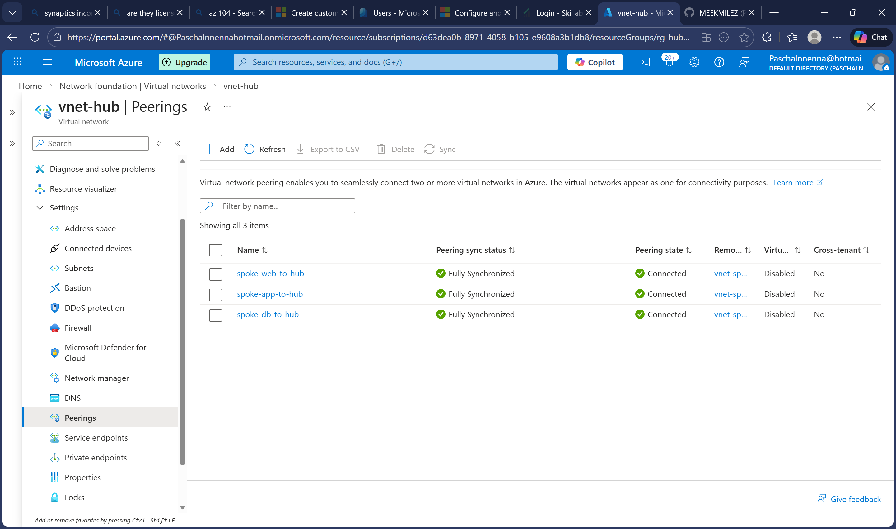
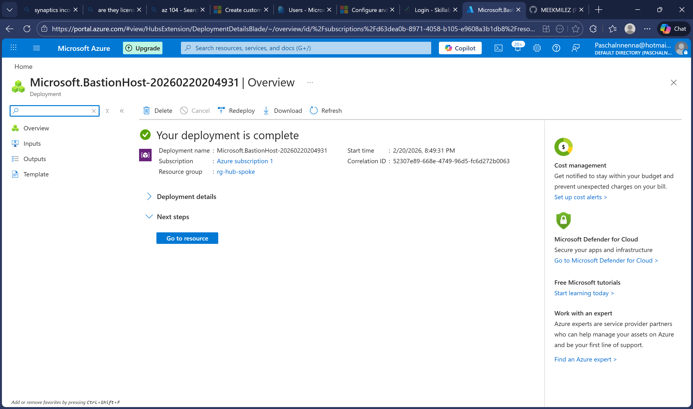
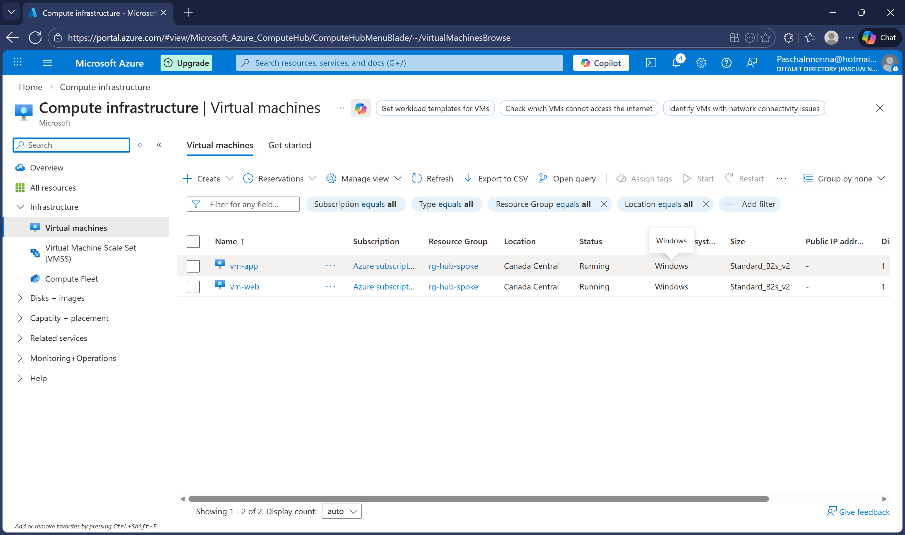
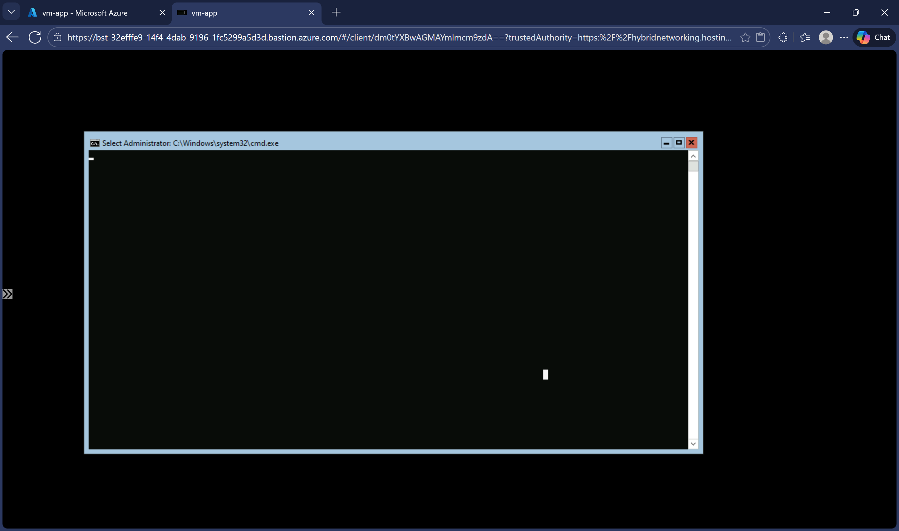
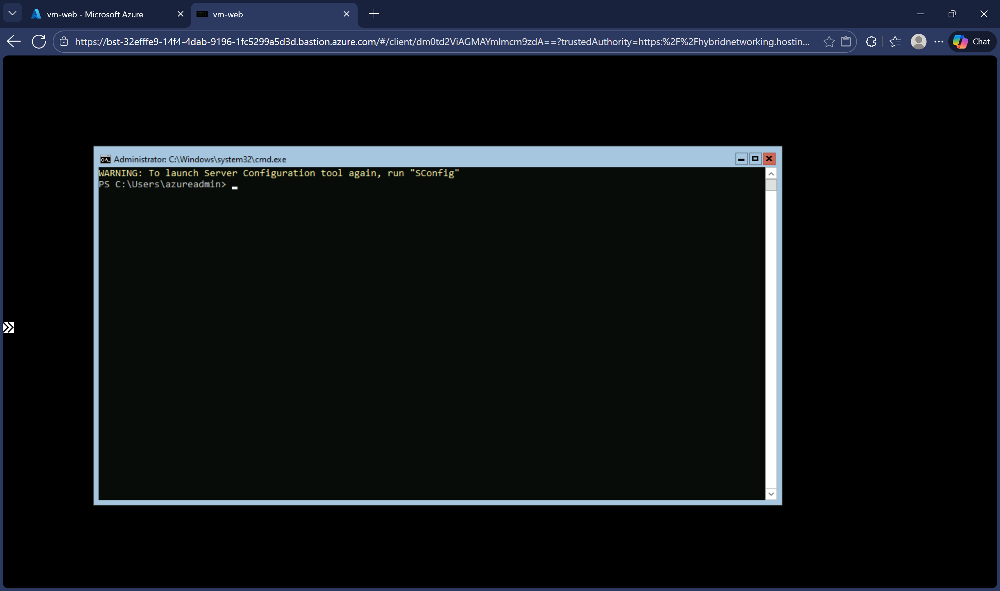

# Project 2: Hub-Spoke Network Architecture

## 📋 Overview
Design and implement a hub-spoke network topology in Azure with two spoke VNets. This architecture centralizes shared services in a hub VNet while isolating workloads in spoke VNets — a common enterprise pattern.

## 🎯 Problem Statement
A company needs to segment their network for security and management purposes. They want a central hub for shared services (like Bastion for secure access) and separate spokes for different workloads (web tier, app tier) that can communicate through the hub.

## 🏗️ Architecture
```
                         ┌─────────────────┐
                         │    Hub VNet     │
                         │   10.0.0.0/16   │
                         │                 │
                         │  Azure Bastion  │
                         │  (Secure RDP)   │
                         └────────┬────────┘
                                  │
                    ┌─────────────┴─────────────┐
                    │ VNet Peering              │ VNet Peering
                    ▼                           ▼
             ┌───────────────┐          ┌───────────────┐
             │   Spoke 1     │          │   Spoke 2     │
             │   Web VNet    │          │   App VNet    │
             │  10.1.0.0/16  │          │  10.2.0.0/16  │
             │               │          │               │
             │  ┌─────────┐  │          │  ┌─────────┐  │
             │  │ Web VM  │  │          │  │ App VM  │  │
             │  └─────────┘  │          │  └─────────┘  │
             └───────────────┘          └───────────────┘
```

## 🛠️ Technologies Used
- Azure Virtual Networks (VNets)
- VNet Peering
- Azure Bastion
- Network Security Groups (NSGs)
- Azure Virtual Machines

## 📝 Steps Completed

### Step 1: Create Resource Group
- Resource group for all hub-spoke resources

### Step 2: Create Hub VNet
- Address space: 10.0.0.0/16
- AzureBastionSubnet: 10.0.0.0/26

### Step 3: Create Spoke VNets
- Spoke 1 (Web): 10.1.0.0/16 with subnet 10.1.1.0/24
- Spoke 2 (App): 10.2.0.0/16 with subnet 10.2.1.0/24

### Step 4: Configure VNet Peering
- Hub ↔ Spoke 1 peering
- Hub ↔ Spoke 2 peering
- Allow forwarded traffic enabled

### Step 5: Deploy Azure Bastion
- Secure RDP/SSH access without public IPs on VMs

### Step 6: Deploy VMs in Spokes
- Web VM in Spoke 1 (no public IP)
- App VM in Spoke 2 (no public IP)
- Access via Bastion only

### Step 7: Test Connectivity
- Connect to VMs via Bastion
- Verify network connectivity between spokes

## 🔑 Key Learnings
- Hub-spoke is the standard enterprise network pattern
- VNet peering is non-transitive (spokes can't talk directly without hub routing)
- Bastion eliminates need for public IPs on VMs
- NSGs control traffic flow between tiers

## 📊 Results
- ✅ Hub-spoke topology with 2 spokes deployed
- ✅ VNet peering configured for all spokes
- ✅ Bastion provides secure access
- ✅ Network segmentation achieved
- ✅ No public IPs on workload VMs

## 📸 Screenshots

### Resource Group


### Hub VNet with Bastion Subnet


### All VNets Created


### VNet Peerings Configured


### Azure Bastion Deployed


### VMs Running in Spokes


### Connected to App VM via Bastion


### Connected to Web VM via Bastion


## 🔗 Related Certification Topics
- AZ-104: Configure and manage virtual networking
- AZ-104: Implement and manage virtual networking
- AZ-700: Design and implement Azure networking
