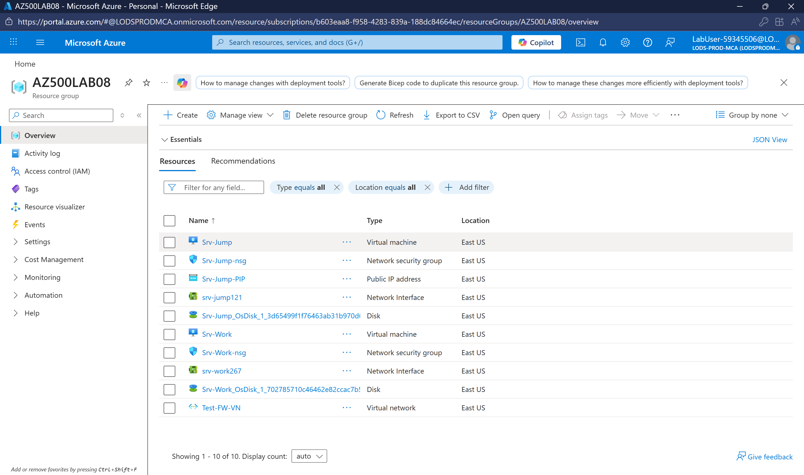
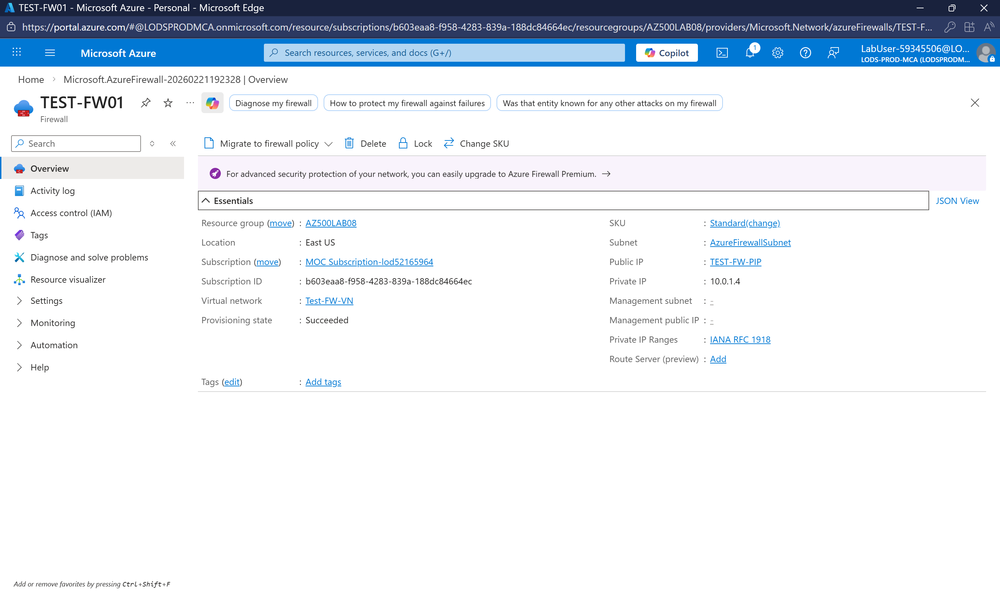
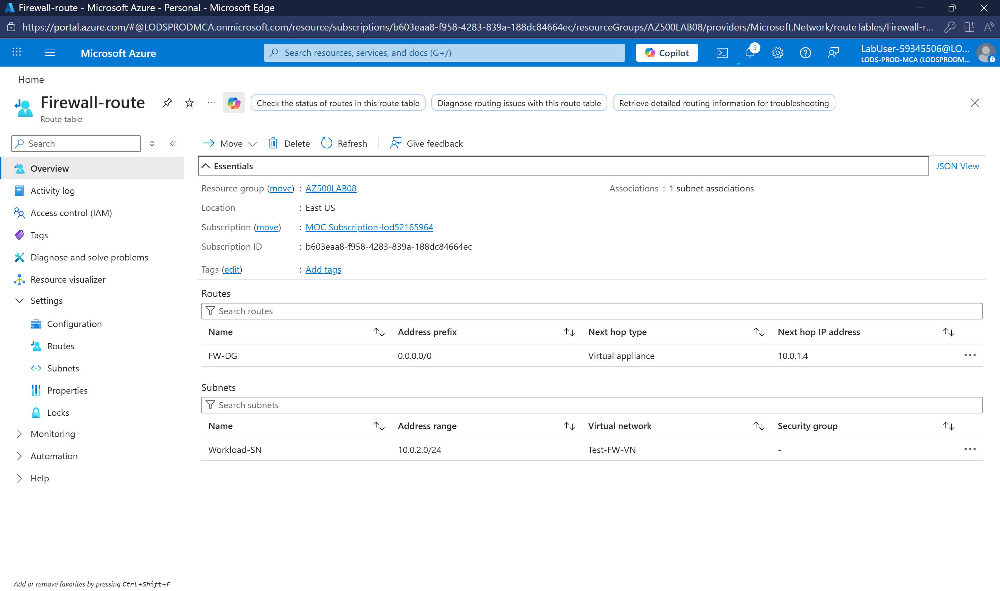
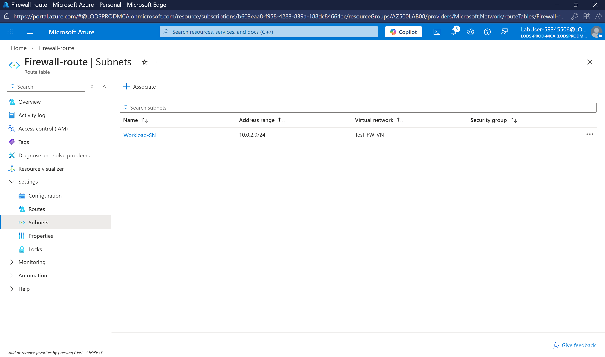
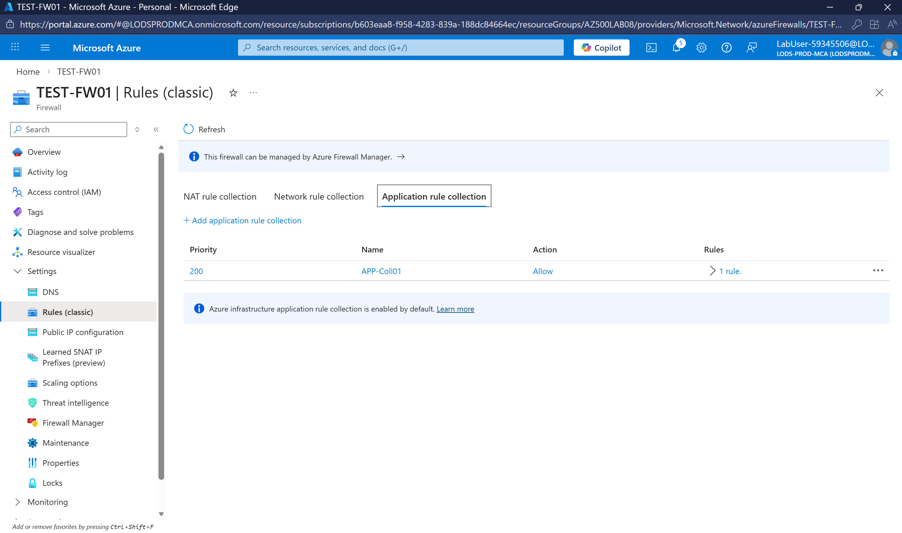
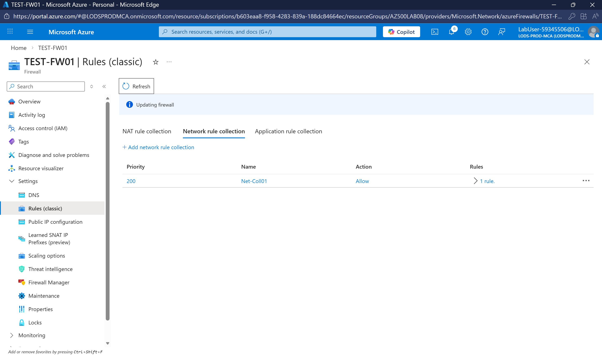
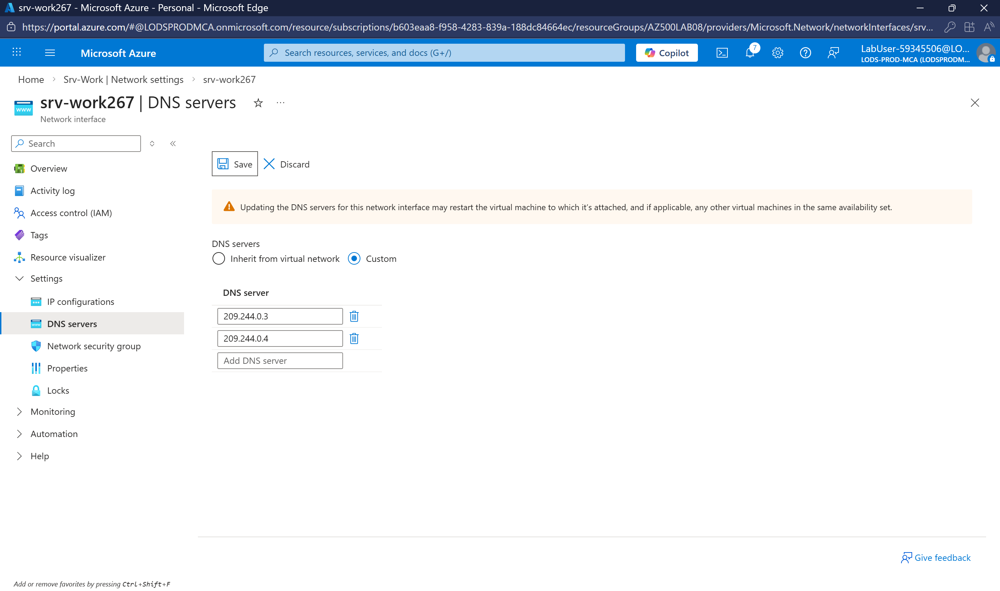
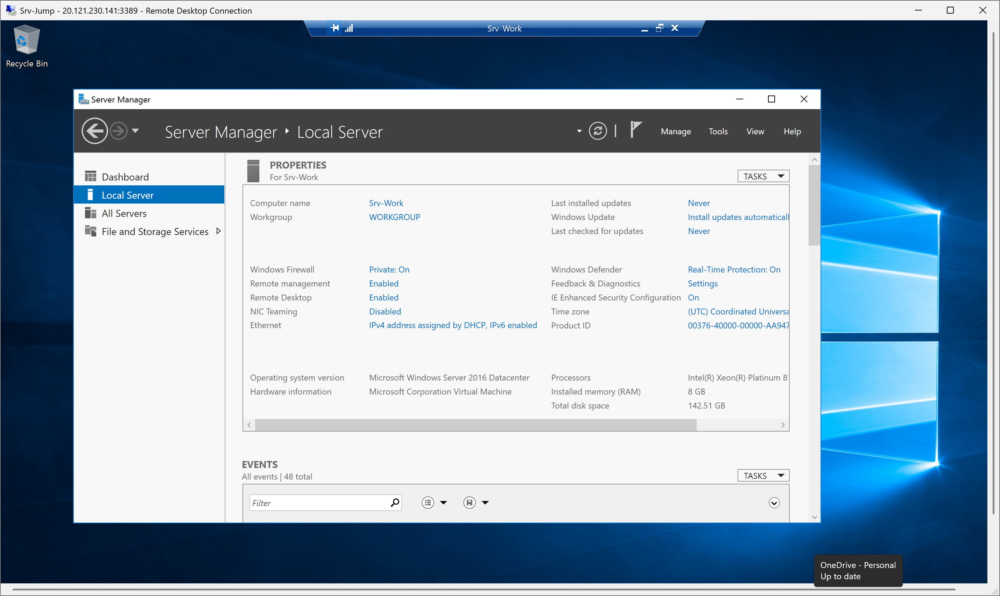
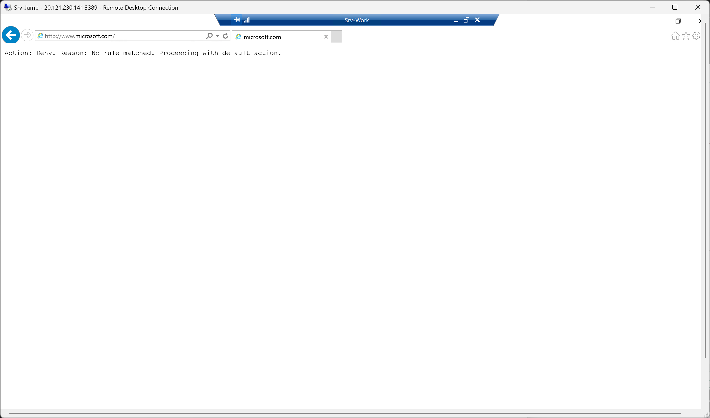

# Project 3: Azure Firewall Implementation

## 📋 Overview
Deploy and configure Azure Firewall to control inbound and outbound network access as part of an overall network security plan. This project demonstrates enterprise-level network security using Azure's managed firewall service.

## 🎯 Problem Statement
An organization needs to control and monitor outbound internet access from their workload servers. They require:
- All outbound traffic from workload VMs to pass through a central firewall
- Only specific websites (www.bing.com) allowed for outbound access
- DNS lookups permitted to external DNS servers
- Secure jump host access pattern for administrative tasks

## 🏗️ Architecture
```
┌────────────────────────────────────────────────────────────────┐
│                        AZ500LAB08                              │
│                      Resource Group                            │
│                                                                │
│   ┌─────────────────────────────────────────────────────────┐  │
│   │                    Test-FW-VN                           │  │
│   │                  Virtual Network                        │  │
│   │                                                         │  │
│   │  ┌──────────────┐  ┌──────────────┐  ┌──────────────┐  │  │
│   │  │AzureFirewall │  │  Jump-SN     │  │ Workload-SN  │  │  │
│   │  │   Subnet     │  │  Subnet      │  │   Subnet     │  │  │
│   │  │              │  │              │  │              │  │  │
│   │  │ ┌──────────┐ │  │ ┌──────────┐ │  │ ┌──────────┐ │  │  │
│   │  │ │ Test-    │ │  │ │ Srv-Jump │ │  │ │ Srv-Work │ │  │  │
│   │  │ │ FW01     │ │  │ │   VM     │ │  │ │   VM     │ │  │  │
│   │  │ │ Firewall │ │  │ │          │ │  │ │          │ │  │  │
│   │  │ └──────────┘ │  │ └──────────┘ │  │ └──────────┘ │  │  │
│   │  └──────────────┘  └──────────────┘  └───────┬──────┘  │  │
│   │                                              │         │  │
│   └──────────────────────────────────────────────┼─────────┘  │
│                                                  │            │
│   ┌──────────────────────────────────────────────▼─────────┐  │
│   │                  Firewall-route                        │  │
│   │            (Forces traffic through FW)                 │  │
│   │              0.0.0.0/0 → Firewall IP                   │  │
│   └────────────────────────────────────────────────────────┘  │
└────────────────────────────────────────────────────────────────┘

Traffic Flow:
Srv-Work → Route Table → Azure Firewall → Internet (only bing.com allowed)
```

## 🛠️ Technologies Used
- Azure Firewall (Standard SKU)
- Azure Virtual Network
- Route Tables (User Defined Routes)
- Network Security Groups
- Azure Virtual Machines
- ARM Templates
- Application Rules (FQDN filtering)
- Network Rules (Port/Protocol filtering)

## 📝 Steps Completed

### Task 1: Deploy Lab Environment via ARM Template
- Deployed virtual network (Test-FW-VN) with multiple subnets
- Created Jump Host subnet with Srv-Jump VM
- Created Workload subnet with Srv-Work VM
- Region: East US

### Task 2: Deploy Azure Firewall
- Firewall name: Test-FW01
- SKU: Standard
- Deployed to AzureFirewallSubnet
- Public IP: TEST-FW-PIP
- Management: Classic rules

### Task 3: Create Default Route
- Route table: Firewall-route
- Route name: FW-DG
- Destination: 0.0.0.0/0 (all traffic)
- Next hop: Virtual appliance (Firewall private IP)
- Associated with: Workload-SN subnet

### Task 4: Configure Application Rule
- Rule collection: App-Coll01
- Priority: 200
- Action: Allow
- Rule name: AllowGH
- Source: 10.0.2.0/24 (Workload subnet)
- Protocol: HTTP (80), HTTPS (443)
- Target FQDN: www.bing.com

### Task 5: Configure Network Rule
- Rule collection: Net-Coll01
- Priority: 200
- Action: Allow
- Rule name: AllowDNS
- Protocol: UDP
- Source: 10.0.2.0/24
- Destination: 209.244.0.3, 209.244.0.4 (Public DNS)
- Port: 53

### Task 6: Configure DNS Servers
- Configured Srv-Work NIC with custom DNS
- Primary DNS: 209.244.0.3
- Secondary DNS: 209.244.0.4

### Task 7: Test the Firewall
- Connected to Srv-Jump via RDP
- From Srv-Jump, connected to Srv-Work via RDP
- Tested www.bing.com → Allowed ✅
- Tested www.microsoft.com → Blocked ❌

## 🔑 Key Learnings
- Azure Firewall requires a dedicated subnet named "AzureFirewallSubnet"
- User Defined Routes (UDR) force traffic through the firewall
- Application rules filter traffic based on FQDNs (domain names)
- Network rules filter traffic based on IP addresses and ports
- Jump host pattern provides secure access to workload VMs
- Firewall acts as a "virtual appliance" in route tables

## 📊 Results
- ✅ Azure Firewall deployed and configured
- ✅ All workload traffic routed through firewall
- ✅ Application rule allows only www.bing.com
- ✅ Network rule allows DNS lookups (UDP 53)
- ✅ Traffic to unauthorized sites blocked (microsoft.com)
- ✅ Jump host access pattern working

## 📸 Screenshots

### Task 1: Deployed Resources


### Task 2: Azure Firewall Overview


### Task 3: Route Table with Default Route


### Task 3: Route Table Subnet Association


### Task 4: Application Rule Collection


### Task 5: Network Rule Collection


### Task 6: DNS Servers Configured


### Task 7: Connected to Srv-Jump


### Task 7: Connected to Srv-Work


### Task 7: Bing.com Allowed


### Task 7: Microsoft.com Blocked


## 🔗 Related Certification Topics
- AZ-104: Configure Azure Firewall
- AZ-500: Implement network security
- AZ-500: Configure Azure Firewall and Firewall Manager
- AZ-700: Design and implement Azure Firewall
