# Project 4: Service Endpoints and Securing Storage

## 📋 Overview
Demonstrate how to secure Azure file shares using Service Endpoints. This project creates a proof of concept showing that storage access can be restricted to specific subnets while blocking access from other network locations.

## 🎯 Problem Statement
An organization needs to secure their Azure file shares so that:
- Traffic destined to Azure Storage stays within the Azure backbone network
- Only resources from a specific subnet can access the storage
- Resources outside of the designated subnet cannot access the storage

## 🏗️ Architecture
```
┌────────────────────────────────────────────────────────────────────┐
│                         AZ500LAB12                                 │
│                       Resource Group                               │
│                                                                    │
│   ┌──────────────────────────────────────────────────────────┐    │
│   │                   myVirtualNetwork                        │    │
│   │                     10.0.0.0/16                           │    │
│   │                                                           │    │
│   │  ┌─────────────────────┐    ┌─────────────────────────┐  │    │
│   │  │    Public Subnet    │    │     Private Subnet      │  │    │
│   │  │     10.0.0.0/24     │    │      10.0.1.0/24        │  │    │
│   │  │                     │    │                         │  │    │
│   │  │  ┌───────────────┐  │    │  ┌───────────────┐      │  │    │
│   │  │  │  myVmPublic   │  │    │  │  myVmPrivate  │      │  │    │
│   │  │  │               │  │    │  │               │      │  │    │
│   │  │  │  ❌ No Access │  │    │  │  ✅ Access    │      │  │    │
│   │  │  │   to Storage  │  │    │  │   to Storage  │      │  │    │
│   │  │  └───────────────┘  │    │  └───────────────┘      │  │    │
│   │  │                     │    │                         │  │    │
│   │  │   myNsgPublic       │    │   myNsgPrivate          │  │    │
│   │  │   (Allow RDP)       │    │   (Allow Storage,       │  │    │
│   │  │                     │    │    Deny Internet,       │  │    │
│   │  │   ✅ Internet       │    │    Allow RDP)           │  │    │
│   │  │      Access         │    │                         │  │    │
│   │  └─────────────────────┘    │   ❌ No Internet        │  │    │
│   │                             │      Access             │  │    │
│   │                             │                         │  │    │
│   │                             │   Service Endpoint:     │  │    │
│   │                             │   Microsoft.Storage     │  │    │
│   │                             └─────────────────────────┘  │    │
│   └──────────────────────────────────────────────────────────┘    │
│                                                                    │
│   ┌────────────────────────────────────────────────────────────┐  │
│   │                    Storage Account                          │  │
│   │                    (my-file-share)                          │  │
│   │                                                             │  │
│   │   Network Rules: Allow access only from Private Subnet      │  │
│   └────────────────────────────────────────────────────────────┘  │
└────────────────────────────────────────────────────────────────────┘
```

## 🛠️ Technologies Used
- Azure Virtual Network
- Service Endpoints (Microsoft.Storage)
- Network Security Groups (NSGs)
- Azure Storage Account
- Azure File Shares
- Azure Virtual Machines

## 📝 Steps Completed

### Task 1: Create Virtual Network
- Created myVirtualNetwork with address space 10.0.0.0/16
- Added Public subnet (10.0.0.0/24)

### Task 2: Add Private Subnet with Service Endpoint
- Added Private subnet (10.0.1.0/24)
- Configured Microsoft.Storage service endpoint on Private subnet

### Task 3: Configure NSG for Private Subnet
- Created myNsgPrivate with outbound rules:
  - Allow-Storage-All: Allows traffic to Azure Storage service tag
  - Deny-Internet-All: Blocks all other internet traffic
- Added inbound rule Allow-RDP-All for remote access
- Associated NSG with Private subnet

### Task 4: Configure NSG for Public Subnet
- Created myNsgPublic with inbound rule Allow-RDP-All
- Associated NSG with Public subnet

### Task 5: Create Storage Account with File Share
- Created storage account with LRS redundancy
- Created file share (my-file-share)
- Configured storage firewall to allow access only from Private subnet

### Task 6: Deploy Virtual Machines
- Deployed myVmPrivate in Private subnet
- Deployed myVmPublic in Public subnet

### Task 7: Test Storage Connection from Private Subnet
- Connected to myVmPrivate via RDP
- Successfully mapped Z: drive to Azure file share
- Confirmed internet access is blocked (bing.com test failed)

### Task 8: Test Storage Connection from Public Subnet
- Connected to myVmPublic via RDP
- Storage access denied (as expected)
- Confirmed internet access works (bing.com test succeeded)

## 🔑 Key Learnings
- Service Endpoints keep traffic within Azure backbone network
- Storage firewall rules can restrict access to specific subnets
- NSGs control traffic flow at the subnet level
- Service tags simplify NSG rule creation (VirtualNetwork, Storage, Internet)
- Combining service endpoints with NSGs provides defense in depth

## 📊 Results
- ✅ Service endpoint configured on Private subnet
- ✅ Storage account accessible only from Private subnet
- ✅ Storage access blocked from Public subnet
- ✅ Internet blocked from Private subnet (NSG)
- ✅ Internet allowed from Public subnet
- ✅ Proof of concept successfully demonstrates secure storage access

## 📸 Screenshots

### Task 1: Virtual Network with Public Subnet
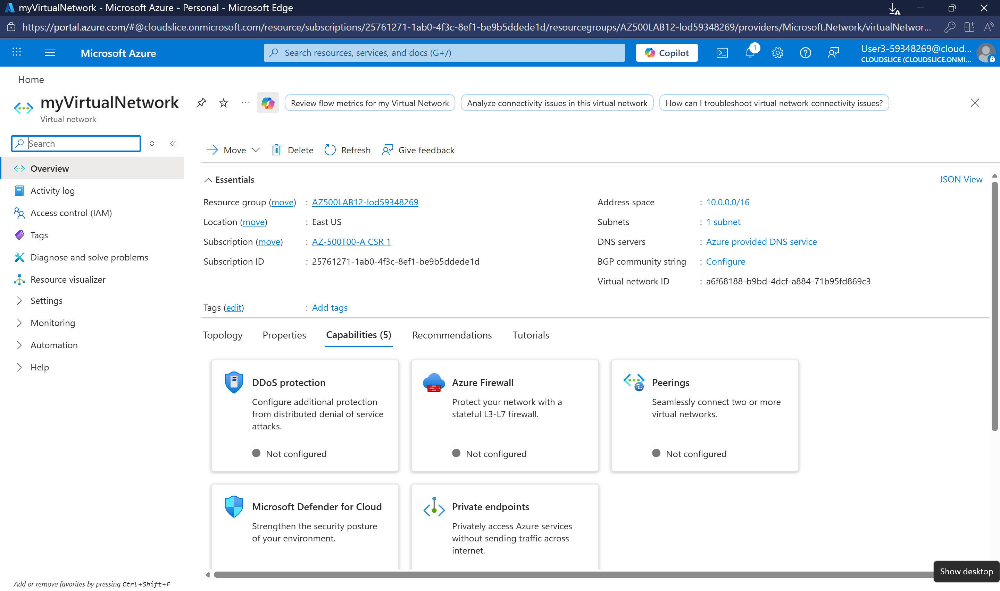

### Task 2: Private Subnet Added
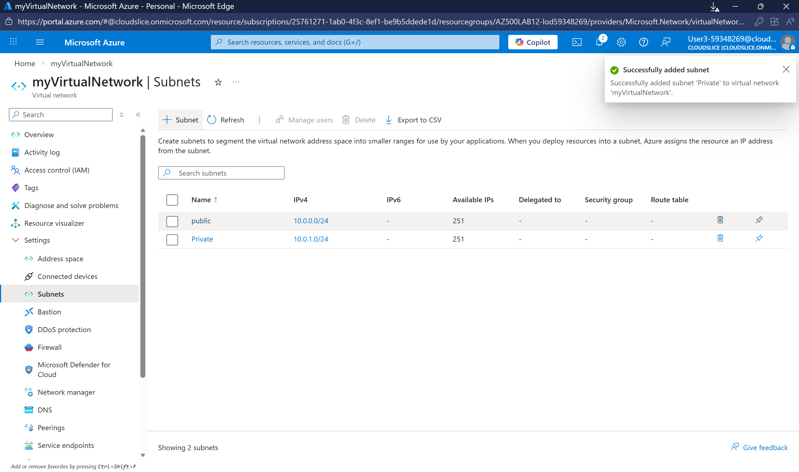

### Task 3: NSG Private Outbound Rules


### Task 3: NSG Private Inbound Rules
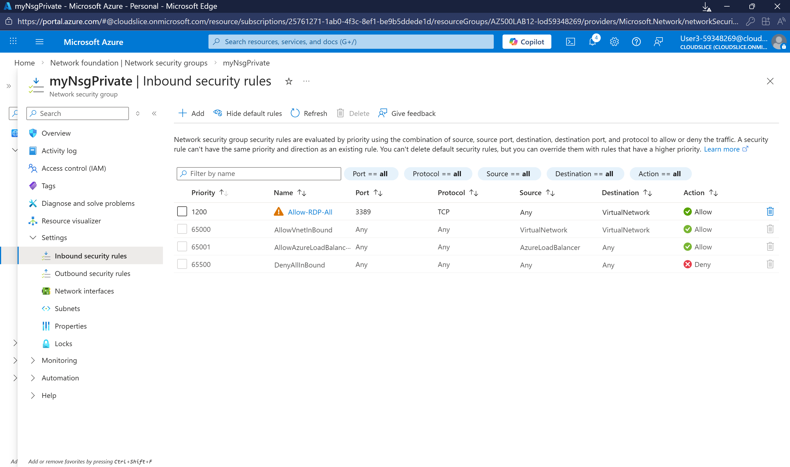

### Task 3: NSG Private Subnet Association
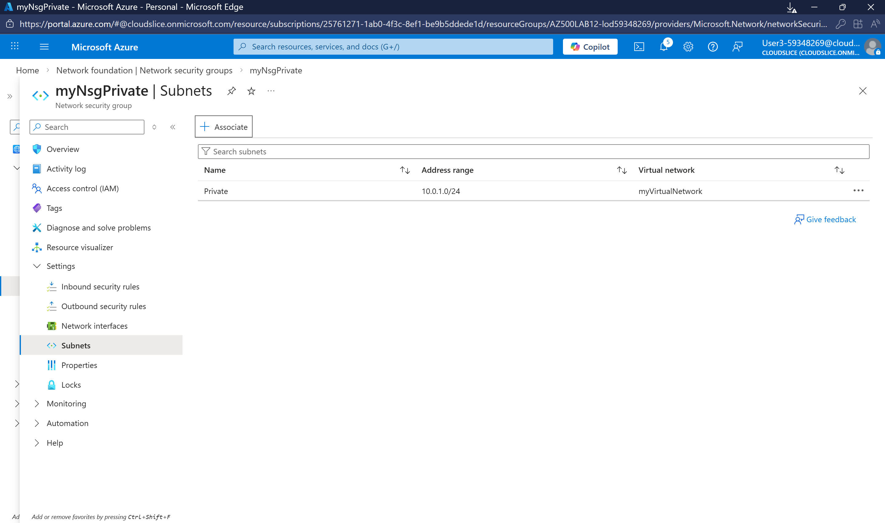

### Task 4: NSG Public Inbound Rules
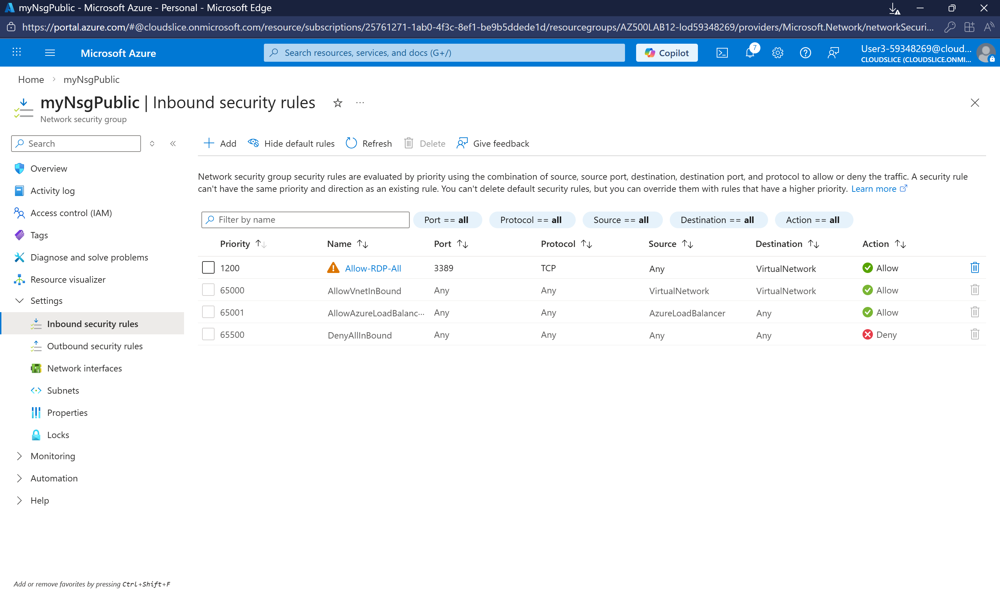

### Task 4: NSG Public Subnet Association
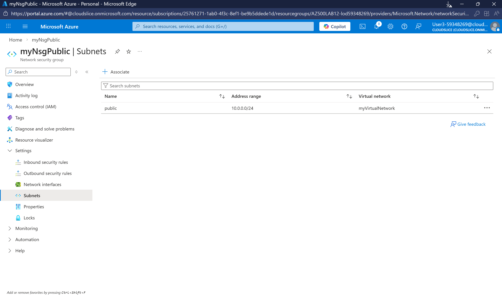

### Task 5: Storage Account Created
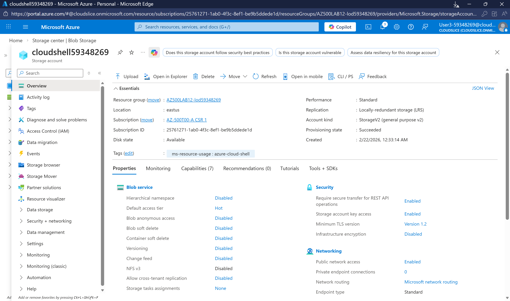

### Task 5: File Share Created
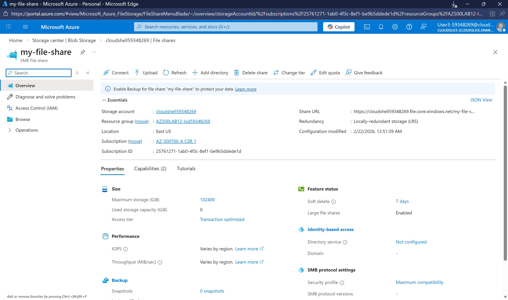

### Task 5: Storage Networking Configured
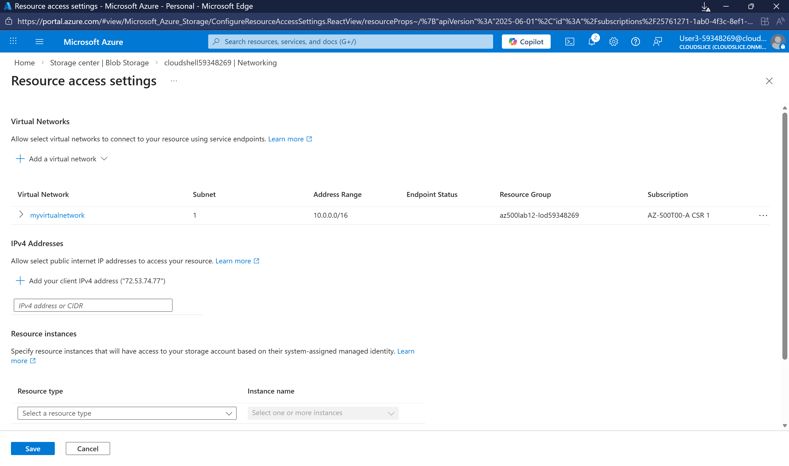

### Task 6: VMs Deployed
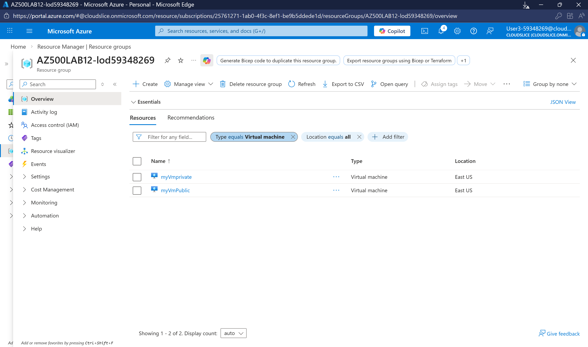

### Task 7: Connected to Private VM
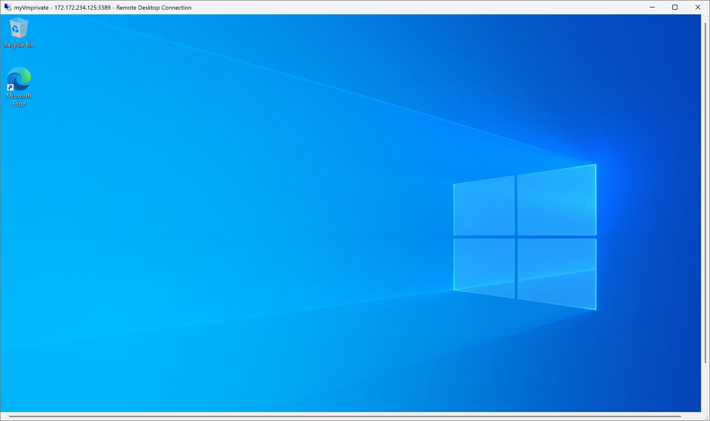

### Task 7: Drive Mapped Successfully
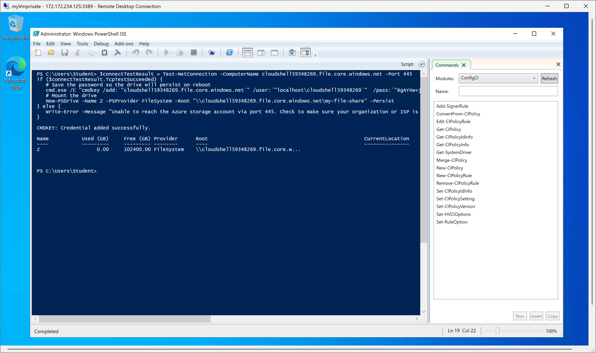

### Task 7: Internet Denied from Private VM
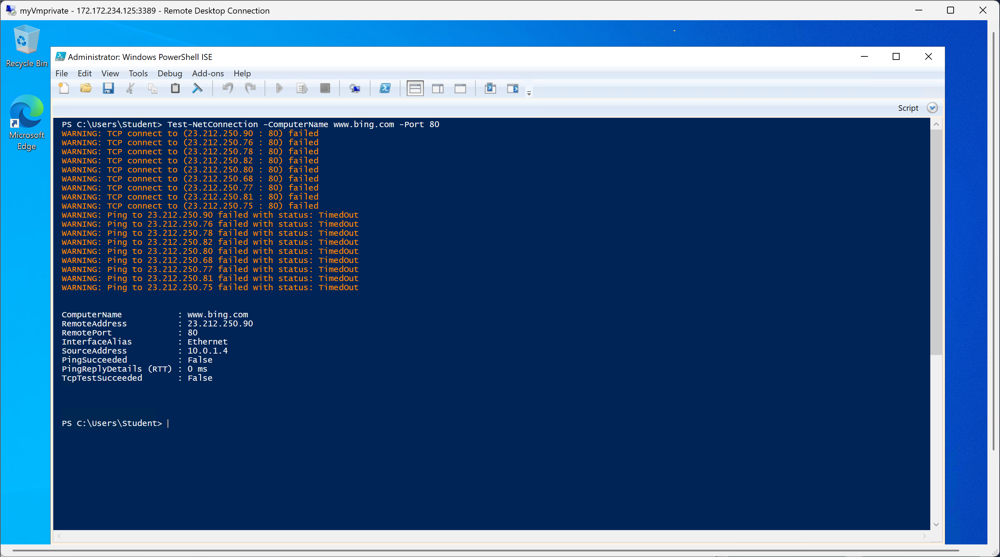

### Task 8: Connected to Public VM
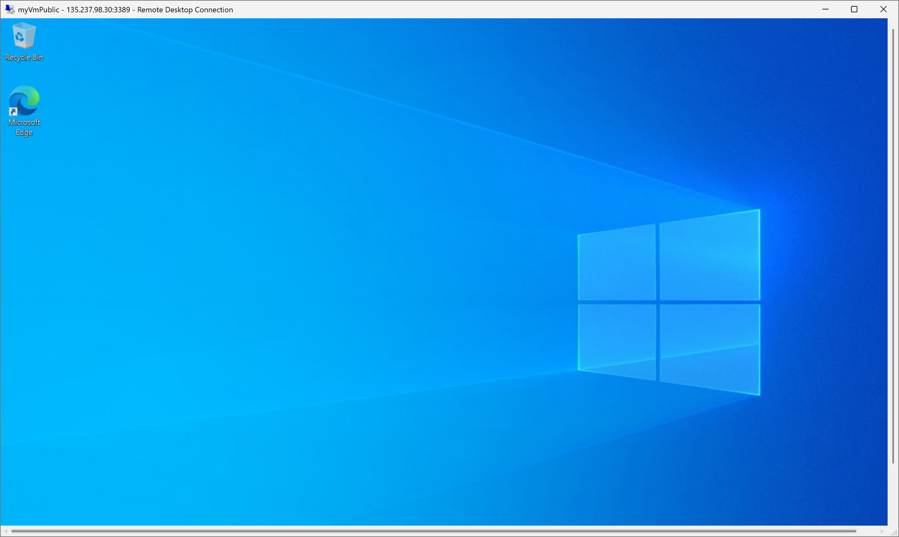

### Task 8: Storage Access Denied
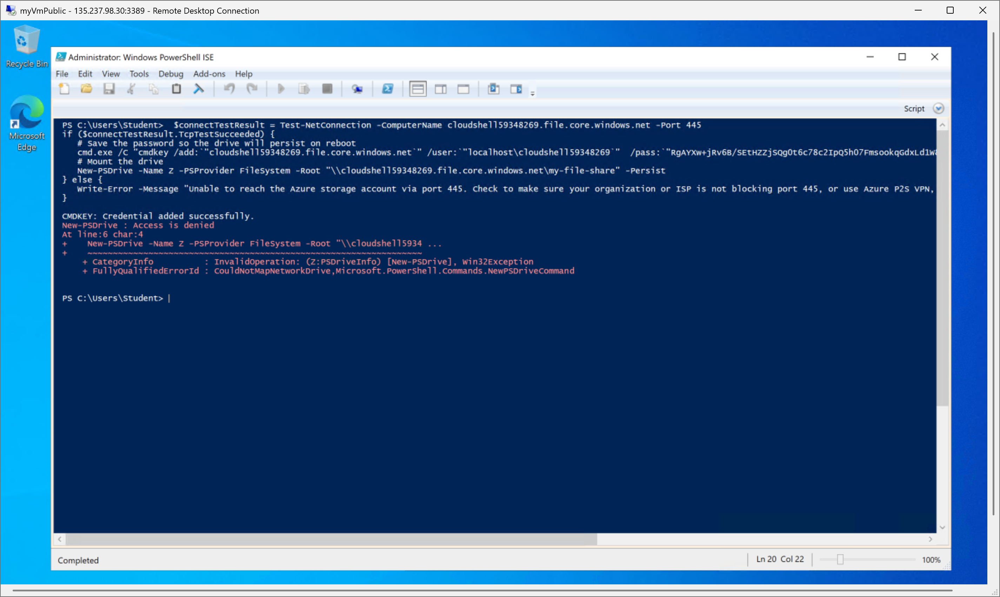

### Task 8: Internet Allowed from Public VM
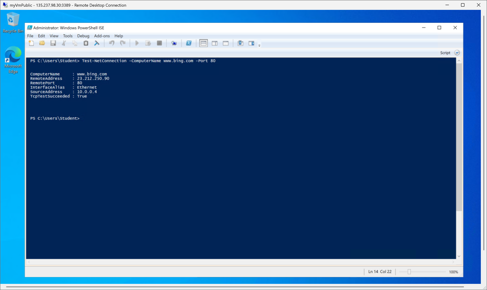

## 🔗 Related Certification Topics
- AZ-500: Implement network security
- AZ-500: Configure Azure Storage security
- AZ-104: Configure Azure Storage
- AZ-104: Configure virtual networks
