# 05 — Azure Security Monitoring

## Overview

This project brings together four interconnected labs to build a complete security monitoring pipeline in Microsoft Azure. Starting with a monitored virtual machine and centralized log collection, it layers on advanced threat protection, just-in-time access controls, and a full SIEM deployment using Microsoft Sentinel. The goal was to simulate what a real-world security operations workflow looks like — from collecting telemetry to detecting incidents and automating responses.

Every organization needs visibility into what's happening across its infrastructure. This project demonstrates how to build that visibility from the ground up, using the same tools and techniques that cloud security teams rely on every day.

## Architecture

**Resources Deployed:**

Azure Virtual Machine (myVM) · Log Analytics Workspace · Storage Account · Data Collection Rule (DCR) · Microsoft Defender for Servers Plan 2 · Just-in-Time VM Access Policy · Microsoft Sentinel · Azure Activity Data Connector · Analytics Rule · Automated Playbook (Logic App)

**Flow:**

VM telemetry → Data Collection Rule → Log Analytics Workspace → Microsoft Sentinel → Analytics Rules → Automated Playbook Response

---

## Task Breakdown

### Task 1 — Monitoring Foundation

The foundation of any security monitoring setup is knowing what's happening on your machines. This task focused on deploying the core infrastructure needed to collect and centralize telemetry data.

- Deployed **myVM** using PowerShell as the target machine to be monitored and protected
- Created a **Log Analytics workspace** to serve as the central hub for all log data
- Provisioned a **storage account** to hold diagnostic data
- Configured a **Data Collection Rule (DCR)** to collect CPU, memory, disk, and network metrics every 60 seconds

### Task 2 — Microsoft Defender for Cloud

With telemetry flowing, the next step was enabling advanced threat protection. Microsoft Defender for Servers Plan 2 adds vulnerability assessments, adaptive application controls, and real-time threat detection on top of the monitoring foundation.

- Enabled **Microsoft Defender for Servers Plan 2** for advanced threat protection across the subscription

### Task 3 — Just-in-Time VM Access

Leaving management ports open around the clock is one of the most common attack vectors in cloud environments. Just-in-Time (JIT) access solves this by keeping ports closed by default and only opening them temporarily when access is explicitly requested and approved.

- Enabled **Just-in-Time VM access** to reduce the attack surface by locking down management ports
- Requested and was granted **temporary JIT access** to connect to the VM, demonstrating the approval workflow

### Task 4 — Microsoft Sentinel (SIEM)

This is where everything comes together. Microsoft Sentinel sits on top of the Log Analytics workspace and turns raw log data into actionable security intelligence. This task covered connecting data sources, creating detection rules, deploying automated response playbooks, and validating that the entire pipeline works end-to-end.

- Added **Microsoft Sentinel** to the Log Analytics workspace for full SIEM capabilities
- Connected the **Azure Activity data connector** to monitor subscription-level activity
- Created an **analytics rule** to detect suspicious resource creation events
- Deployed an **automated playbook** (Logic App) to change incident severity on trigger
- Built a **custom alert with automated playbook response** to tie detection to action
- Validated the pipeline — **Sentinel caught a JIT policy deletion automatically**, confirming that the detection-to-incident workflow is fully operational

## 🔑 Key Learnings

- Security monitoring is a pipeline, not a single tool — each layer builds on the one before it
- Data Collection Rules give you granular control over what telemetry gets collected and how often
- Microsoft Defender for Cloud adds threat detection that goes beyond basic log collection
- Just-in-Time access is one of the simplest and most effective ways to reduce attack surface
- Microsoft Sentinel turns raw logs into actionable incidents with automated response capabilities
- End-to-end automation separates a reactive security posture from a proactive one

## 📊 Results

- ✅ VM deployed and monitored with Data Collection Rules
- ✅ Log Analytics workspace centralized all telemetry
- ✅ Microsoft Defender for Servers Plan 2 enabled
- ✅ Just-in-Time VM access configured and tested
- ✅ Microsoft Sentinel deployed with data connectors
- ✅ Analytics rules and automated playbooks operational
- ✅ Sentinel detected JIT policy deletion automatically

## 📸 Screenshots

### Task 1: VM Deployed
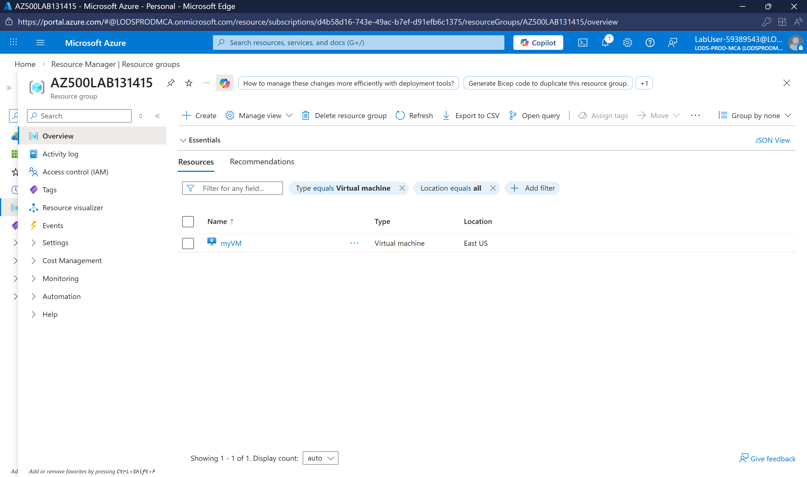

### Task 1: Log Analytics Workspace
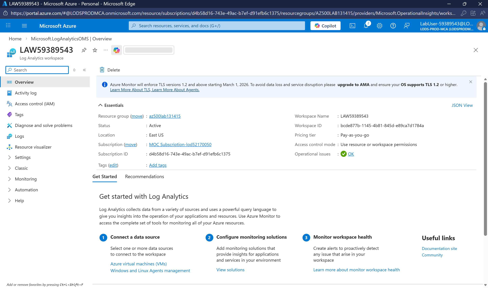

### Task 1: Storage Account
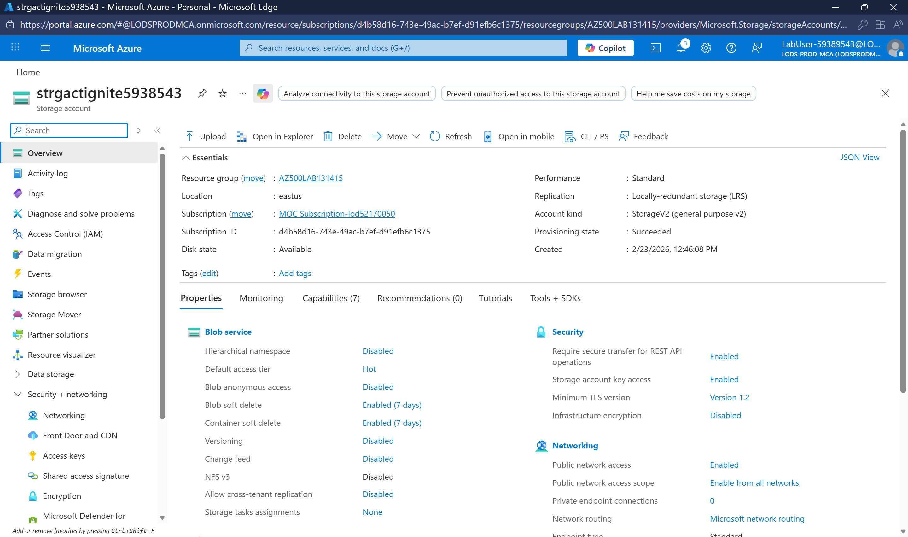

### Task 1: Data Collection Rule
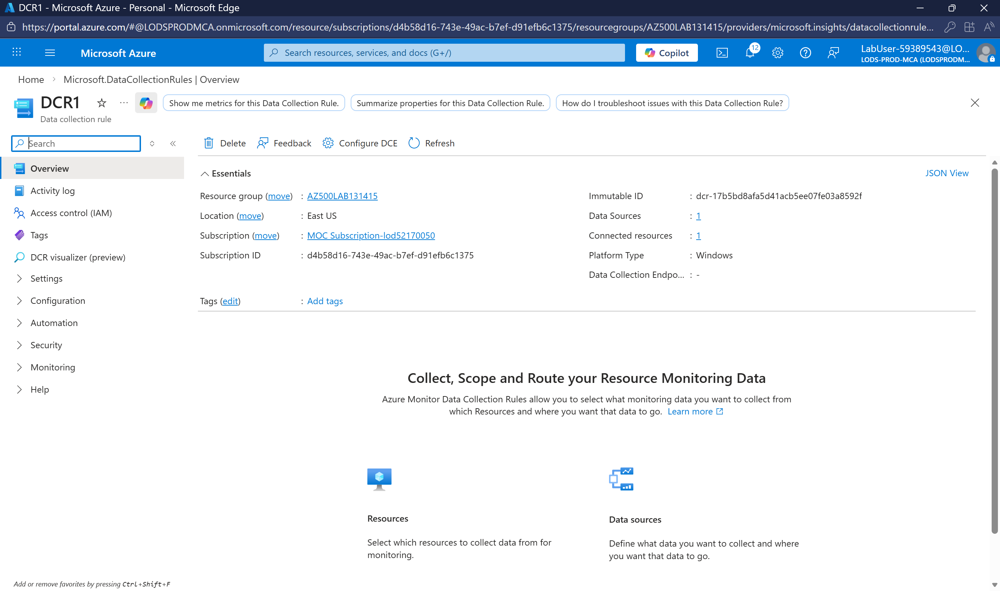

### Task 2: Defender Enabled

### Task 3: JIT Access Enabled
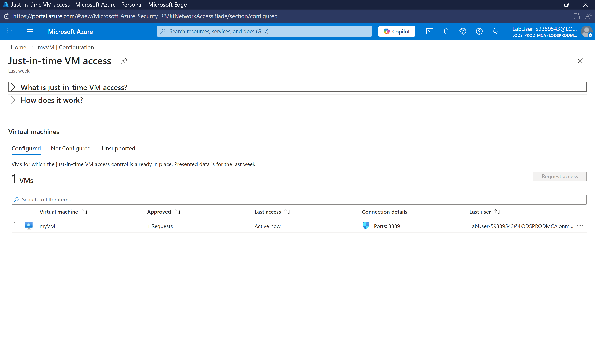

### Task 3: JIT Access Granted
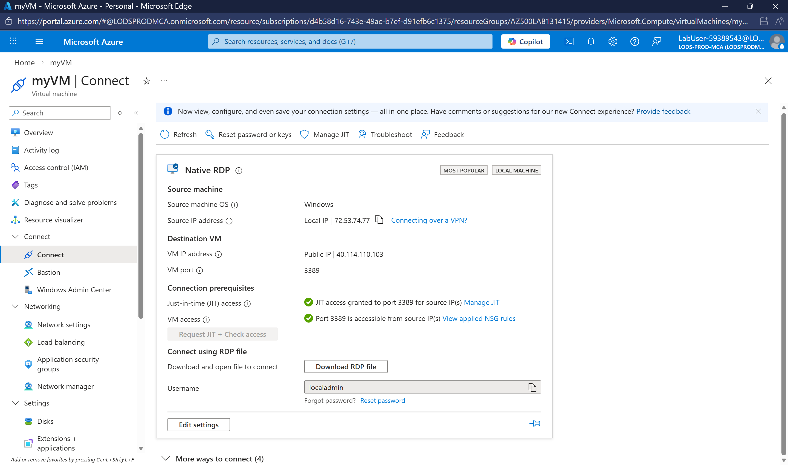

### Task 4: Sentinel Added
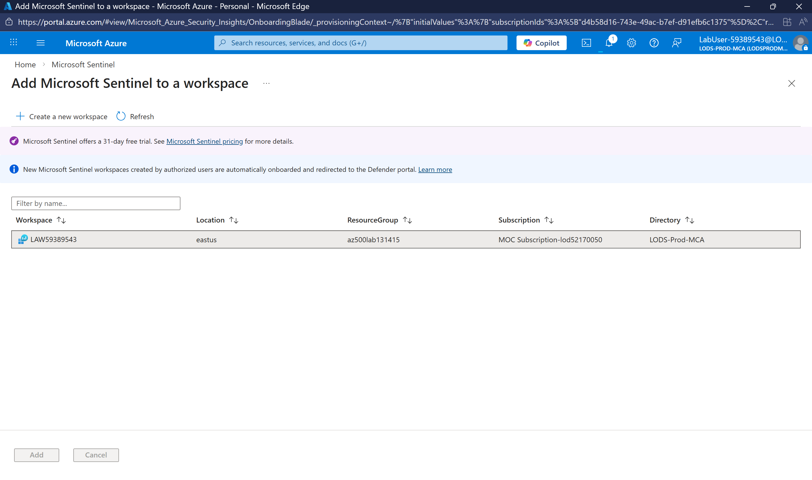

### Task 4: Activity Connector

### Task 4: Analytics Rule
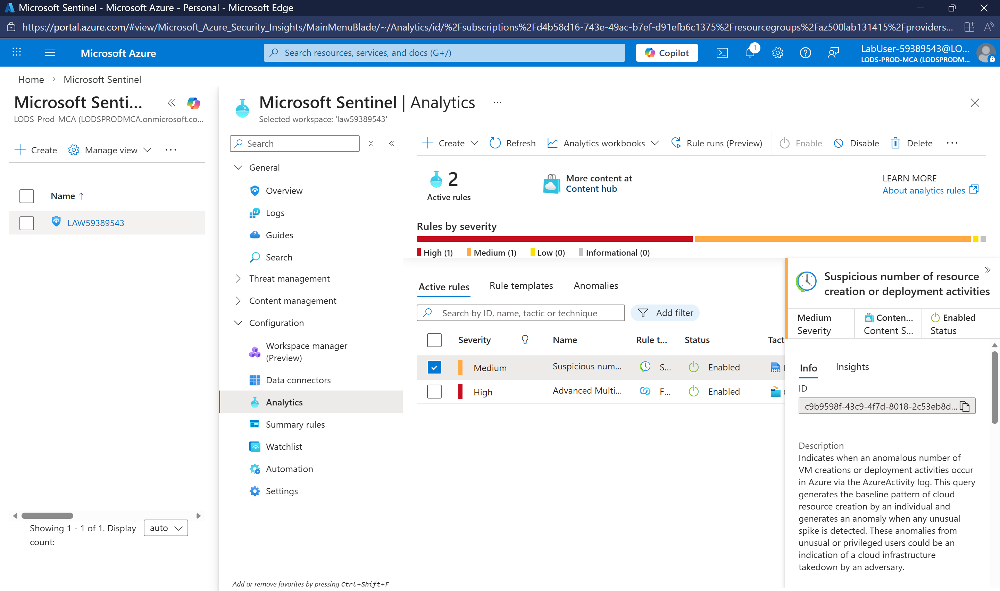

### Task 4: Playbook Deployed
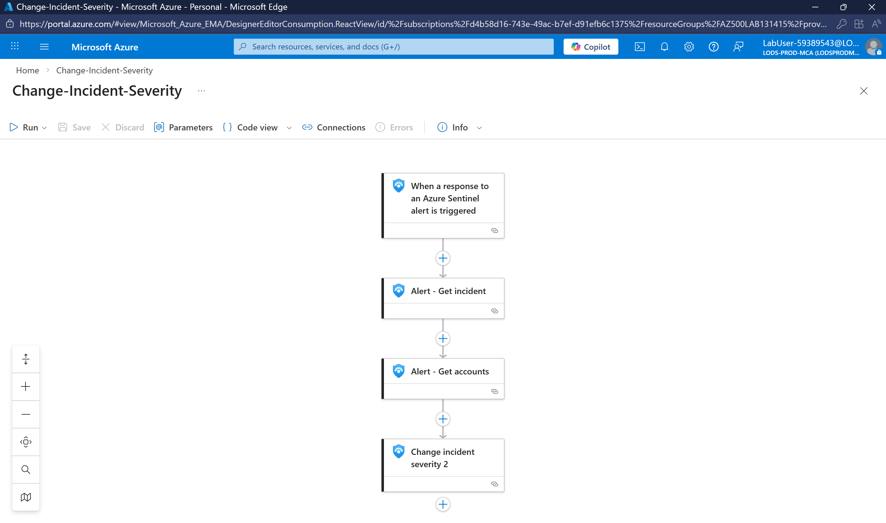

### Task 4: Custom Alert Automation
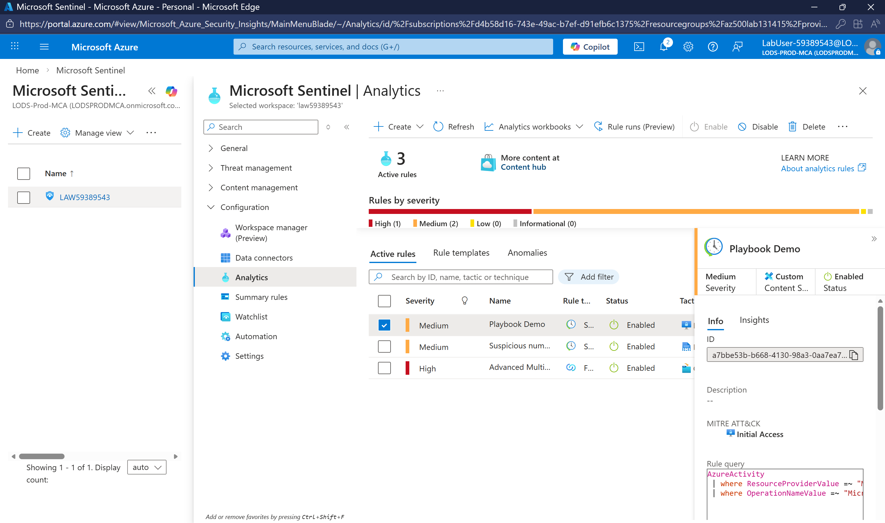

### Task 4: Incident Detected
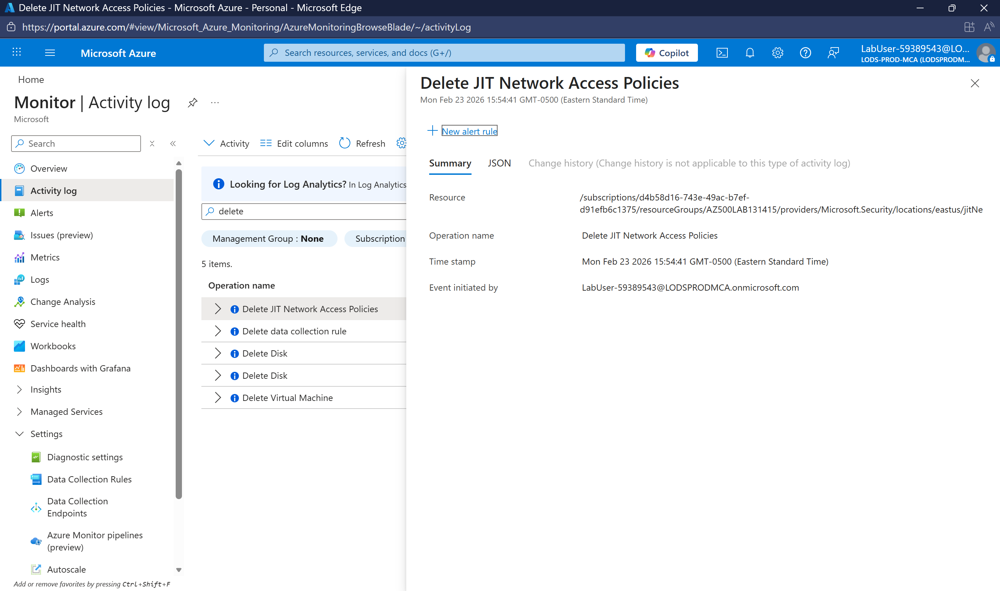

## 🔗 Related Certification Topics

- AZ-500: Manage security operations
- AZ-500: Configure threat protection
- AZ-104: Monitor and maintain Azure resources
- SC-200: Mitigate threats using Microsoft Sentinel

---

**Paschal Nnenna** · Cloud Administrator · [GitHub](https://github.com/MEEKMILEZ) · [LinkedIn](https://linkedin.com/in/paschal-nnenna)
