# Azure Security Monitoring & SIEM Implementation (Microsoft Sentinel)

## 📋 Overview

This project implements a centralized security monitoring and incident response pipeline in Microsoft Azure. It simulates a real-world Security Operations (SOC) workflow by collecting telemetry, detecting suspicious activity, and triggering automated responses.

The solution integrates multiple Azure services to provide end-to-end visibility, threat detection, and response automation across cloud infrastructure.

---

## 🧩 The Problem

Organizations often lack centralized visibility into their cloud environments. Logs are distributed across multiple services, making it difficult to detect threats early or respond efficiently.

Common challenges include:
- Limited visibility into infrastructure activity  
- Open management ports increasing attack surface  
- Manual and delayed incident response  
- Lack of automated threat detection  

This project addresses these challenges by building a unified monitoring and response system.

---

## ⚙️ The Solution

A layered security monitoring pipeline was designed and implemented using Azure-native tools:

- Centralized telemetry collection using Log Analytics  
- Advanced threat protection with Microsoft Defender for Cloud  
- Reduced attack surface using Just-in-Time (JIT) VM access  
- SIEM-based detection and incident management using Microsoft Sentinel  
- Automated incident response using Logic App playbooks  

---

## 🏗️ Architecture

**Resources Deployed:**

Azure Virtual Machine (myVM) · Log Analytics Workspace · Storage Account · Data Collection Rule (DCR) · Microsoft Defender for Servers Plan 2 · Just-in-Time VM Access Policy · Microsoft Sentinel · Azure Activity Data Connector · Analytics Rule · Automated Playbook (Logic App)

**Flow:**

VM telemetry → Data Collection Rule → Log Analytics Workspace → Microsoft Sentinel → Analytics Rules → Automated Playbook Response

---

## 🔧 Core Implementation

### Monitoring Foundation
- Deployed a virtual machine (**myVM**) as the monitored workload  
- Created a **Log Analytics Workspace** for centralized log ingestion  
- Configured a **Data Collection Rule (DCR)** to collect system metrics (CPU, memory, disk, network)  
- Provisioned a **storage account** for diagnostics  

### Threat Protection
- Enabled **Microsoft Defender for Servers Plan 2**  
- Added vulnerability assessment and real-time threat detection capabilities  

### Access Control & Hardening
- Implemented **Just-in-Time (JIT) VM access**  
- Restricted management ports to reduce attack surface  
- Validated secure access workflow through temporary access requests  

### Detection & Response (SIEM)
- Deployed **Microsoft Sentinel** on top of the Log Analytics workspace  
- Connected **Azure Activity logs** for subscription-level visibility  
- Created **analytics rules** to detect suspicious activity  
- Built an **automated playbook (Logic App)** to respond to incidents  
- Triggered and validated end-to-end detection → incident → response workflow  

---

## 📈 Impact

- Centralized visibility across infrastructure and activity logs  
- Reduced attack surface through Just-in-Time access controls  
- Automated detection of suspicious activity using SIEM rules  
- Faster incident response through Logic App automation  
- End-to-end security pipeline from telemetry to action  

---

## 🔍 Key Learnings

- Security monitoring is a pipeline — not a single tool, but a layered system  
- Data Collection Rules provide granular control over telemetry ingestion  
- Microsoft Defender enhances security posture with proactive threat detection  
- Just-in-Time access is critical for minimizing exposure  
- Microsoft Sentinel enables real-time detection and incident management  
- Automation is essential for moving from reactive to proactive security  

---

## 📊 Results

- ✅ VM deployed and fully monitored  
- ✅ Centralized logging via Log Analytics  
- ✅ Microsoft Defender for Servers Plan 2 enabled  
- ✅ Just-in-Time VM access configured and validated  
- ✅ Microsoft Sentinel deployed with active data connectors  
- ✅ Analytics rules and automated playbooks operational  
- ✅ Successful detection of JIT policy deletion event  

---

## 📸 Screenshots

### Task 1: VM Deployed
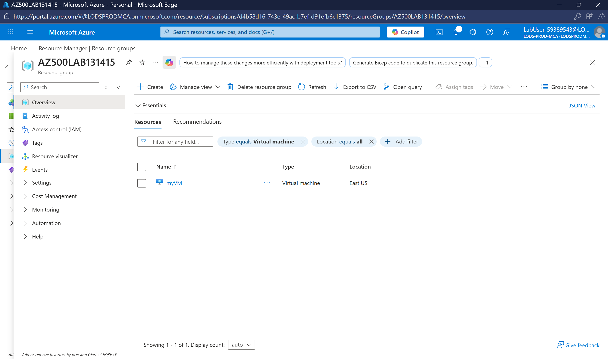

### Task 2: Log Analytics Workspace
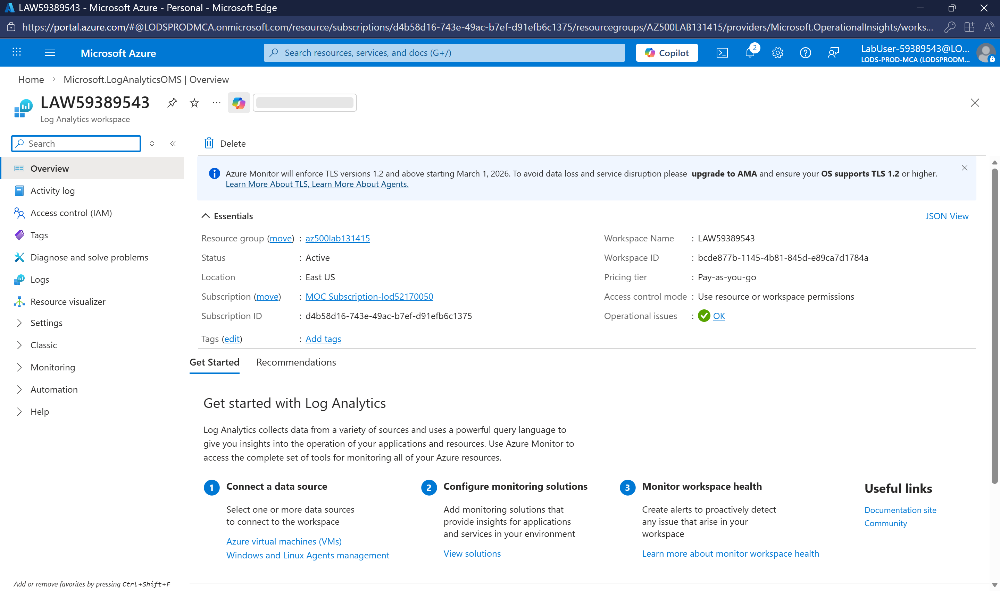

### Task 3: Storage Account
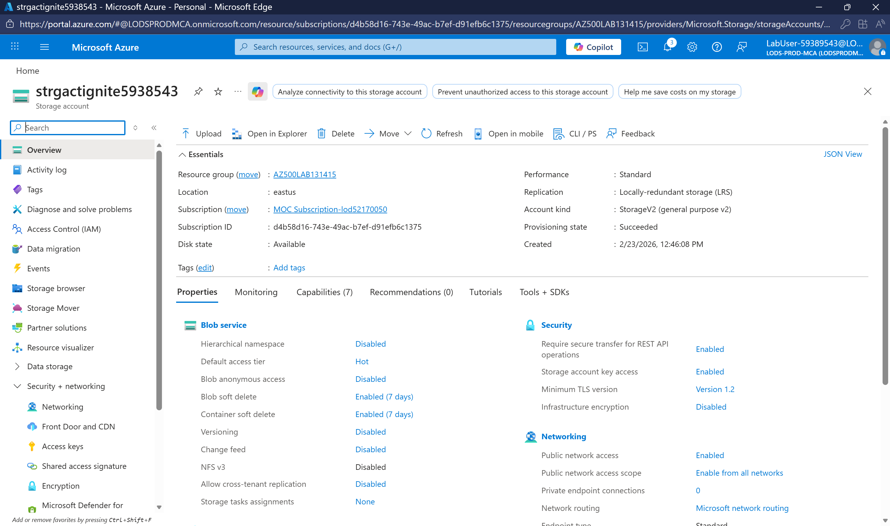

### Task 4: Data Collection Rule
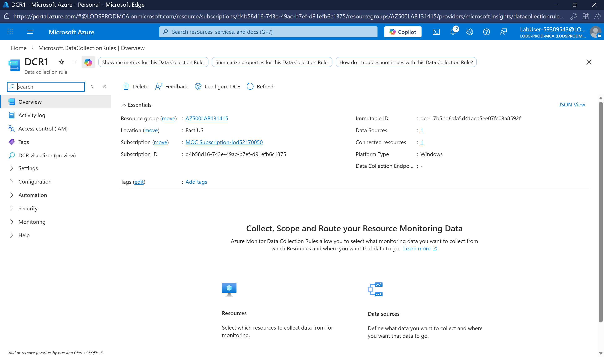

### Task 5: Defender Enabled
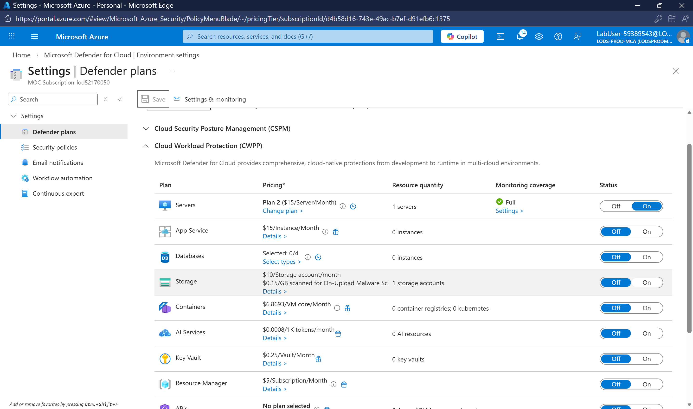

### Task 6: JIT Access Enabled
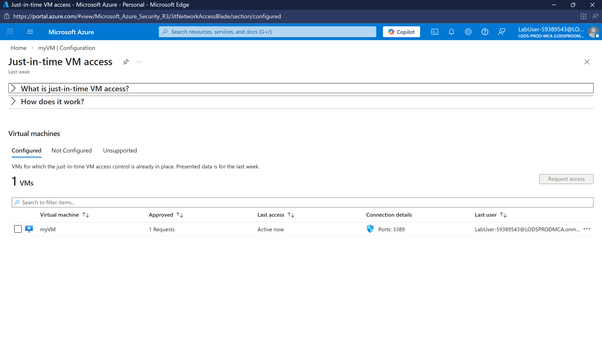

### Task 7: JIT Access Granted
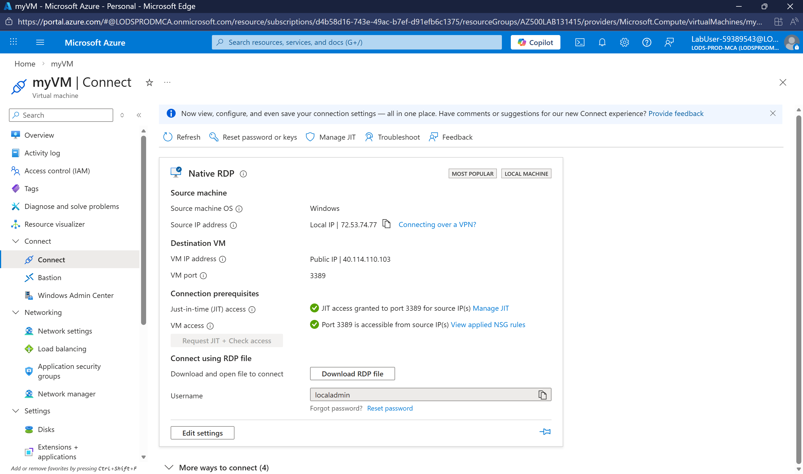

### Task 8: Sentinel Added
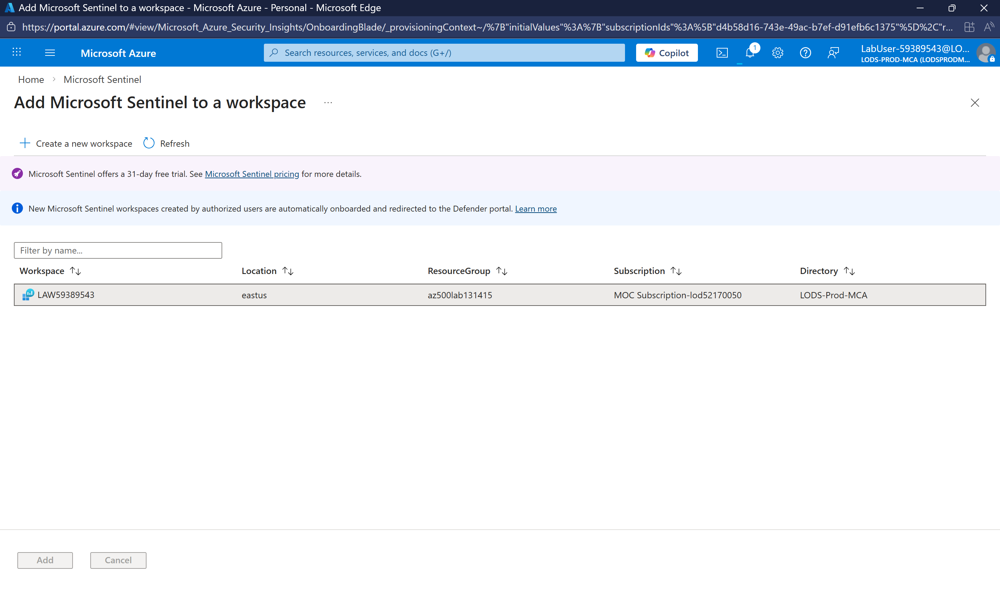

### Task 9: Activity Connector
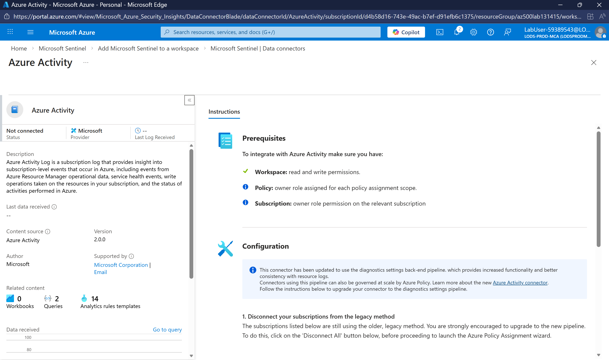

### Task 10: Analytics Rule
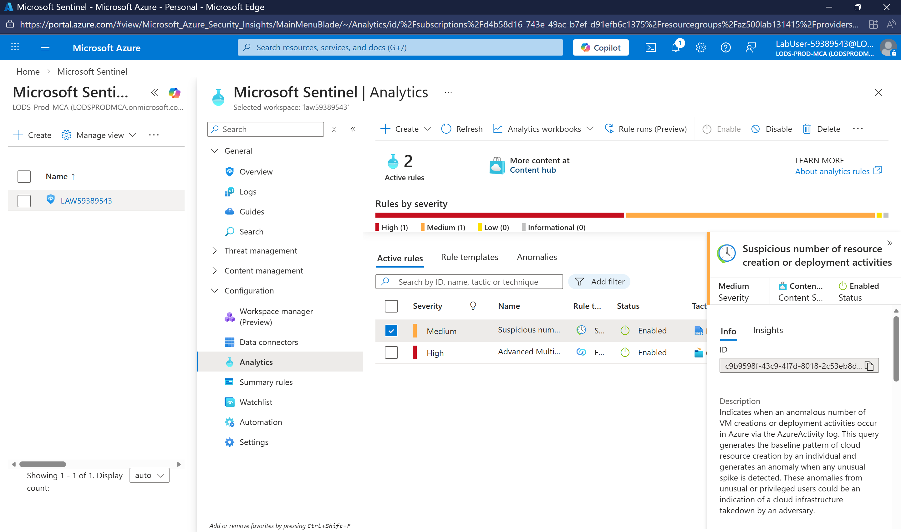

### Task 11: Playbook Deployed
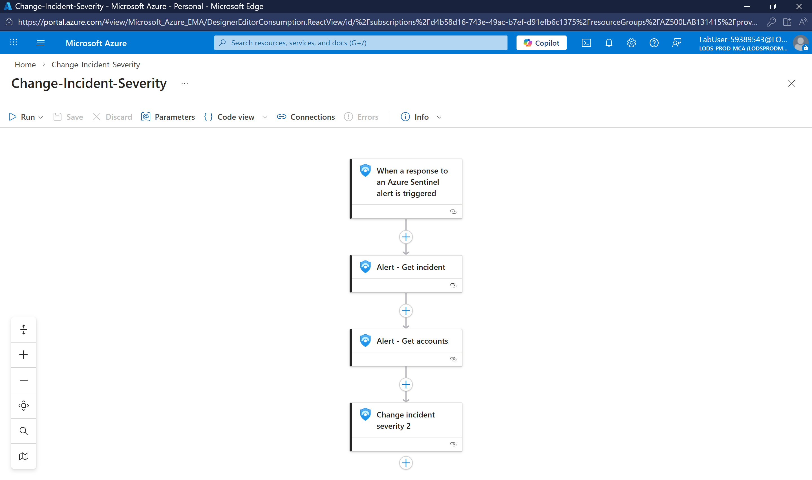

### Task 12: Custom Alert Automation
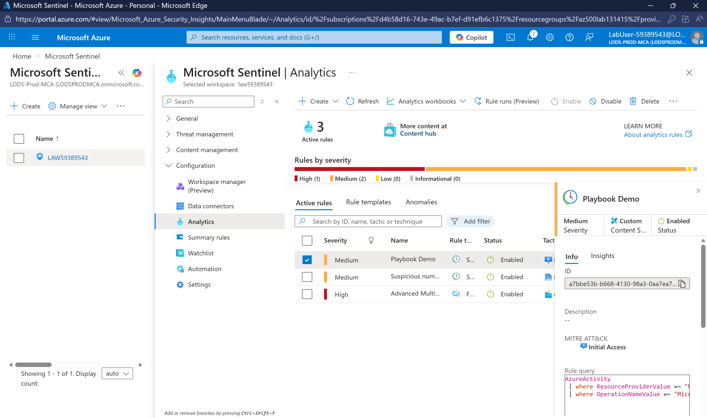

### Task 13: Incident Detected
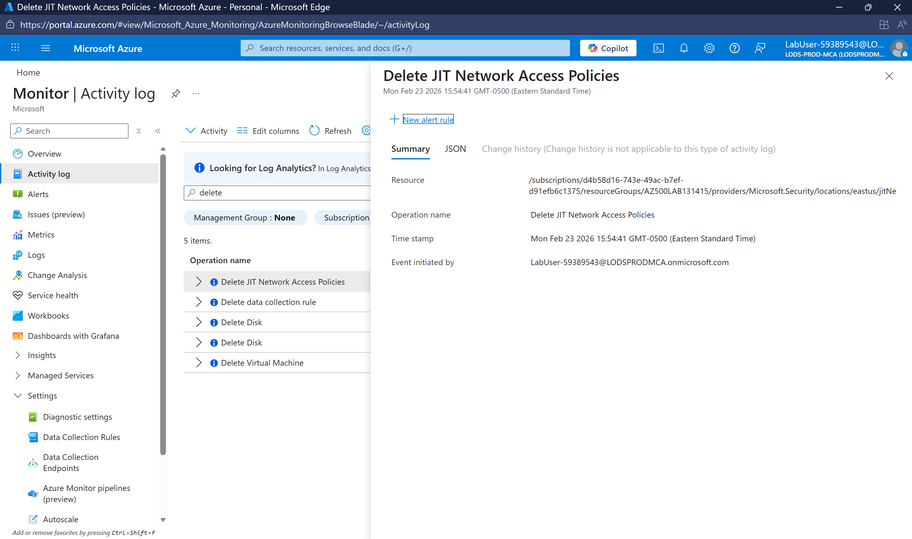

---

## 🔗 Related Certification Topics

- AZ-500: Manage security operations  
- AZ-500: Configure threat protection  
- AZ-104: Monitor and maintain Azure resources  
- SC-200: Mitigate threats using Microsoft Sentinel  

---

**Paschal Nnenna** · Cloud Administrator · [GitHub](https://github.com/MEEKMILEZ) · [LinkedIn](https://linkedin.com/in/paschal-nnenna)
