# 06 — Automated Backup Verification & Reporting

## The Problem

Every morning before the team starts, someone has to log into the Azure portal, navigate to each Recovery Services Vault, check every VM backup job from the last 24 hours, note any failures, and email a status summary to the group. Across our environment, this takes 15–30 minutes daily. It's tedious, error-prone, and occasionally gets skipped when the person responsible is out or busy with an incident.

A missed backup failure went unnoticed for three days because the admin covering that week forgot to check. When the VM it was protecting had a disk issue, recovery took significantly longer than it should have.

## The Solution

I built an automated pipeline that handles this entire workflow with zero human intervention. Every morning at 7:00 AM, the system scans all Recovery Services Vaults, checks every backup job from the past 24 hours, categorizes the results, and sends a notification to the team. Failed backups are flagged immediately.

## Architecture

```
Recovery Services Vault (VM Backups)
        ↓
Azure Automation Runbook (PowerShell — scans all vaults, queries backup jobs)
        ↓
Logic App (Scheduled trigger → invokes runbook → sends email notification)
        ↓
Team Inbox (report delivered before start of business)
```

The runbook also runs independently on its own schedule at 6:30 AM as a redundancy measure — even if the Logic App has an issue, the scan still executes and logs results.

## Components

| Resource | Name | Purpose |
|---|---|---|
| Resource Group | RG-BackupAutomation | Contains all project resources |
| Virtual Machine | vm-backup-test | Protected workload generating backup data |
| Recovery Services Vault | vault-backup-proj | Stores VM backup data and manages policies |
| Automation Account | aa-backup-monitor | Hosts the PowerShell runbook with managed identity |
| Runbook | Check-BackupStatus | Scans vaults, queries backup jobs, outputs report |
| Logic App | la-backup-report | Triggers runbook on schedule, sends email notification |

## What This Automates

| Manual Process | Automated Solution |
|---|---|
| Log into Azure portal daily | Scheduled runbook runs at 6:30 AM |
| Navigate to each vault manually | Script scans ALL vaults automatically |
| Check each VM backup job one by one | PowerShell queries all jobs in 24h window |
| Note failures in a spreadsheet | Failures flagged in the report output |
| Compose and send summary email | Logic App triggers and notifies team |
| 15–30 minutes daily per admin | Zero time — fully unattended |
| Occasionally missed or forgotten | Runs every day without exception |

## Implementation

### Phase 1 — Environment Setup

Deployed all resources via Azure Cloud Shell (PowerShell) in the East US region. Created a Windows Server 2022 VM (Standard_D2s_v3), a Recovery Services Vault with default backup policy, and triggered an on-demand backup to generate job data.

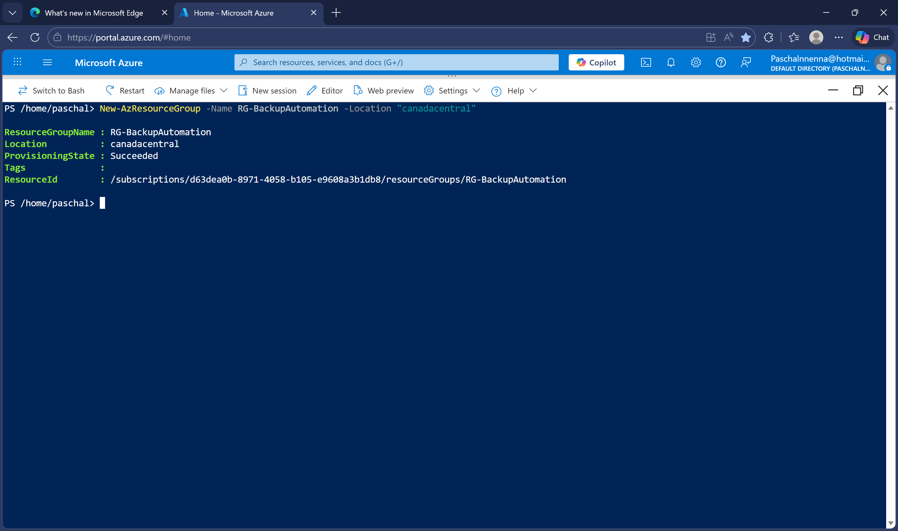

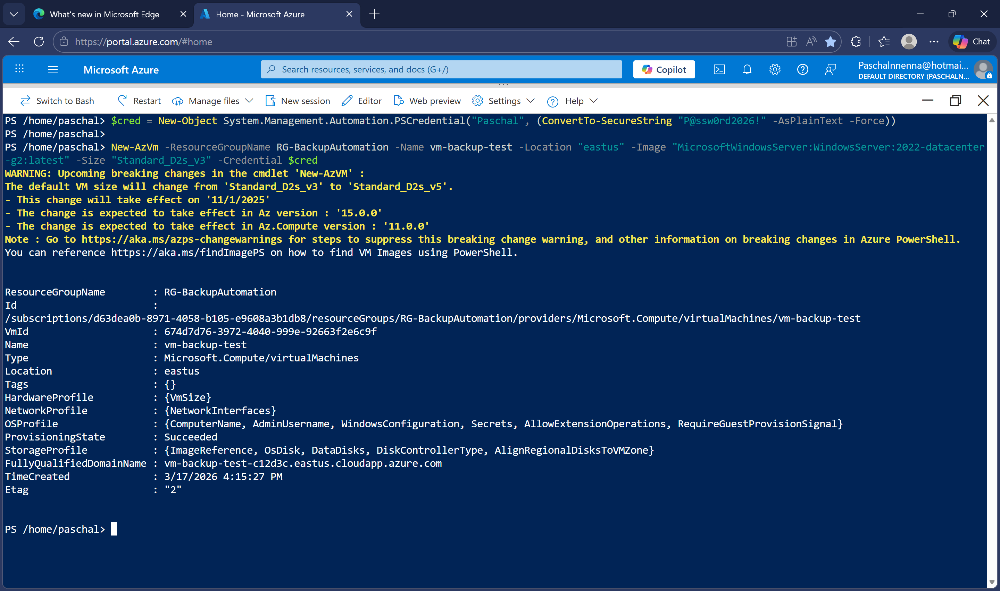

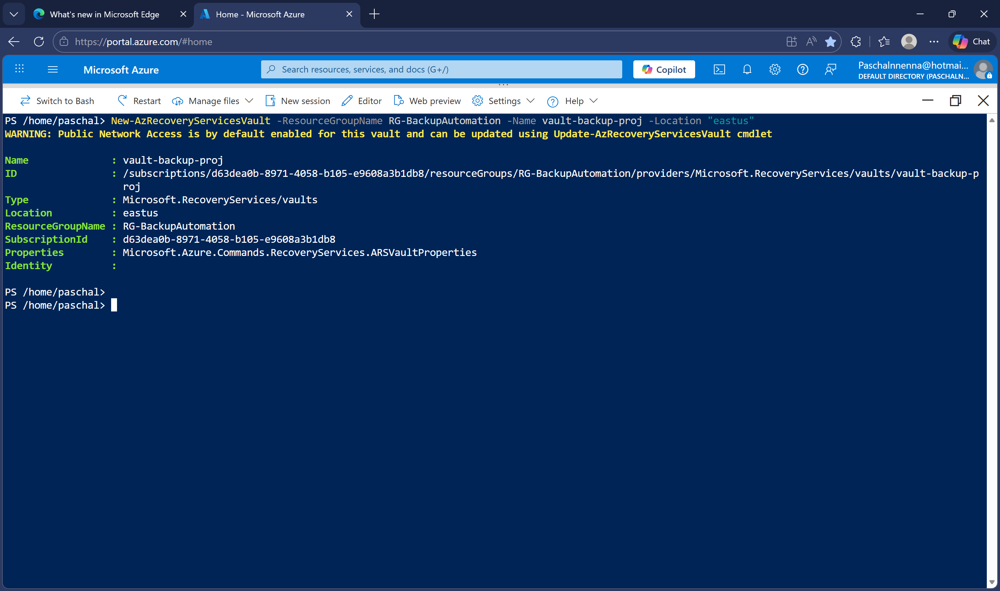

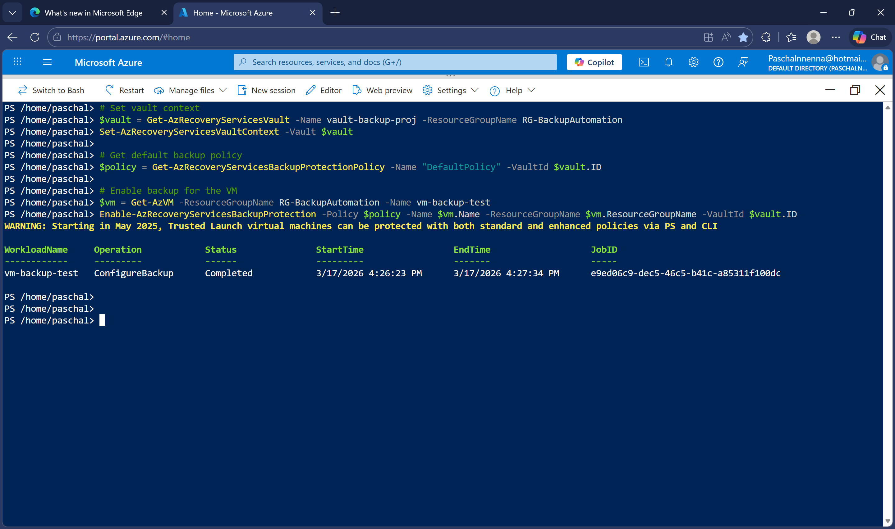

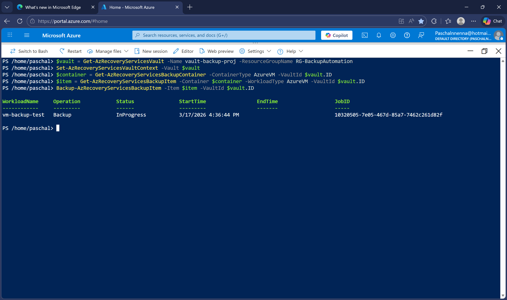

### Phase 2 — Automation Account & Runbook

Created the Automation Account with system-assigned managed identity for credential-free authentication. Assigned Reader and Backup Reader roles to the identity. Imported Az.Accounts (v3.0.5), Az.RecoveryServices (v6.9.0), and Az.Resources (v7.5.0) — version pinning was necessary due to compatibility issues with the latest modules and the Automation runtime.

The runbook authenticates with managed identity, discovers all Recovery Services Vaults, queries backup jobs from the last 24 hours (UTC), and outputs a structured JSON report plus a human-readable summary.

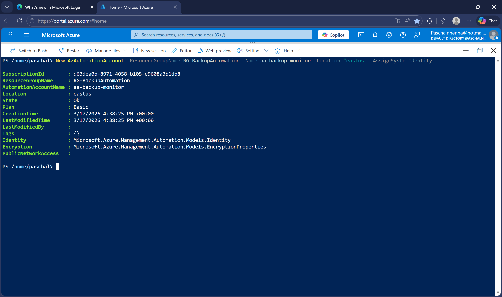

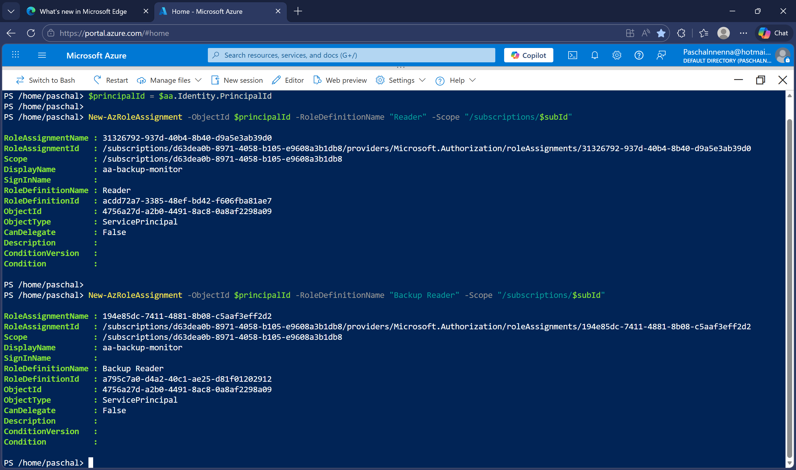

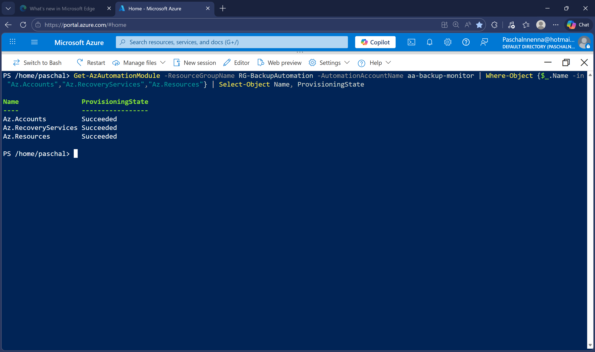

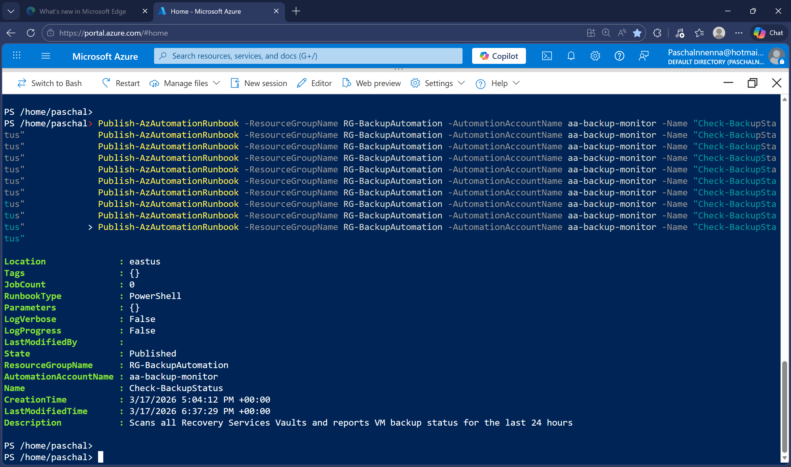

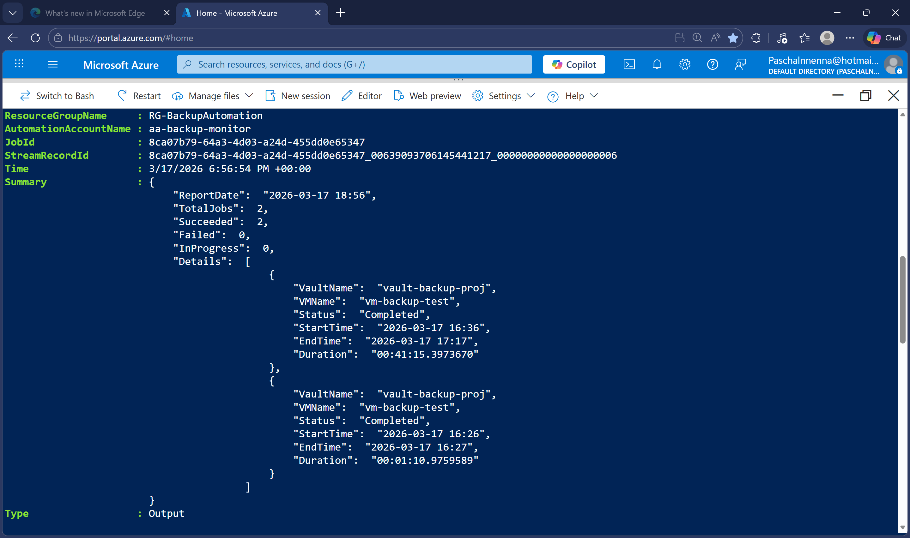

### Phase 3 — Logic App Workflow

Created a Logic App with a Recurrence trigger (daily at 7:00 AM Eastern). The runbook is invoked via a direct HTTP PUT call to the Azure Management REST API, authenticated with the Logic App's own system-assigned managed identity. After the runbook completes, an Outlook.com connector sends a notification email to the team.

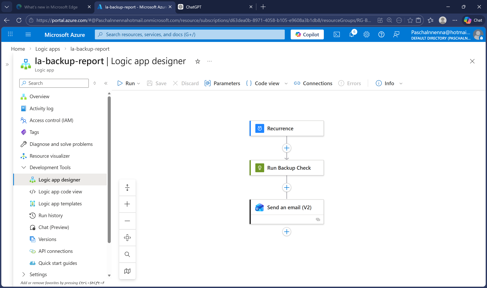

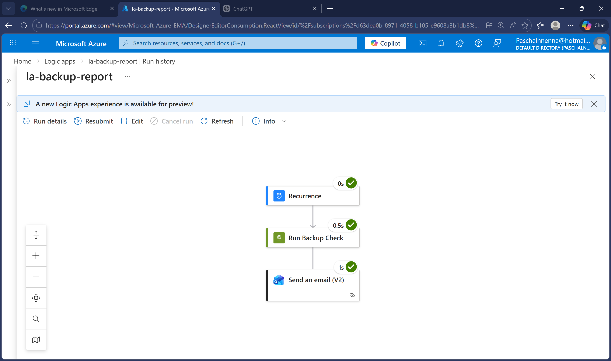

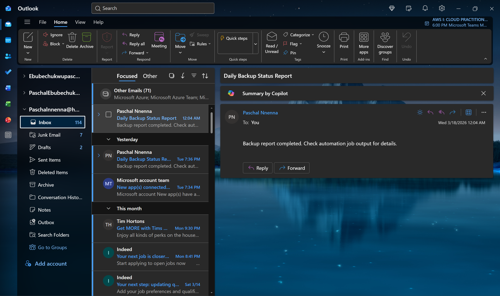

### Phase 4 — Scheduling & Redundancy

Configured dual schedules for resilience. The runbook runs independently at 6:30 AM via its own schedule, and the Logic App triggers again at 7:00 AM with email notification. If either mechanism fails, the other still captures the data.

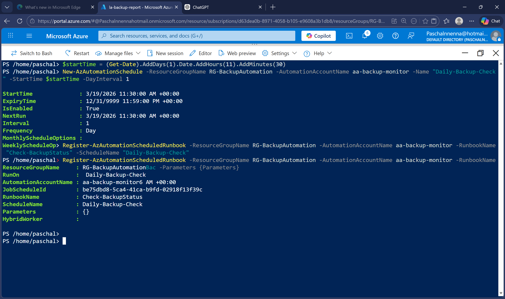

## Impact

- **Time recovered:** ~2.5 hours per week across the team
- **Reliability:** 100% daily execution vs. occasional misses under the manual process
- **Response time:** Backup failures surfaced within hours, not days
- **Cost:** Under $0.50/month — Automation Account free tier covers job runtime, Logic App consumption plan costs fractions of a cent per execution
- **Security:** Zero stored credentials — managed identity handles all authentication

## Troubleshooting & Lessons Learned

This project involved significant real-world troubleshooting during implementation. Below are the issues encountered and how each was resolved.

### VM SKU Capacity Constraints
Standard_B1s was unavailable in both Canada Central and East US due to regional capacity limits. Standard_B2s also failed in Canada Central. Resolved by switching the entire deployment to East US with Standard_D2s_v3, which is Azure's default VM size and has guaranteed capacity. Takeaway: always have a fallback SKU and region when planning deployments.

### Silent VM Creation Failure
The VM creation command completed without errors but the VM was never created. Root cause was the password entered via Get-Credential not meeting Azure's complexity requirements (12+ characters, uppercase, lowercase, number, special character). Resolved by using a PSCredential object with a pre-defined compliant password. Takeaway: when a deployment silently fails, check input validation requirements first.

### Module Version Incompatibility
The latest Az.Accounts module (version 5.x) caused a GetTokenAsync implementation error in the Azure Automation runtime. Downgrading to version 2.13.2 fixed the token error but broke Az.RecoveryServices due to cross-module dependency conflicts. Final resolution was pinning to Az.Accounts 3.0.5 with Az.RecoveryServices 6.9.0 and Az.Resources 7.5.0 — a compatible set that worked with the Automation runtime. Takeaway: in automation environments, the latest version is not always the best version. Version pinning and compatibility testing are essential.

### Managed Identity Object ID Mismatch
After assigning Reader and Backup Reader roles, the runbook still failed with "does not have authorization." Investigation revealed that the PowerShell command used to retrieve the managed identity's principal ID returned a different object ID than the one the Automation runtime actually uses. The correct object ID was extracted from the authorization error message itself and roles were reassigned. Takeaway: always verify identity object IDs from actual runtime errors rather than relying solely on PowerShell property lookups.

### UTC Timestamp Requirement
The runbook successfully found the vault but returned zero backup jobs. The Get-AzRecoveryServicesBackupJob cmdlet requires the -From and -To parameters in UTC format. The original script used local time via Get-Date. Resolved by adding .ToUniversalTime() to both date parameters. Takeaway: Azure backup APIs operate in UTC — always convert timestamps explicitly.

### Logic App Connector Failure
The built-in Azure Automation connector in the Logic App designer failed with "Unknown Error" when attempting to create a connection. Multiple attempts with different connection names and authentication methods all failed. Resolved by bypassing the connector entirely and using a direct HTTP action calling the Azure Management REST API with the Logic App's managed identity for authentication. Takeaway: when built-in connectors fail, the REST API is a reliable fallback and often provides more control.

### REST API Method Not Allowed
The initial HTTP action used POST to trigger the automation job, which returned "MethodNotAllowed." The Azure Automation REST API requires a PUT request with a unique GUID-based job name in the URI. Resolved by changing the method to PUT and adding a dynamic GUID to generate a job ID for each run. Takeaway: always verify the correct HTTP method and URI format in the Azure REST API documentation.

### Logic App Forbidden Error
After switching to the HTTP action, the Logic App returned "Forbidden" because its managed identity lacked permission to create automation jobs. Resolved by assigning the Contributor role on the automation account resource directly to the Logic App's managed identity. Takeaway: each Azure resource with a managed identity needs its own explicit role assignments — permissions don't transfer between identities.

## Technologies Used

Azure Automation, PowerShell, Azure Logic Apps, Recovery Services Vault, Managed Identity, Azure RBAC, Azure Cloud Shell, REST API, Outlook.com
