# 08 — Cloud Cost Watchdog: Automated Zombie Resource Detection and Cost Optimization

## The Problem

After deploying cloud resources for projects, testing, or development, teams forget to clean up. Stopped VMs still incur storage costs, orphaned disks sit unused, unattached public IPs get billed monthly, and empty resource groups clutter the environment. Nobody notices until the monthly bill arrives and it is 30% higher than expected. Across the industry, companies waste 25 to 35 percent of their cloud spend on resources that serve no purpose.

The typical response is a manual audit: someone logs into the portal, clicks through each resource group, checks what is running, and decides what to delete. It takes hours, it is inconsistent, and it only happens when someone remembers to do it.

## The Solution

I built an automated cost watchdog that scans the entire Azure subscription daily, identifies zombie resources across six categories, calculates estimated monthly waste for each one, and sends an email report to the admin team. The scan runs every morning at 6:00 AM UTC without any human intervention. If there is nothing to report, the system confirms the environment is clean.

## Architecture

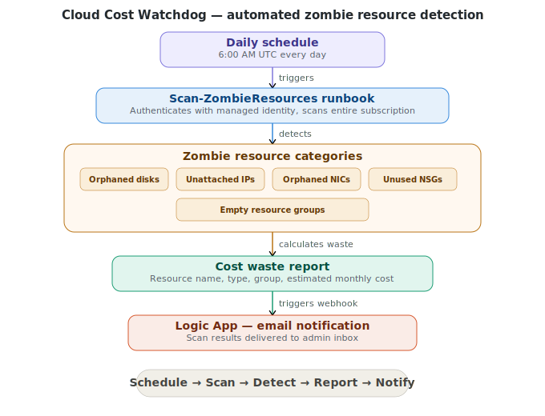

## Components

| Resource | Name | Purpose |
|---|---|---|
| Resource Group | RG-CostWatchdog | Contains all project resources |
| Automation Account | aa-cost-watchdog | Hosts the scanning runbook with managed identity |
| Runbook | Scan-ZombieResources | Scans subscription and identifies waste across six categories |
| Logic App | la-cost-report | Sends email report triggered by the runbook via webhook |
| Action Group | ag-cost-report | Email notification group for admin alerts |
| Schedule | Daily-Zombie-Scan | Triggers the runbook daily at 6:00 AM UTC |

## What It Detects

| Zombie Resource Type | Why It Matters | Cost Impact |
|---|---|---|
| Orphaned Managed Disks | Left behind after VM deletion | ~$0.04/GB/month |
| Unattached Public IPs | Billed even when not assigned to anything | ~$3.65/month each |
| Orphaned Network Interfaces | Leftover from deleted VMs, clutter and security risk | No direct cost |
| Unused Network Security Groups | Not associated with any subnet or NIC | No direct cost |
| Empty Resource Groups | Leftover from deleted projects, signals poor hygiene | No direct cost |

## What This Automates

| Manual Process | Automated Solution |
|---|---|
| Log into portal and click through resource groups | Scheduled runbook scans entire subscription |
| Check each resource manually for usage | Script queries disk state, IP attachment, NIC assignment, NSG association |
| Calculate waste in a spreadsheet | Runbook calculates estimated monthly cost per resource |
| Email the team a summary | Logic App sends automated report via webhook |
| Remember to do it regularly | Daily schedule runs at 6:00 AM UTC without exception |

## Implementation

### Phase 1 — Creating Zombie Resources (Simulated Waste)

To demonstrate the scanner against real resources, I intentionally deployed eight zombie resources across the subscription simulating what a real environment looks like after months of neglect: orphaned disks left behind after VM deletion, public IPs that were allocated but never assigned, a network interface not attached to any VM, a network security group not associated with any subnet, and two empty resource groups from abandoned projects.

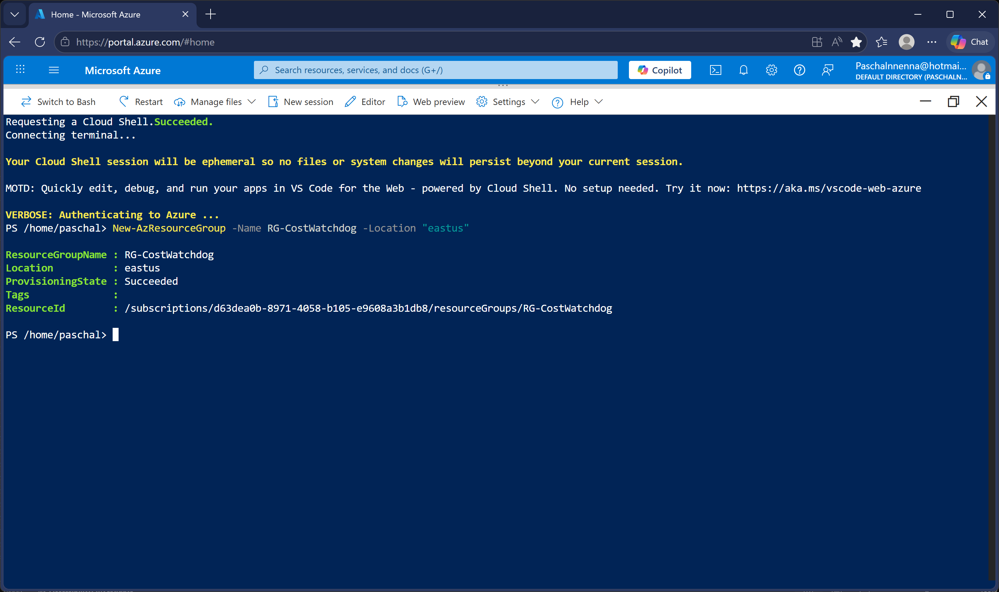
*Resource groups created via PowerShell including RG-CostWatchdog and two empty groups simulating abandoned projects.*

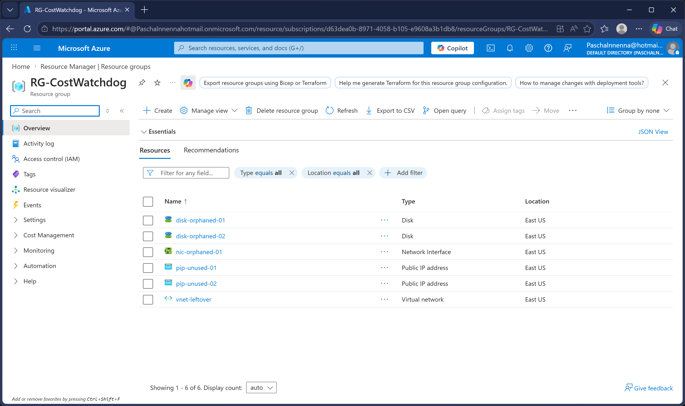
*RG-CostWatchdog resources view showing orphaned disks, unattached public IPs, unused NIC, leftover VNet, and unassociated NSG.*

### Phase 2 — Deploying Infrastructure with Terraform

All core infrastructure was deployed using Terraform rather than portal clicks or individual PowerShell commands. A single Terraform configuration file defines the Automation Account with system-assigned managed identity, Reader role assignment at subscription scope, four PowerShell modules with version pinning, a daily scan schedule, an action group with email notification, and the Logic App. One command deploys everything.

The managed identity is assigned Reader at subscription scope so the runbook can scan all resource groups, not just the one it lives in. This is critical for a cost watchdog since zombie resources can exist anywhere in the subscription.

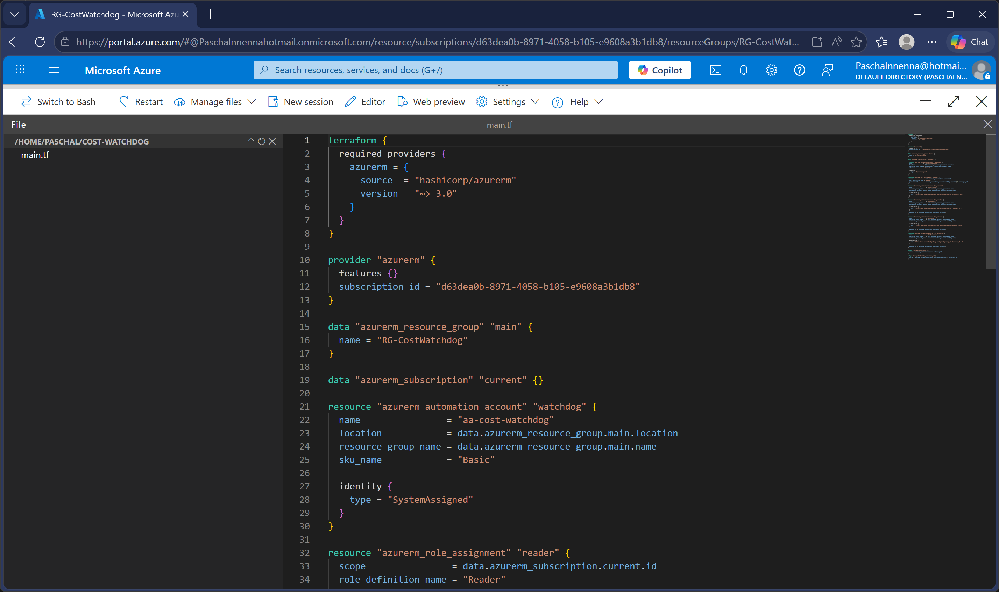
*Terraform configuration file defining all infrastructure in a single declarative template.*

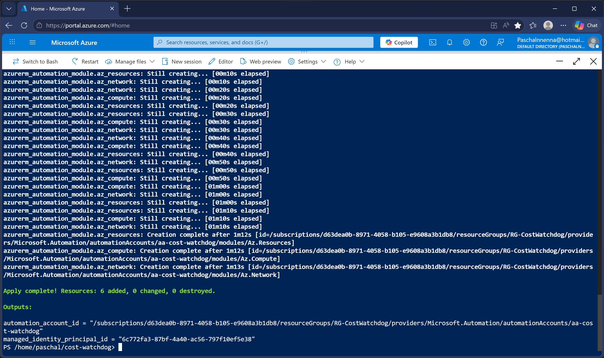
*Terraform apply completed with all resources created successfully.*

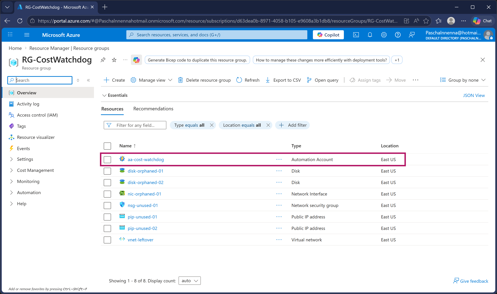
*Automation account aa-cost-watchdog visible in the resource group with managed identity enabled.*

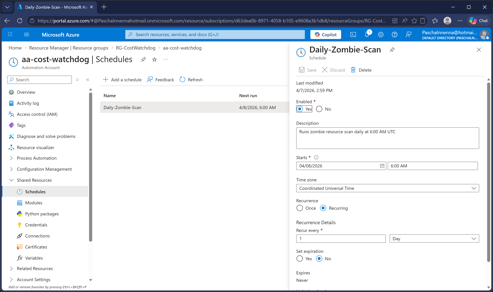
*Daily automation schedule configured to trigger the zombie resource scan at 6:00 AM UTC.*

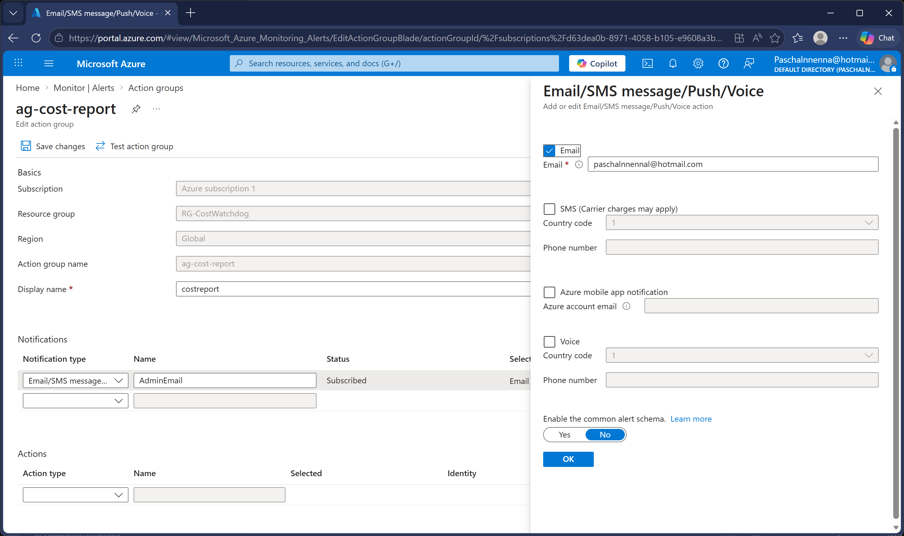
*Action group ag-cost-report with email notification configured.*

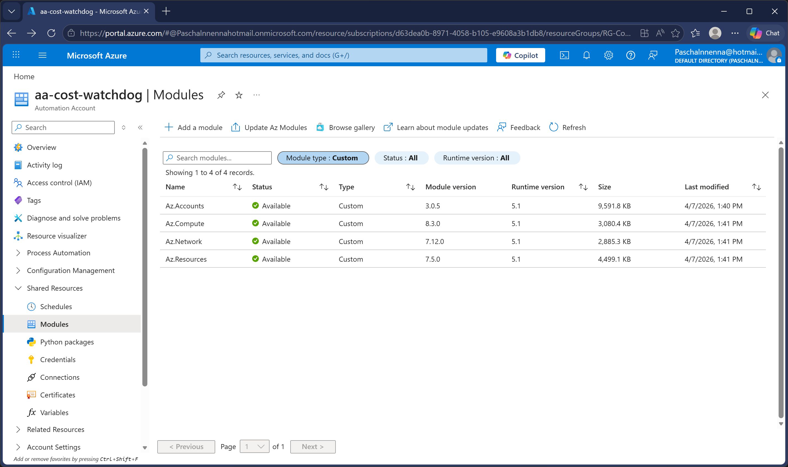
*All four PowerShell modules showing Available status in the Automation Account.*

### Phase 3 — Building the Scanner Runbook

The runbook authenticates using managed identity so no credentials are stored in the script. It scans five resource categories: orphaned disks using the Az.Compute module, unattached public IPs and orphaned NICs and unused NSGs using the Azure REST API directly, and empty resource groups using the Az.Resources module.

The Azure REST API approach was used for network resources because the Az.Network module had a dependency conflict with the Automation runtime that could not be resolved regardless of version. Switching to direct REST API calls with bearer tokens from the managed identity is actually more reliable and eliminates module dependency issues entirely.

Each detected resource gets an estimated monthly cost. At the end of the scan, the runbook calls the Logic App webhook to trigger an email notification automatically.

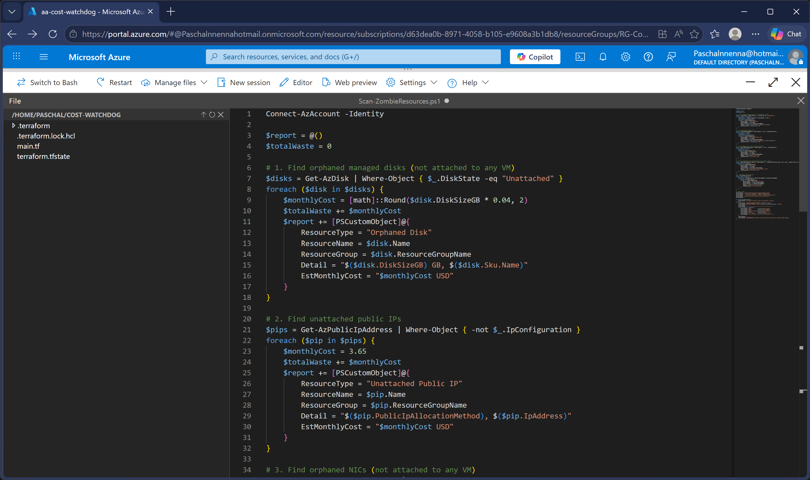
*PowerShell runbook code scanning for orphaned disks, unattached public IPs, unused NICs, unused NSGs, and empty resource groups.*

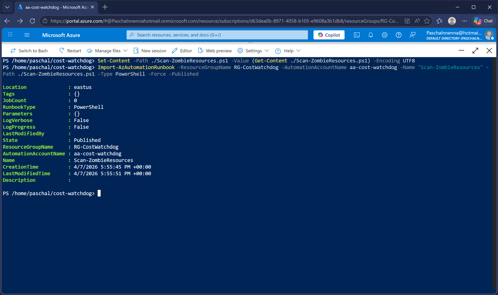
*Scan-ZombieResources runbook imported and published in the Automation Account.*

### Phase 4 — Notification Pipeline

Created a Logic App with an HTTP trigger and Outlook.com email connector. The runbook calls the Logic App webhook URL at the end of every scan, passing the scan date, zombie count, and estimated waste as JSON. The Logic App sends a notification email to the admin team.

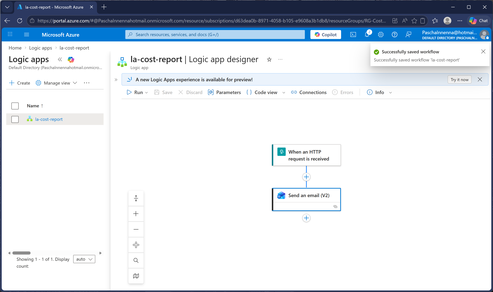
*Logic App designer showing HTTP trigger and Outlook.com email notification step.*

### Phase 5 — Testing

Triggered the runbook and let the full automated chain execute: scan all resources, detect zombies, calculate costs, trigger the Logic App, send the email.

The scan identified all eight zombie resources with a total estimated monthly waste of $14.98:

- 2 orphaned disks: $7.68/month combined
- 2 unattached public IPs: $7.30/month combined
- 1 orphaned NIC: no direct cost
- 1 unused NSG: no direct cost
- 2 empty resource groups: no direct cost

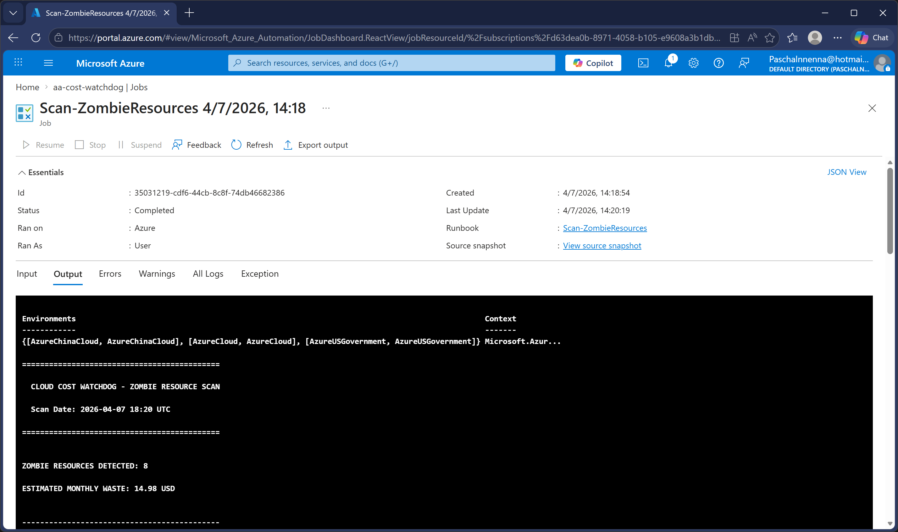
*Runbook output showing all 8 zombie resources detected with $14.98 estimated monthly waste.*

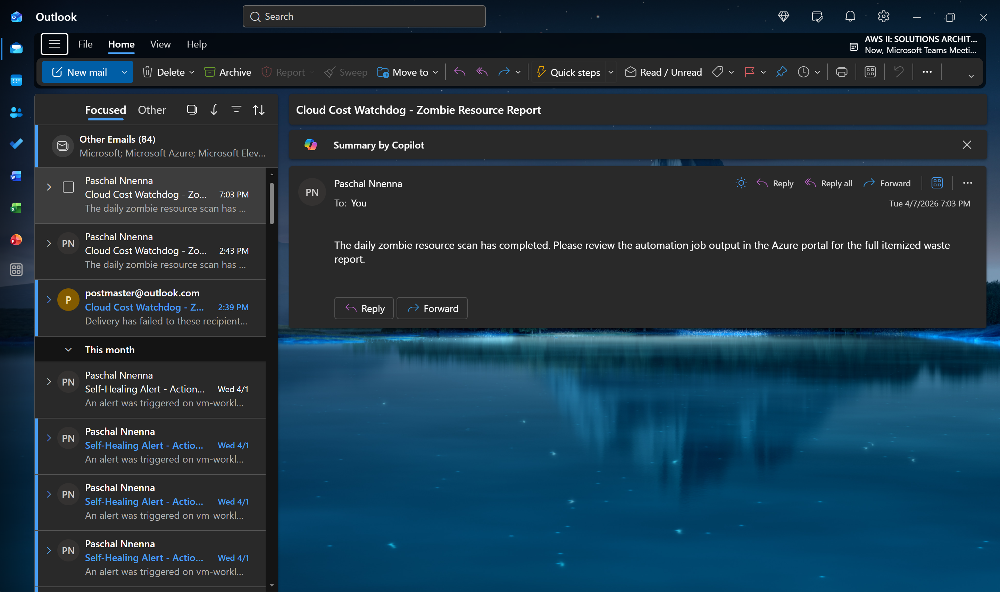
*Email notification automatically triggered by the runbook after completing the zombie resource scan.*

After verifying the scan results, all zombie resources were deleted. A second scan confirmed the environment was clean.

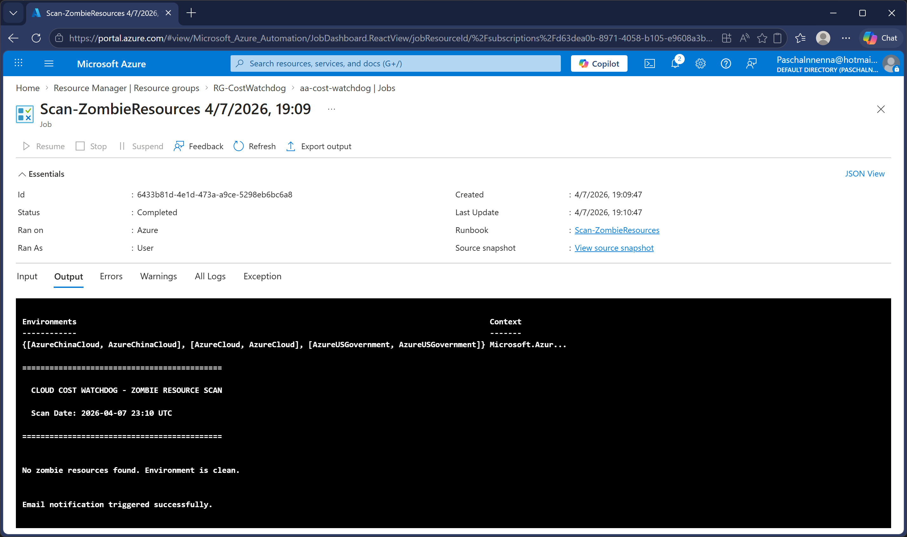
*Post-cleanup scan showing zero zombie resources detected, confirming all waste has been eliminated.*

## Impact

- **Cost visibility:** Identifies wasted spend that would otherwise go unnoticed until the monthly bill
- **Automated scanning:** Runs daily at 6:00 AM UTC with zero human intervention
- **Subscription-wide coverage:** Scans all resource groups, not just one
- **Actionable reporting:** Each zombie resource includes type, name, resource group, and estimated monthly cost
- **Email notification:** Admin team is notified automatically after every scan
- **Clean environment validation:** Confirms when no waste exists
- **Cost:** Under $1/month — Automation Account free tier, Logic App consumption plan

## Troubleshooting & Lessons Learned

### Az.Network Module Failed to Load in Automation Runtime
The Az.Network module could not be loaded regardless of version (tested 6.5.0, 7.12.0, 7.26.0). The Automation runtime threw "module could not be loaded" errors for all Az.Network cmdlets including Get-AzPublicIpAddress, Get-AzNetworkInterface, and Get-AzNetworkSecurityGroup. Resolved by replacing all Az.Network cmdlets with direct Azure REST API calls using Invoke-RestMethod with managed identity bearer tokens. This approach is more reliable and eliminates module dependency issues entirely.

### Terraform Provider Registration Permission Denied
Terraform's default behavior automatically registers Azure resource providers, but the subscription permissions did not allow this. The error "unexpected status 401 Unauthorized" appeared during terraform plan. Resolved by adding skip_provider_registration = true to the provider block, which tells Terraform to skip automatic registration and use only already-registered providers.

### Cloud Shell Session Resets Wiping Terraform State
Azure Cloud Shell sessions expire and reset the home directory, deleting the Terraform state file and configuration. Resources created by Terraform continued to exist in Azure but Terraform lost track of them. Lesson learned: in production, Terraform state should be stored in a remote backend like an Azure Storage Account blob container, not in the local file system.

### Runbook Job Definition Empty After Import
The runbook script imported successfully but jobs failed with "job definition was empty." The file encoding from Cloud Shell's Out-File command was incompatible with the Automation runtime. Resolved by using Set-Content with -Encoding UTF8 before importing the runbook.

### Logic App Email Delivery Rejected by Outlook
The Office 365 Outlook connector's authentication token expired, causing emails to be rejected by Outlook's mail protection servers. Resolved by removing and re-adding the Outlook.com connector with fresh credentials.

## Technologies Used

Terraform, Azure Automation, PowerShell, Azure REST API, Azure Monitor Action Groups, Azure Logic Apps, Managed Identity, Azure RBAC, Azure Cloud Shell
