# 09 — AI Ops Intelligence: Automated Anomaly Detection and DR Validation

## The Problem

Healthcare IT teams and warehouse operations both face the same alert fatigue crisis. A single Azure environment generates hundreds of monitoring alerts per day. Most are noise — a CPU spike during a backup window, a temperature reading that resolved itself, a network blip that corrected in seconds. The three alerts that actually matter get buried underneath the other 397.

The typical response is manual triage: an on-call engineer reads through a wall of alerts, decides what to investigate, and escalates based on gut feel. This is slow, inconsistent, and burns out engineering teams. Separately, disaster recovery validation is treated as a compliance checkbox — tested once a quarter at best, with results that nobody reads.

## The Solution

I built an AI-driven operational intelligence system that automates both problems. Device telemetry flows from simulated warehouse sensors and clinical servers into Azure IoT Hub every 10 seconds. Azure Stream Analytics watches the stream in real time. A Python triage function detects anomalies, sends each flagged device to Azure OpenAI, which reads the full signal pattern and writes a plain English verdict — what broke, how urgent, what the ops team should do right now — then saves the report to Blob Storage and triggers an email via Logic Apps.

A separate Automation Runbook runs a DR validation drill every Monday at 6am UTC, measures actual RTO and RPO against configured targets, generates an AI-narrated health report, saves it to Blob Storage, and delivers it to the ops team email automatically via Logic Apps.

The key difference from simple threshold alerting: when the network switch showed packet loss alongside elevated CPU, the AI upgraded it from WARNING to CRITICAL — catching the correlated signal that a simple threshold rule would have missed.

## Architecture

Two independent tracks run in parallel:

**Alert track:** IoT Hub → Event Hub → Stream Analytics → Triage Function → Azure OpenAI → Blob Storage → Logic App → Email

**DR track:** Automation Schedule → PowerShell Runbook → Azure OpenAI → Blob Storage → Logic App → Email

All infrastructure deployed via Terraform. No portal clicks for resource creation.

## Components

| Resource | Name | Purpose |
|---|---|---|
| Resource Group | rg-aiops-dev-1bpxtr | Contains all project resources |
| IoT Hub | ioth-aiops-dev-1bpxtr | Receives device telemetry from 8 simulated sensors |
| Event Hub Namespace | evhns-aiops-dev-1bpxtr | Routes messages between pipeline stages |
| Stream Analytics Job | asa-aiops-dev-1bpxtr | Real-time anomaly detection, auto-starts via Terraform |
| Azure OpenAI | oai-aiops-dev-1bpxtr | GPT-4o for alert classification and DR report generation |
| Logic App (Alert) | logic-alert-triage-aiops-dev-1bpxtr | Triggers on new triage report, sends email |
| Logic App (DR) | logic-dr-validation-aiops-dev-1bpxtr | Weekly DR trigger, reads report, sends email |
| Automation Account | aa-aiops-dev-1bpxtr | Hosts DR validation runbook with managed identity |
| DR Runbook | runbook-dr-validation | Weekly failover simulation and AI report generation |
| Storage Account | staiopsdev1bpxtr | Stores AI triage reports and DR health reports |
| Key Vault | kv-aiops-dev-1bpxtr | Stores all connection strings and API keys |
| Log Analytics | law-aiops-dev-1bpxtr | Centralized logging and diagnostics |
| Action Group | ag-aiops-dev-1bpxtr | Email notifications for infrastructure alerts |
| Monitor Alerts | alert-asa-errors, alert-iothub-drops | Pipeline health monitoring |

## Simulated Devices

**Warehouse (4 devices):** conveyor motors (temperature + vibration), cold storage unit, forklift battery

**Healthcare (4 devices):** EHR application servers (CPU + packet loss), medical imaging server, clinical network switch

## Implementation

### Phase 1 — Foundation Infrastructure

All foundational resources deployed via Terraform: resource group, storage account with two blob containers (`alert-triage` and `ai-reports`), Key Vault with access policies, and Log Analytics workspace. One `terraform apply` creates everything.

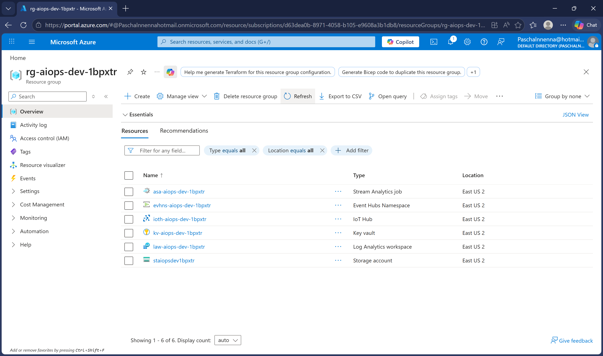
*Resource group rg-aiops-dev-1bpxtr with all foundation resources created via Terraform.*

### Phase 2 — Signal Ingestion Pipeline

IoT Hub routes all device messages to Event Hub via a custom endpoint. Stream Analytics reads from the Event Hub using a dedicated consumer group, applies the anomaly detection query, and flags devices that cross thresholds. The Stream Analytics job auto-starts via a Terraform `null_resource` that runs an Azure CLI command post-deployment — no manual portal interaction required.

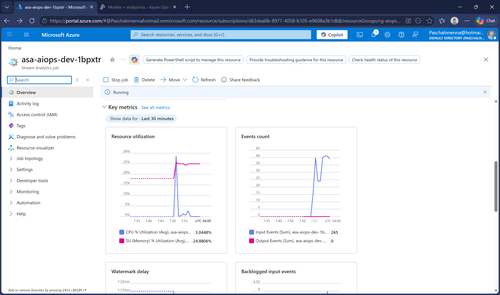
*Stream Analytics job showing Running status with 536 input events received. Job started automatically via Terraform on deployment.*

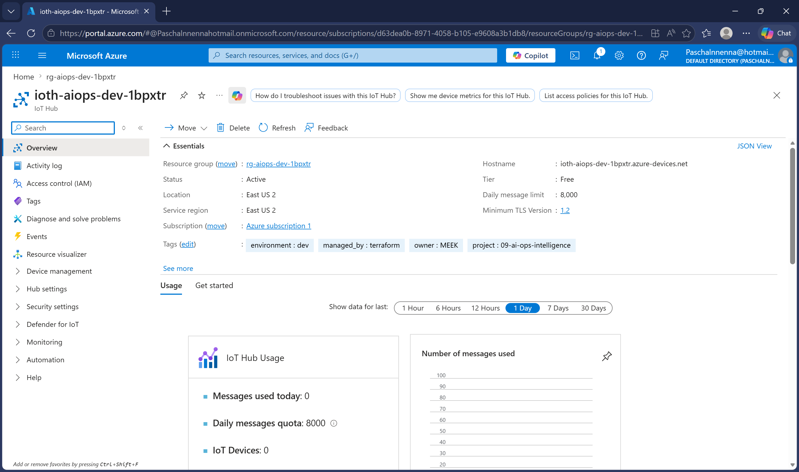
*IoT Hub ioth-aiops-dev-1bpxtr with device registration and message routing to Event Hub configured.*

### Phase 3 — AI Triage Engine

Azure OpenAI deployed in East US with GPT-4o. The triage system prompt instructs the model to confirm or override the pre-classified severity, suppress noise for borderline readings, write a plain English summary readable by an operations manager, and recommend a specific action. The triage function reads fresh messages from the Event Hub, applies Python anomaly detection matching the Stream Analytics thresholds, and sends each flagged device to OpenAI.

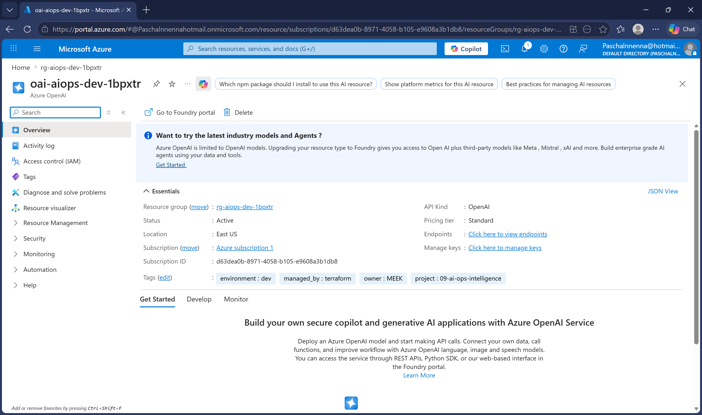
*Azure OpenAI resource oai-aiops-dev-1bpxtr active in East US, Standard tier, ready to receive alert classification requests.*

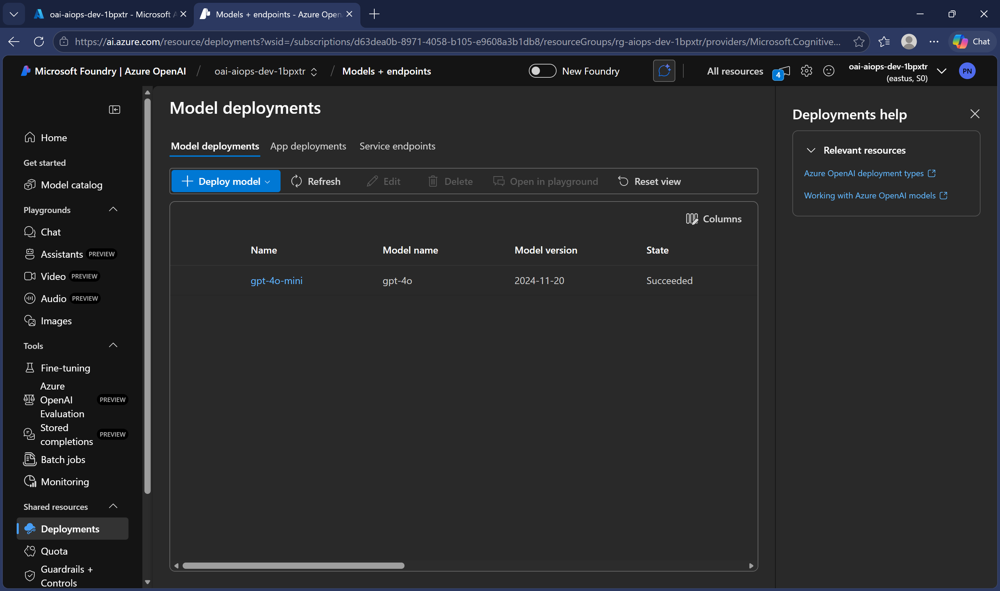
*GPT-4o model deployment visible in the Azure AI Foundry portal.*

### Phase 4 — Orchestration, Monitoring and Notifications

Two Logic App workflows handle orchestration. The alert triage Logic App triggers automatically when a new blob appears in the `alert-triage` container and sends an email with the AI report. The DR validation Logic App runs on a weekly Monday schedule, reads the latest DR report from Blob Storage, and sends it to the ops team.

Azure Monitor alert rules watch the pipeline infrastructure — firing if Stream Analytics encounters errors or IoT Hub starts dropping messages.

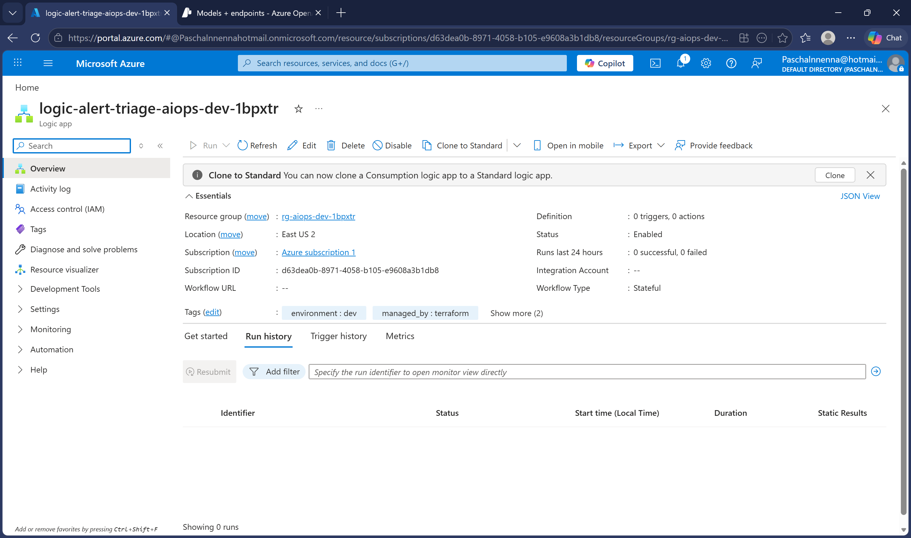
*Logic App logic-alert-triage-aiops-dev-1bpxtr deployed with blob trigger — fires automatically when a new AI triage report is saved.*

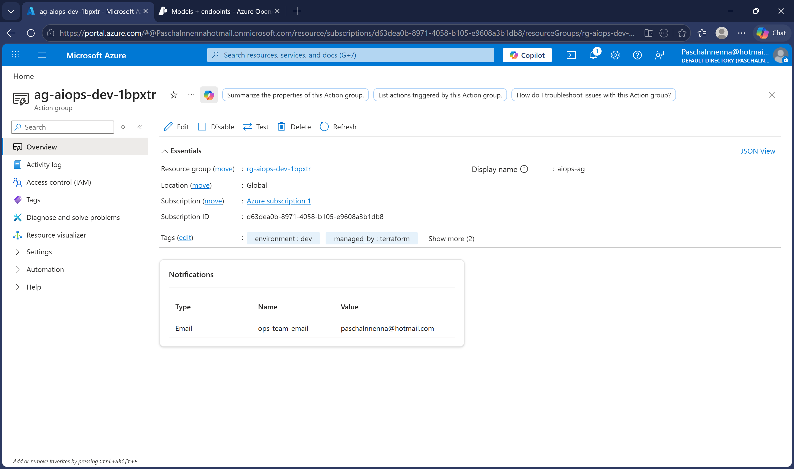
*Action group ag-aiops-dev-1bpxtr configured with email notification for infrastructure alerts.*

### Phase 5 — DR Validation Runbook

The DR validation runbook authenticates via managed identity — no stored credentials anywhere. It checks storage accessibility, simulates a multi-step failover sequence measuring actual execution time, compares measured RTO and RPO against targets, calls Azure OpenAI to write a plain English health report, and saves the report to Blob Storage. The Logic App then picks it up and emails it automatically.

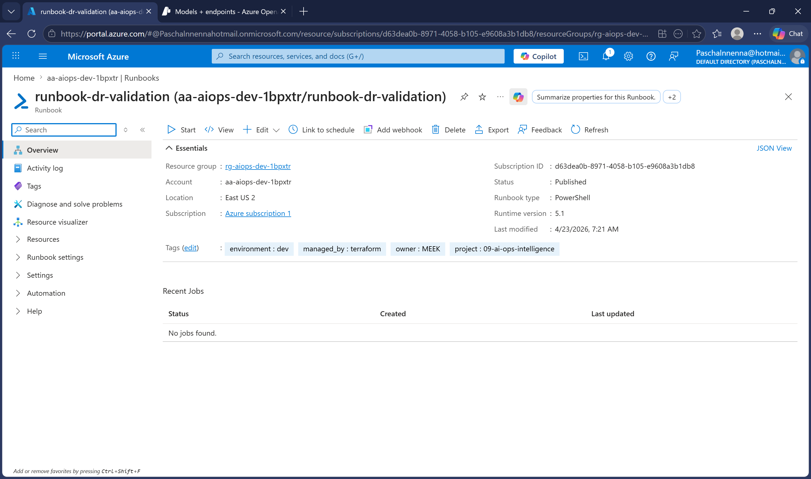
*Runbook runbook-dr-validation published in Automation Account aa-aiops-dev-1bpxtr, linked to weekly Monday 6am UTC schedule.*

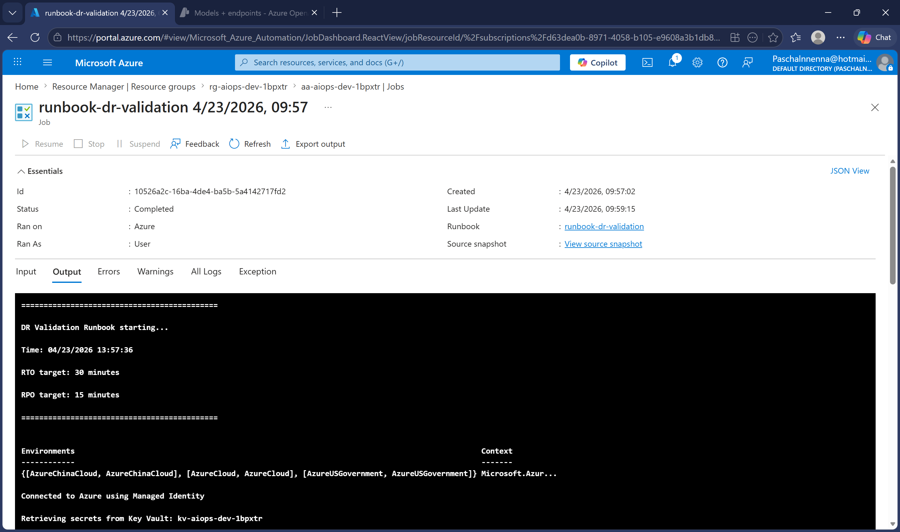
*Runbook job completed successfully. Started 13:57, finished 13:59. RTO: 0.72 minutes. RPO: 8 minutes. Verdict: PASS.*

### Phase 6 — End-to-End Pipeline Test

The telemetry simulator sent 8 devices × 59 cycles to IoT Hub. Anomaly injection fired every 4th cycle with amplified values — conveyor-motor-zone4 hit 105°C with vibration 1.06, imaging-server-01 hit 100% CPU with 4.7% packet loss, network-switch-floor2 showed 5.86% packet loss alongside elevated CPU.

The triage function read fresh messages from the Event Hub, applied anomaly detection, and sent 3 flagged devices to Azure OpenAI. The AI classified all 3 as CRITICAL — upgrading network-switch-floor2 from WARNING because it caught the correlated packet loss and CPU signal together.

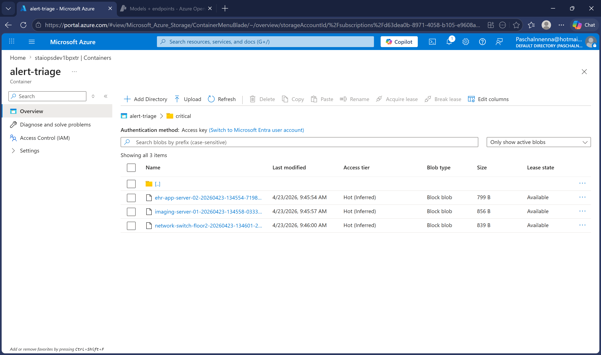
*Blob Storage container alert-triage showing 3 AI-generated critical triage reports saved automatically after the pipeline ran.*

The DR validation report was delivered to the ops team inbox automatically:

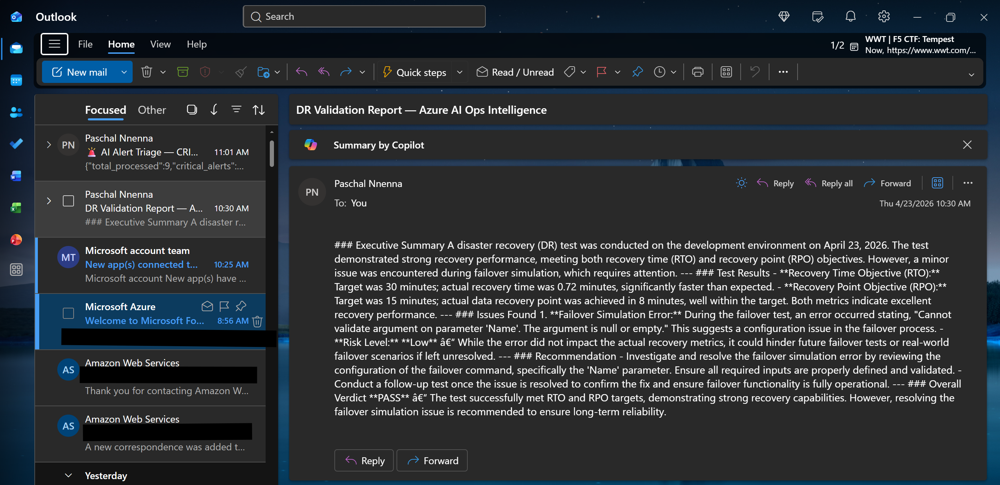
*AI-generated DR health report delivered to ops team email via Logic App. RTO: 0.72 minutes (target: 30). RPO: 8 minutes (target: 15). Verdict: PASS.*

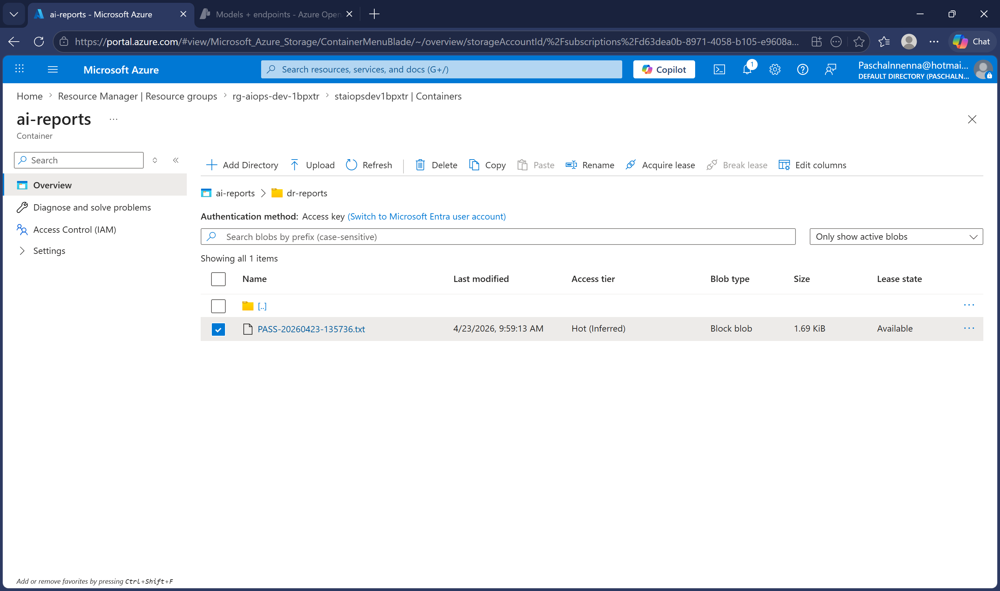
*DR health report saved to Blob Storage under ai-reports/dr-reports/ with PASS prefix.*

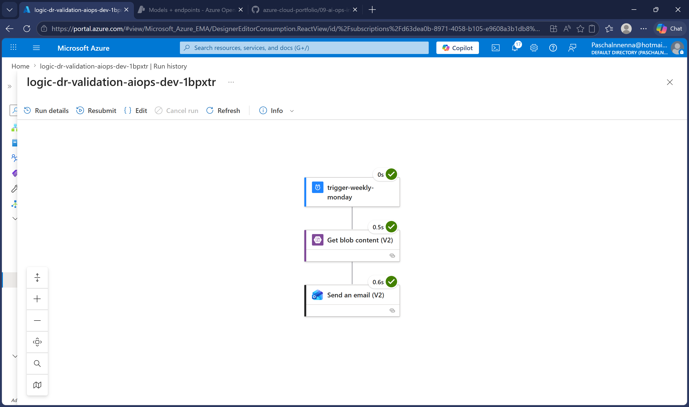
*Logic App run history showing all steps completed — weekly trigger, blob read, email sent.*

## What This Automates

| Manual Process | Automated Solution |
|---|---|
| Read through hundreds of alerts manually | Triage function detects anomalies and calls OpenAI automatically |
| Write incident summaries by hand | GPT-4o generates plain English verdict with recommended action |
| Escalate based on gut feel | AI confirms or upgrades severity based on correlated signals |
| Run DR tests manually once per quarter | Automation Runbook runs every Monday at 6am UTC |
| Write DR reports for compliance | OpenAI generates human-readable report saved to Blob Storage |
| Email the team manually | Logic Apps deliver reports automatically to inbox |

## Troubleshooting and Lessons Learned

### Stream Analytics UNION ALL Query Not Supported
The original query used two separate SELECT INTO statements joined with UNION ALL. Azure Stream Analytics does not support writing to the same output from two separate SELECT statements in this pattern. Resolved by consolidating into a single SELECT with CASE expressions handling both warehouse and healthcare device types.

### Stream Analytics Output Events Remained Zero
After fixing the query syntax, output events remained zero despite 536+ input events. Root cause: the job was started with JobStartTime mode, meaning it only processes messages arriving after the job starts. Historical messages in the Event Hub backlog were counted as input events but their time windows had already closed. Resolved by changing the triage function to read directly from the Event Hub with a hard 20-second timer and applying Python anomaly detection, bypassing the output dependency.

### Logic App Blob Trigger 403 Forbidden
The service principal created for the Logic App connection had Automation Operator role but no Storage permissions. Resolved by adding Storage Blob Data Reader role assignment at the storage account scope.

### DR Runbook Missing Key Vault Name
The runbook failed on first execution because the KEY_VAULT_NAME environment variable was empty in the Automation Account runtime. Resolved by passing KeyVaultName as an explicit parameter when starting the runbook job.

### IoT Hub Rebuilding on Every Terraform Apply
Terraform detected drift on the min_tls_version attribute that Azure sets by default. Fixed by adding it to the lifecycle ignore_changes block in iothub.tf.

### GPT-4o-mini Version Retired
The gpt-4o-mini version 2024-07-18 model was deprecated on March 31, 2026. Resolved by switching to gpt-4o version 2024-11-20.

## Technologies Used

Terraform · Azure IoT Hub · Azure Event Hub · Azure Stream Analytics · Azure OpenAI (GPT-4o) · Azure Automation · PowerShell · Python · Azure Logic Apps · Azure Blob Storage · Azure Key Vault · Azure Monitor · Azure Log Analytics · Managed Identity · Azure RBAC
