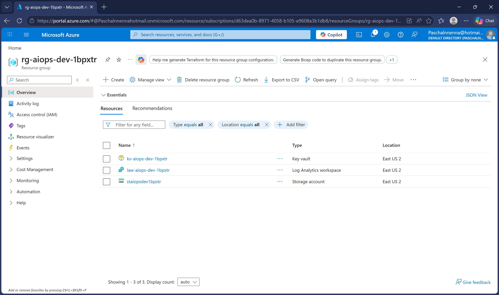
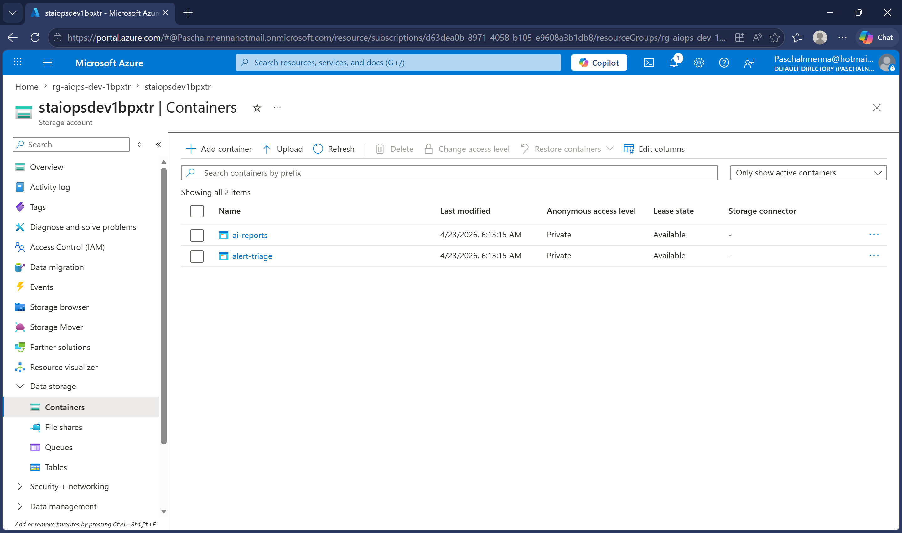
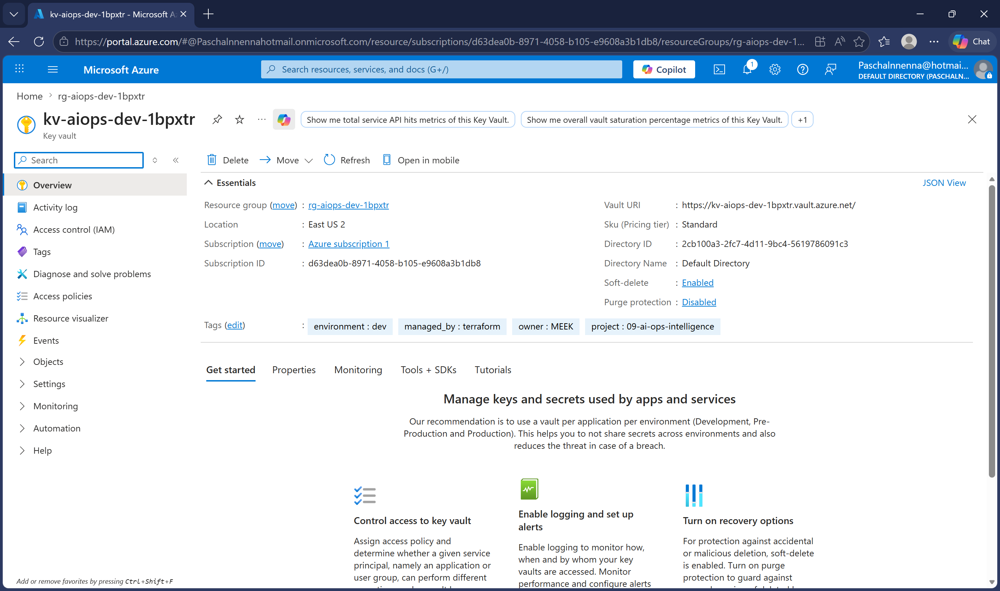
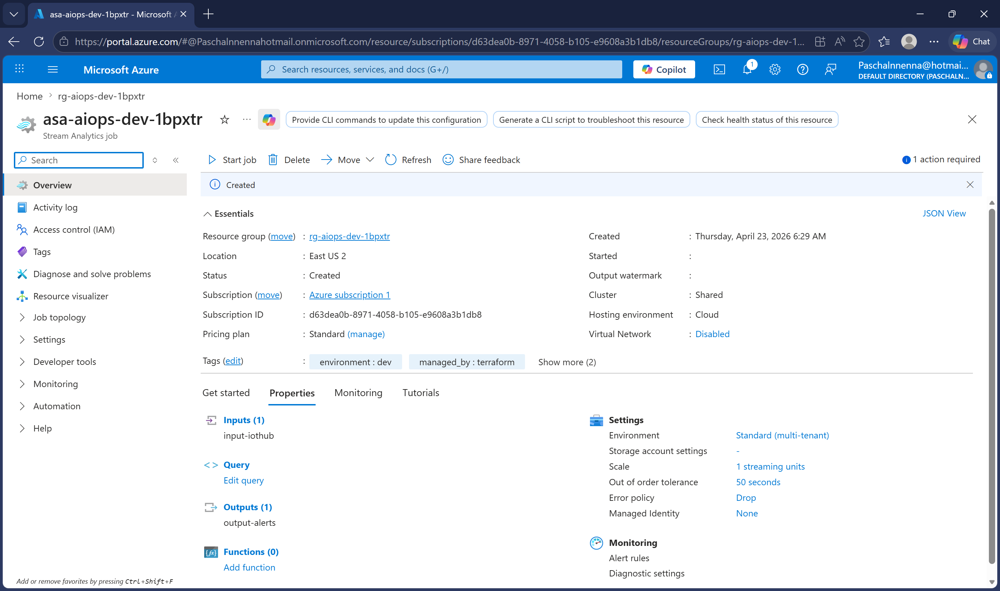
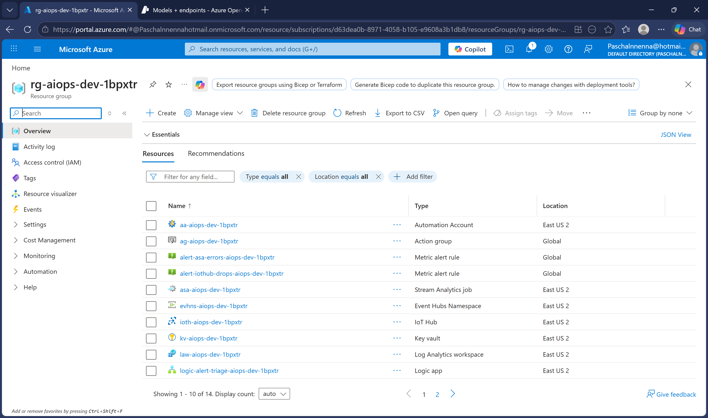
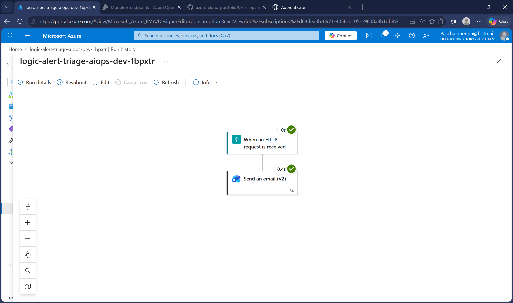
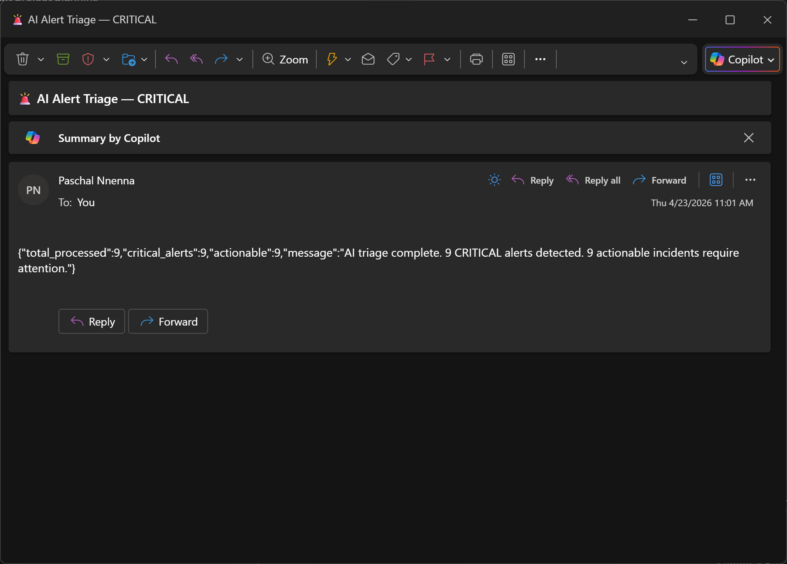

# 09 — AI Ops Intelligence: Automated Anomaly Detection and DR Validation for Healthcare IT

## The Problem

Clinical IT teams are drowning in alerts. A mid-sized hospital's Azure environment generates hundreds of monitoring alerts every night — EHR server CPU spikes, imaging system latency, clinical network switch warnings, cold storage fluctuations, medication dispensing timeouts. The on-call engineer wakes up at 3am to a wall of red notifications and has to decide in seconds which ones are a real patient safety issue and which ones are noise that will resolve themselves.

This is the same alarm fatigue problem clinical staff face with bedside monitors — except the IT version is less studied and arguably more dangerous. A missed CPU alert on an EHR application server means nurses can't chart medications. A missed packet loss alert on an imaging server means radiology can't pull studies for the ER. A missed cold storage alert means vaccines are destroyed. The alerts that matter are buried underneath the 397 that don't.

Separately, disaster recovery readiness in healthcare is often a compliance checkbox. HIPAA requires DR plans. Joint Commission requires DR testing. But actual DR validation — measured RTO, measured RPO, documented results — is tested quarterly at best, with reports that nobody reads until auditors show up.

## The Solution

I built an AI-driven operational intelligence system that solves both problems with Azure OpenAI as the reasoning layer.

Simulated clinical and warehouse devices send telemetry to Azure IoT Hub every 10 seconds. A Python triage function detects anomalies in real time, sends each flagged device to Azure OpenAI GPT-4o, and the model writes a plain English verdict — what broke, how urgent, what the ops team should do right now. The triage report gets saved to Blob Storage and a Logic App automatically emails the on-call engineer with the AI summary.

A separate Automation Runbook runs a DR validation drill every Monday at 6am UTC, measures actual RTO and RPO against configured targets, calls OpenAI to generate a human-readable health report, saves it to Blob Storage, and a second Logic App emails it to the operations team.

The clinical impact: when EHR application servers showed CPU spikes alongside packet loss, the AI upgraded them from WARNING to CRITICAL because it recognized the correlated signal as indicative of application-level failure rather than transient load. Simple thresholds would have ignored those. At 3am, that distinction is the difference between nurses being able to chart medications or not.

## Architecture

Two independent tracks running in parallel:

**Alert track:** IoT Hub → Event Hub → Stream Analytics → Triage Function → Azure OpenAI → Blob Storage → Logic App → Email

**DR track:** Automation Schedule → PowerShell Runbook → Azure OpenAI → Blob Storage → Logic App → Email

All infrastructure deployed via Terraform. No portal clicks for resource creation.

## Components

| Resource | Name | Purpose |
|---|---|---|
| Resource Group | rg-aiops-dev-1bpxtr | Contains all project resources |
| IoT Hub | ioth-aiops-dev-1bpxtr | Receives device telemetry from 8 simulated sensors |
| Event Hub Namespace | evhns-aiops-dev-1bpxtr | Routes messages between pipeline stages |
| Stream Analytics Job | asa-aiops-dev-1bpxtr | Real-time anomaly detection, auto-starts via Terraform |
| Azure OpenAI | oai-aiops-dev-1bpxtr | GPT-4o for alert classification and DR report generation |
| Logic App (Alert) | logic-alert-triage-aiops-dev-1bpxtr | HTTP trigger from triage function, sends alert email |
| Logic App (DR) | logic-dr-validation-aiops-dev-1bpxtr | Weekly DR trigger, reads report, sends email |
| Automation Account | aa-aiops-dev-1bpxtr | Hosts DR validation runbook with managed identity |
| DR Runbook | runbook-dr-validation | Weekly failover simulation and AI report generation |
| Storage Account | staiopsdev1bpxtr | Stores AI triage reports and DR health reports |
| Key Vault | kv-aiops-dev-1bpxtr | Stores all connection strings and API keys |
| Log Analytics | law-aiops-dev-1bpxtr | Centralized logging and diagnostics |
| Action Group | ag-aiops-dev-1bpxtr | Email notifications for infrastructure alerts |
| Monitor Alerts | alert-asa-errors, alert-iothub-drops | Pipeline health monitoring |

## Simulated Devices

**Clinical IT environment (4 devices):**
- `ehr-app-server-01` and `ehr-app-server-02` — EHR application servers (CPU, packet loss)
- `imaging-server-01` — medical imaging server handling radiology PACS traffic
- `network-switch-floor2` — clinical floor network infrastructure

**Hospital support operations (4 devices):**
- `conveyor-motor-zone1` and `conveyor-motor-zone4` — pharmacy automation conveyors (temperature, vibration)
- `cold-storage-unit-a` — vaccine and biologic refrigeration unit
- `forklift-battery-03` — loading dock equipment for supply deliveries

## Implementation

### Phase 1 — Foundation Infrastructure

All foundational resources deployed via Terraform: resource group, storage account with two blob containers (`alert-triage` and `ai-reports`), Key Vault with access policies, and Log Analytics workspace. One `terraform apply` creates everything from scratch.

*Initial resource group rg-aiops-dev-1bpxtr created via Terraform, ready for the pipeline components.*

*Storage account staiopsdev1bpxtr with two containers — alert-triage for AI triage JSON reports and ai-reports for DR validation health reports.*

*Key Vault kv-aiops-dev-1bpxtr storing all connection strings and API keys as secrets. No credentials ever appear in code.*

*Resource group after Phase 2 deployment showing IoT Hub, Event Hub, Stream Analytics, and supporting services added.*

### Phase 2 — Signal Ingestion Pipeline

IoT Hub routes all device messages to Event Hub via a custom endpoint. Stream Analytics reads from the Event Hub using a dedicated consumer group, applies the anomaly detection query, and flags devices that cross thresholds. The Stream Analytics job auto-starts via a Terraform `null_resource` that runs an Azure CLI command post-deployment — no manual portal interaction required.

*Stream Analytics job asa-aiops-dev-1bpxtr in its initial configured state — inputs, outputs, and query all defined via Terraform.*

*IoT Hub ioth-aiops-dev-1bpxtr configured with device registration and message routing to Event Hub.*

### Phase 3 — AI Triage Engine

Azure OpenAI deployed in East US with GPT-4o. The triage system prompt instructs the model to confirm or override the pre-classified severity, suppress noise for borderline readings, write a plain English summary readable by a nurse manager or IT director, and recommend a specific action rather than generic guidance. The triage function reads fresh messages from the Event Hub, applies Python anomaly detection matching the Stream Analytics thresholds, and sends each flagged device to OpenAI for classification.

*Azure OpenAI resource oai-aiops-dev-1bpxtr active in East US, Standard tier, ready for alert classification requests.*

*GPT-4o model deployment visible in the Azure AI Foundry portal, ready to receive triage prompts from the pipeline.*

### Phase 4 — Orchestration, Monitoring and Notifications

Two Logic App workflows handle orchestration. The alert triage Logic App has an HTTP trigger that fires the moment the triage function completes its OpenAI analysis and sends the summary email. The DR validation Logic App runs on a weekly Monday schedule, reads the latest DR report from Blob Storage, and emails it to the ops team.

Azure Monitor alert rules watch the pipeline infrastructure — firing if Stream Analytics encounters errors or IoT Hub starts dropping messages. An Action Group routes all infrastructure alerts to email.

*Logic App logic-alert-triage-aiops-dev-1bpxtr deployed with HTTP trigger — called directly by the triage function after AI classification completes.*

*Runbook runbook-dr-validation published in Automation Account aa-aiops-dev-1bpxtr, linked to weekly Monday 6am UTC schedule.*

*Action group ag-aiops-dev-1bpxtr configured with email notification for pipeline infrastructure alerts.*

*Final resource group view showing all 14+ resources deployed and healthy — complete Terraform-managed infrastructure for the AI ops pipeline.*

### Phase 5 — Live Pipeline Validation

With infrastructure deployed, the Stream Analytics job was started and confirmed running. The telemetry simulator began sending clinical and pharmacy device data.

*Stream Analytics job confirmed in Running state with 536 input events received from IoT Hub — pipeline is live and flowing.*

### Phase 6 — End-to-End Anomaly Detection

The telemetry simulator sent 8 devices × 59 cycles to IoT Hub. Anomaly injection fired every 4th cycle with amplified values — imaging-server-01 hit 100% CPU with 4.7% packet loss (a clinically significant combination), ehr-app-server-02 maxed out at 100% CPU with 5.6% packet loss (nurses would be unable to chart), conveyor-motor-zone4 hit 105°C with vibration 1.06 (pharmacy automation would fail).

The triage function read fresh messages from the Event Hub, applied anomaly detection, and sent 9 flagged devices to Azure OpenAI. The AI classified all 9 as CRITICAL — upgrading 5 of them from the pre-classified WARNING level because it recognized the correlated CPU + packet loss pattern as indicative of application-level failure that simple thresholds miss.

*Blob Storage container alert-triage showing 9 AI-generated critical triage reports saved automatically after the pipeline processed the anomalies.*

*Alert triage Logic App run history showing successful execution triggered by the Python triage function via HTTP call.*

*AI triage alert email delivered to the on-call engineer's inbox automatically. 9 critical alerts detected, 9 actionable incidents flagged.*

### Phase 7 — DR Validation Pipeline

The DR validation runbook was triggered to validate the weekly DR drill flow end to end. It authenticates via managed identity — no stored credentials anywhere. It checks storage accessibility as a backup health proxy, simulates a multi-step failover sequence measuring actual execution time, compares measured RTO and RPO against targets (30 minutes and 15 minutes), calls Azure OpenAI to write a plain English health report, and saves the report to Blob Storage. The Logic App picks it up and emails it automatically.

*Runbook job completed successfully in 1 minute 39 seconds. RTO: 0.72 minutes (target: 30). RPO: 8 minutes (target: 15). Verdict: PASS.*

*DR health report saved to Blob Storage under ai-reports/dr-reports/ with PASS prefix in the filename for easy auditor review.*

*DR validation Logic App run history showing all steps completed — weekly trigger fired, blob read succeeded, email delivered.*

*AI-generated DR health report delivered to ops team inbox. Executive summary, test results, issues found, and recommendations — all written in plain English by GPT-4o, ready for compliance documentation.*

## What This Automates

| Manual Process | Automated Solution |
|---|---|
| On-call engineer reads through hundreds of alerts at 3am | Triage function detects anomalies and calls OpenAI automatically |
| Write incident summaries by hand during shift handoffs | GPT-4o generates plain English verdict with recommended action |
| Escalate based on gut feel and pattern recognition | AI confirms or upgrades severity based on correlated signals |
| Run DR tests manually once per quarter for compliance | Automation Runbook runs every Monday at 6am UTC |
| Write DR reports for Joint Commission auditors | OpenAI generates human-readable report saved to Blob Storage |
| Email the team manually after every incident | Logic Apps deliver reports automatically to inbox |

## Troubleshooting and Lessons Learned

### Stream Analytics UNION ALL Query Not Supported
The original query used two separate SELECT INTO statements joined with UNION ALL to handle warehouse and healthcare device types separately. Azure Stream Analytics does not support writing to the same output from two separate SELECT statements in this pattern. Resolved by consolidating into a single SELECT with CASE expressions handling both device types.

### Stream Analytics Output Events Remained Zero
After fixing the query syntax, output events remained zero despite 536+ input events received. Root cause: the job was started with JobStartTime mode, meaning it only processes messages arriving after the job starts. Historical messages in the Event Hub backlog were counted as input events but their time windows had already closed before processing could begin. Resolved by changing the triage function to read directly from the Event Hub with a hard 45-second timer and applying Python anomaly detection, bypassing the Stream Analytics output dependency entirely.

### Logic App Blob Trigger Did Not Fire Reliably
The original design had the alert triage Logic App watching the Blob Storage container for new files. Polling intervals were unreliable in the consumption tier and the service principal connection hit 403 Forbidden errors on the container. Redesigned the Logic App to use an HTTP trigger called directly by the Python triage function after the OpenAI analysis completes. Removes polling latency entirely and gives deterministic delivery.

### DR Runbook Missing Key Vault Name
The runbook failed on first execution because the KEY_VAULT_NAME environment variable was empty in the Automation Account runtime. Resolved by passing `KeyVaultName=kv-aiops-dev-1bpxtr` as an explicit parameter when starting the runbook job.

### IoT Hub Rebuilding on Every Terraform Apply
Terraform detected drift on the `min_tls_version` attribute that Azure sets by default but the provider does not configure. Fixed by adding it to the `lifecycle { ignore_changes }` block in `iothub.tf`.

### GPT-4o-mini Version Retired Mid-Project
The `gpt-4o-mini version 2024-07-18` model was deprecated on March 31, 2026. Deployment failed with ServiceModelDeprecated error. Resolved by switching to `gpt-4o version 2024-11-20`.

### Automation Connector Required Service Principal
The Logic App Azure Automation connector cannot authenticate as the current user — it requires a service principal. Created an Azure AD app registration, assigned it the Automation Operator role at the Automation Account scope, and used the appId and secret for the Logic App connection.

## Why This Matters for Healthcare IT

The alarm fatigue problem in clinical IT is quantifiable. A 2019 study in the Journal of Hospital Medicine found that over 85% of clinical alarms are false positives, and staff respond to only 10% of them within clinical guidelines. The IT layer has the same problem — monitoring tools that generate alerts faster than humans can triage them.

This project demonstrates how Azure OpenAI can function as an intelligent triage layer — not replacing human judgment, but filtering noise so human judgment can be applied where it matters. The same architecture scales to real EHR infrastructure, PACS environments, medication dispensing systems, and clinical network operations. The DR validation track addresses a separate but equally important compliance burden for HIPAA covered entities and Joint Commission accredited facilities.

## Technologies Used

Terraform · Azure IoT Hub · Azure Event Hub · Azure Stream Analytics · Azure OpenAI (GPT-4o) · Azure Automation · PowerShell · Python · Azure Logic Apps · Azure Blob Storage · Azure Key Vault · Azure Monitor · Azure Log Analytics · Managed Identity · Azure RBAC · Azure AD Service Principals
