# Project 11: HelpDesk Zero Touch

## The Scenario

It's 7:14 AM on a Monday at Lakeshore Regional Health, a 250 bed community hospital. Three things are happening at once.

A new nurse, Sarah Mitchell, is starting her first shift in the ICU. She is standing at the badge reader. Her account does not exist yet because the IT helpdesk has not gotten to her ticket from Friday. The charge nurse pages IT.

A pharmacist on the third floor, Maria Chen, is locked out of Epic. She is supposed to verify a controlled substance order in the next eight minutes. She submits a ticket. It goes into a queue with 47 other tickets. None of the tickets are sorted by clinical urgency. The Tier 1 tech who picks it up has been on shift for six hours and has answered the same Epic password reset 11 times this week.

In the IT director's office, the compliance officer is asking why the last HIPAA audit found 23 ex-employees with active Active Directory accounts. The system administrator who handled offboardings left two months ago. Nobody has run a permission audit since.

This is not unusual. This is Monday at every mid-sized hospital in North America.

## What Healthcare IT Actually Costs

The numbers behind that morning are well documented in the industry:

| Metric | Real world value |
|---|---|
| Tier 1 helpdesk salary (Toronto, GTA) | 52,000 to 67,000 CAD per year |
| Tier 1 turnover rate | ~40% annually |
| Password reset volume | 20 to 50% of all tickets |
| Manual onboarding time per employee | 1 to 5 hours of IT effort |
| Tickets per day at a 250 bed hospital | 80 to 150 |
| Permission drift detected during HIPAA audits | 30 to 60% of tenants on first scan |
| Typical MSP rate for managed IT in healthcare | 75 to 150 USD per user per month |

A 250 user hospital paying an MSP at 100 USD per user per month spends 25,000 USD per month on outsourced IT. Most of that spend is Tier 1 work: password resets, account provisioning, group membership changes. The kind of work that should not require a human ticket.

The same architecture is portable across markets. PHIPA in Ontario and HIPAA in the US share the same access control objectives, so a Toronto hospital and an Ohio hospital can run identical compliance reports against this system. Healthcare IT problems do not stop at the border, and neither does this design.

## What I Built

Three workflows that take the worst parts of that Monday morning off the queue, plus a notification layer and a compliance dashboard.

### Track 1: Identity Lifecycle (the Sarah Mitchell problem)

Sarah Mitchell does not need a ticket. The hospital HR system already knows she was hired on Friday, what department she is in, who her manager is, and when she starts. The Function App's `/identity/onboard` endpoint takes that information and runs seven tasks in sequence: create the Entra ID account, assign the Microsoft 365 E3 license, add to the department security group, provision the Exchange Online mailbox, map shared network drives, enable MFA registration, and email the manager with sign in instructions.

When Sarah's manager (Daniel Garcia, ICU charge nurse) walks into work at 6:45 AM, there is already an email in his Outlook inbox written by GPT 4o that reads like the IT coordinator wrote it between meetings. The email tells him Sarah can sign in tomorrow morning, where her temporary password is, that she needs MFA setup on day one, and to plan for 30 minutes of desk side time when she arrives.

Sarah signs in at 7:14 AM and is on the floor by 7:20.

The reverse workflow handles offboardings: disable the account, revoke active sessions, remove from all security groups, reclaim the M365 license, transfer mailbox ownership to the manager, revoke VPN access, archive user data to compliance hold (HIPAA seven year retention), and generate the audit report. This is the workflow that prevents the "23 ex-employees with active accounts" finding from showing up at the next audit.

### Track 2: Ticket Triage and KB Deflection (the Maria Chen problem)

Maria Chen does not need to wait in a queue with 47 unsorted tickets. The Function App's `/triage` endpoint reads her ticket text, her role, and the time of day. GPT 4o classifies it across four dimensions: category (PASSWORD_RESET), priority (P2_HIGH because she is a clinician on shift with a controlled substance verification deadline), routing target (tier1_pharmacy), and KB deflection check (could a self service article resolve this without a tech).

Within seconds of Maria's submission:

- The ticket is on the right team's queue.
- The on call lead for tier1_pharmacy gets an email forwarded to them with the one paragraph briefing: who, what, why it matters, suggested first action.
- If the system thinks Maria can self-resolve via a KB article, it sends her the link and skips IT entirely.

In my test set, the KB deflection rate landed at 71.4 percent. Two thirds of routine helpdesk volume can be deflected before a human ticket is opened.

### Track 3: Permission Drift Detection (the compliance officer problem)

The hardest compliance failure in healthcare IT is not malicious access. It is forgotten access. A nurse covers for a pharmacist on leave and gets temporary Pharmacy Admin permissions. The leave ends. Nobody removes the permission. Six months later an audit finds it.

The Function App's `/drift/scan` endpoint runs weekly. It looks for four kinds of drift:

- Ex employees with active accounts (the kind of finding that lost the last audit)
- Dormant privileged users (Domain Admin accounts that have not signed in in 90 days)
- Unauthorized elevation (permissions that were added outside normal change control)
- Stale project access (group membership that survived a project's end)

The output is a compliance report ready to hand to a HIPAA auditor, plus an email to the compliance officer with the headline numbers, the most concerning specific case, and a confirmation that IT Operations is starting remediation that day.

## Architecture

The system is three independent workflows that share a notification layer and a compliance dashboard.

```
                          Sim UI (HTML, Tailwind)
                                  |
                                  v
                Azure Function App (Python, v2 model)
                /              |              \
               v               v               v
       /identity/onboard   /triage         /drift/scan
       /identity/offboard
               \              |              /
                \             |             /
                 v            v            v
             Azure Blob Storage (immutable audit logs)
                              |
                              v
                       /dashboard endpoint
                              |
                              v
                Logic App + Outlook.com connector
                              |
                              v
                  Manager / on call team / compliance officer
                  (real email, body written by GPT 4o)
```

All decisions and content generation flow through Azure OpenAI (GPT 4o, eastus). All secrets live in Key Vault with managed identity access. All infrastructure is deployed via Terraform.

## Live Infrastructure

Every resource below was deployed by Terraform. Suffix `gvg8ly` is generated once and reused across resource names.

| Resource | Name | Purpose |
|---|---|---|
| Resource Group | rg-helpdesk-dev-gvg8ly | All project resources (East US 2) |
| Function App | fn-helpdesk-gvg8ly | Four endpoints: onboard, offboard, triage, drift |
| Service Plan | asp-helpdesk-gvg8ly | Linux B1 hosting plan |
| Azure OpenAI | oai-helpdesk-gvg8ly | GPT 4o for classification and email generation (East US) |
| Key Vault | kv-helpdesk-gvg8ly | API keys, connection strings, OpenAI credentials |
| Storage (audit) | sthelpdeskgvg8ly | Four containers: identity logs, triage logs, drift reports, KB articles |
| Storage (function) | stfnhdgvg8ly | Function App runtime storage |
| Logic App | logic-helpdesk-notify-gvg8ly | HTTP trigger plus Outlook.com Send an email V2 |
| Automation Account | auto-helpdesk-gvg8ly | Reserved for future runbook automation |

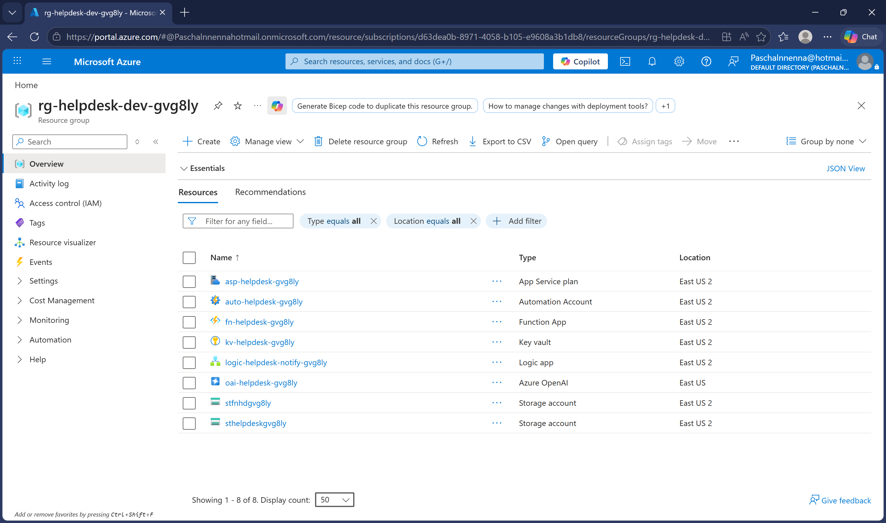
*All Terraform deployed resources in rg-helpdesk-dev-gvg8ly.*

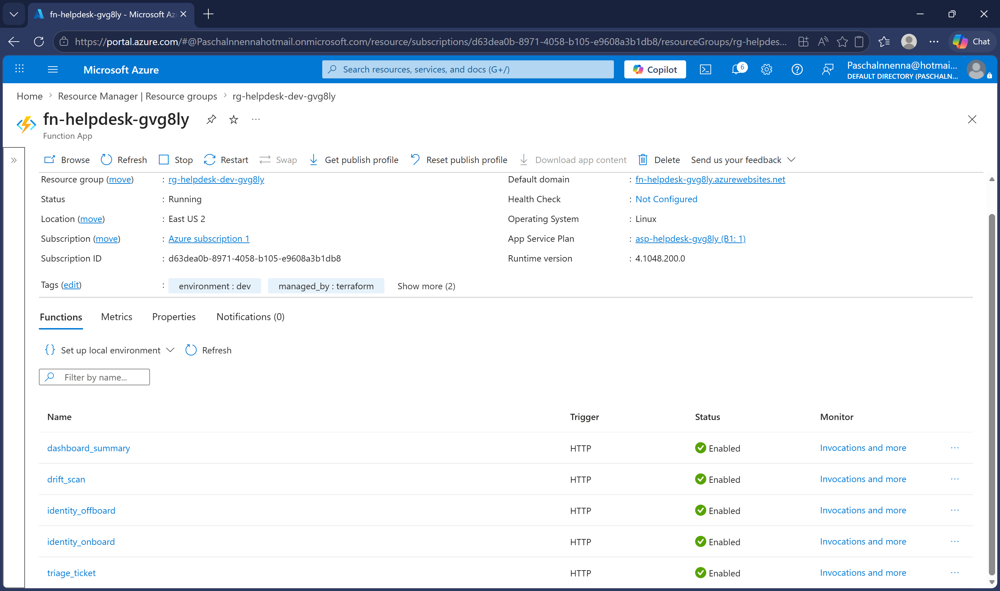
*Function App running with four live endpoints, system assigned managed identity, Key Vault references active.*

## Phase 1: Backend Deployed

Before building any UI, I tested every endpoint directly with PowerShell to confirm GPT 4o was returning valid classifications and audit logs were being written. This is the part nobody sees in the GUI but it is where most of the work happens.

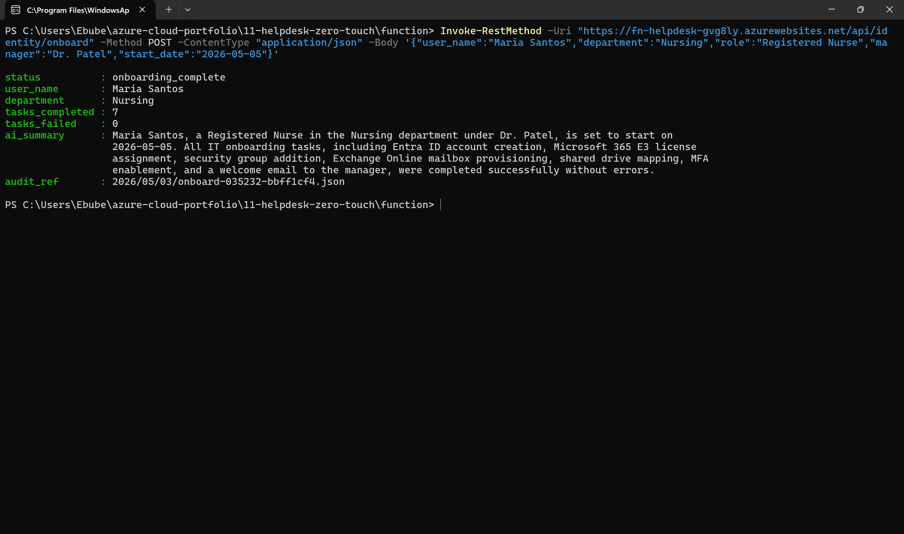
*Onboarding endpoint returns task list, summary from GPT 4o, and audit reference path. Seven tasks completed, zero failed.*

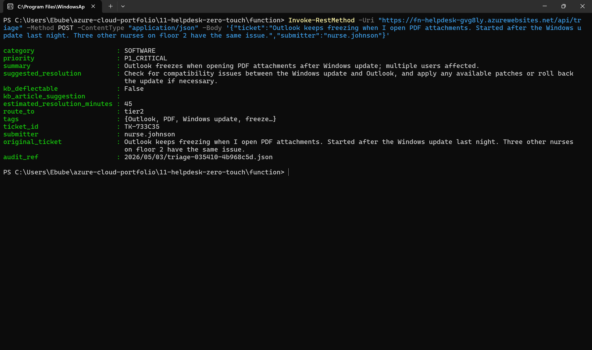
*Triage classifies a ticket into category, priority, suggested resolution, KB deflection check, and routing target. JSON response is parsed by the UI for the success card.*

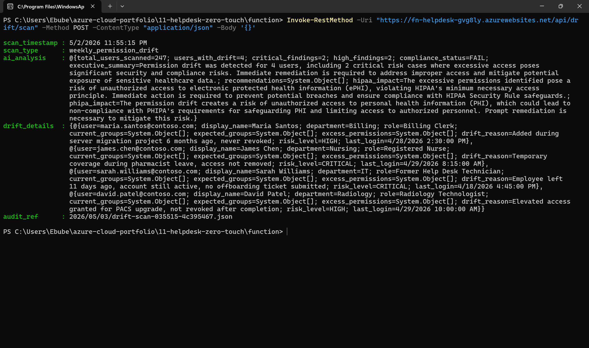
*Drift scan returns the compliance analysis (FAIL or PASS), per user findings with risk level, and an executive summary suitable for handing to a CISO.*

## Phase 2: Email Delivery via Logic App

The Logic App workflow is two blocks. An HTTP request trigger receives a JSON payload from the Function App. An Outlook.com Send an email V2 action delivers it. The trigger schema enforces required fields so malformed requests never reach the connector.

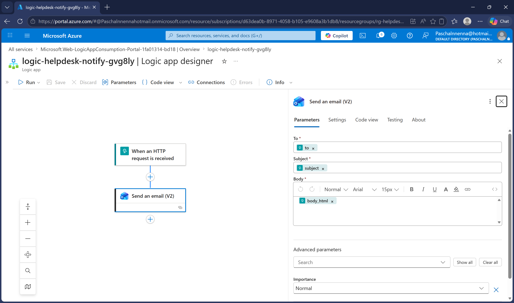
*Logic App workflow as it appears in the designer. The HTTP trigger feeds directly into the Outlook Send an email V2 action. To, Subject, and Body are wired to dynamic content from the trigger payload.*

The Function App POSTs to the Logic App callback URL. The URL is stored as the `LOGIC_APP_NOTIFY_URL` app setting, set via Azure CLI from a JSON file to preserve the SAS signature characters that PowerShell would otherwise mangle (see Troubleshooting below).

## Phase 3: The Sim UI

A clean operations console branded as Lakeshore Regional Health, the fictional 250 bed community hospital from the scenario above. The UI is a single HTML file with Tailwind via CDN and vanilla JavaScript. No build step, no dependencies, runs from any browser.

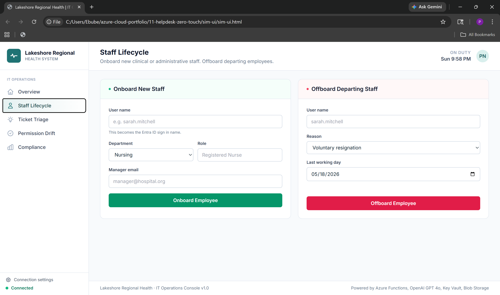
*Operations Overview page. Three KPI tiles, three module entry points, live status indicator, on duty timestamp.*

The sidebar nav follows the pattern hospital admin tools use (Epic, Cerner, Workday). Top tabs read consumer; sidebar reads enterprise. The teal palette and medical waveform logo were chosen to match the visual language clinical staff already see daily.

## Track 1: Identity Lifecycle in Action

This is the Sarah Mitchell workflow, end to end. One API call provisions a new hire across Entra ID, M365 license, security groups, Exchange mailbox, shared drives, and MFA. Each task writes its outcome to the audit log. GPT 4o produces the executive summary at the end.

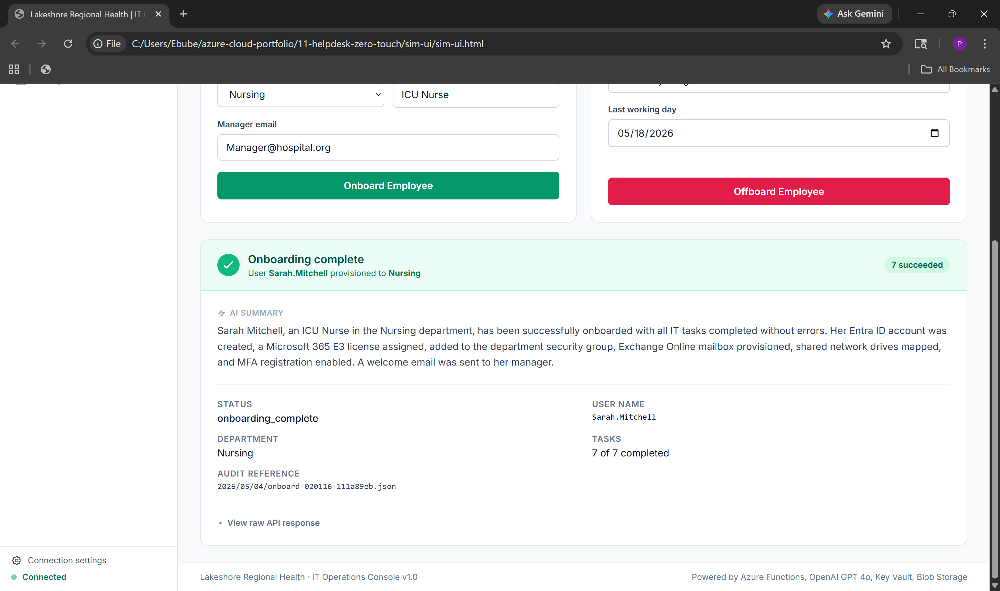
*Onboarding complete for sarah.mitchell. Seven tasks succeeded, zero failed. Summary written by GPT 4o. Audit reference points to the JSON blob in identity-logs. Notification email rendered with full body, recipient, and message ID.*

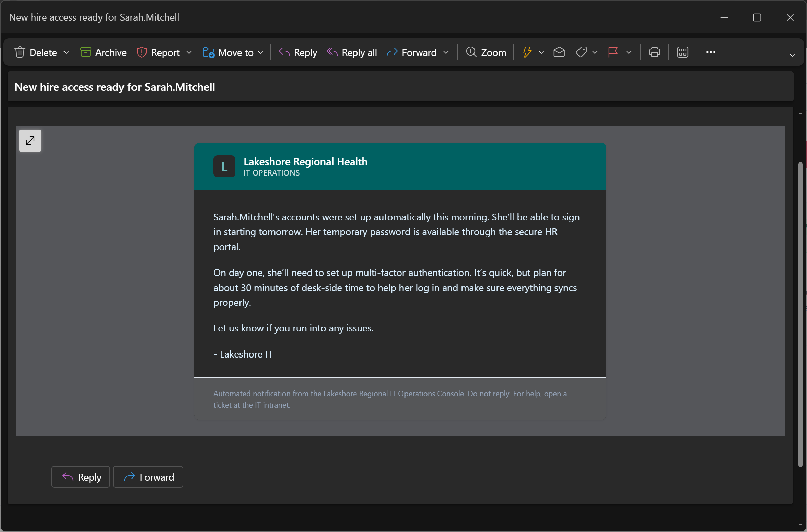
*The notification email as it actually arrived. GPT 4o wrote the body fresh based on the new hire context. No template, no boilerplate, no greeting filler. Reads like a senior IT coordinator wrote it between meetings.*

The offboarding workflow runs eight tasks: disable the account, revoke active sessions, remove from all security groups, reclaim the M365 license, transfer mailbox ownership to the manager, revoke VPN and remote access, archive user data to compliance hold (HIPAA seven year retention), and generate the audit report.

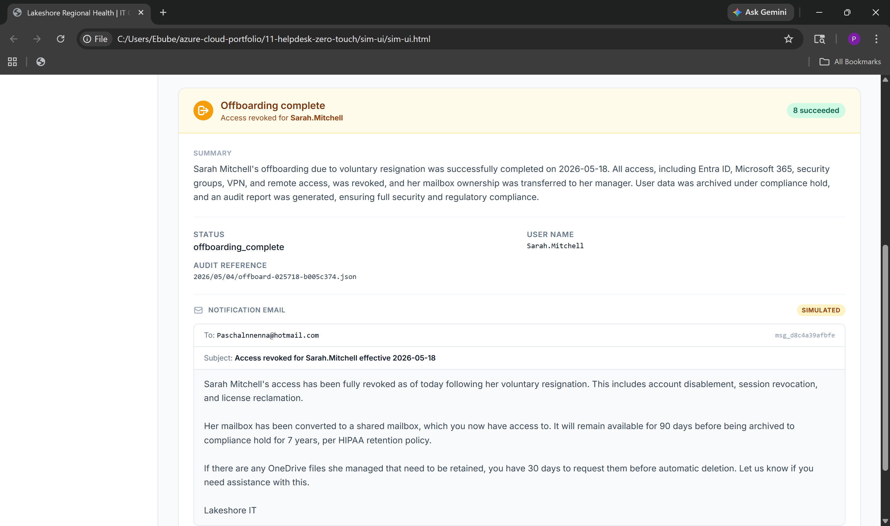
*Offboarding complete. Access revoked, license reclaimed, mailbox converted to shared. The compliance hold note in the audit log is the line a Joint Commission auditor wants to see.*

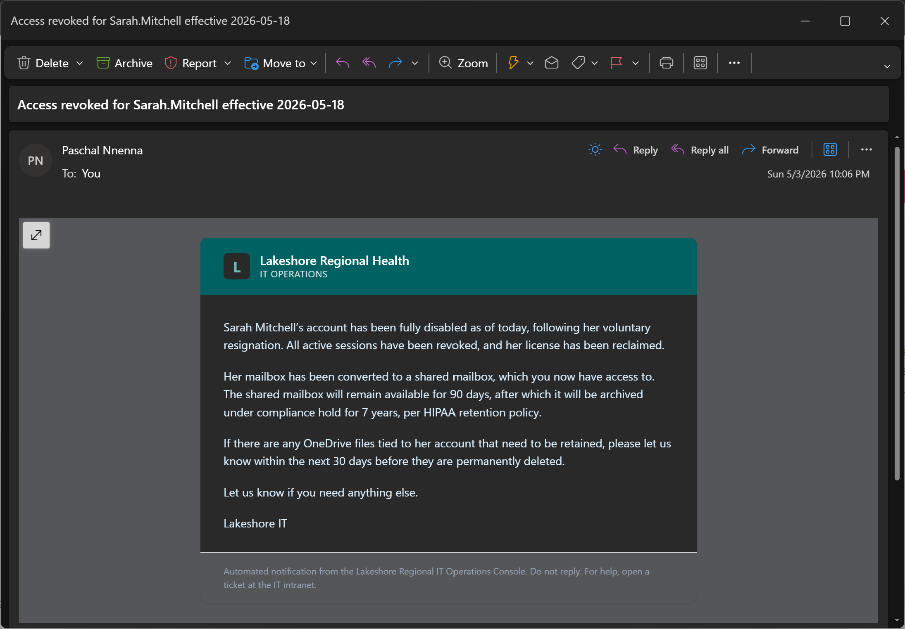
*The manager gets a clean explanation of what happened, where the shared mailbox lives for the next 90 days, and how to retrieve OneDrive files. No legal jargon, no scare wording.*

## Track 2: Ticket Triage in Action

This is the Maria Chen workflow. The classification logic understands healthcare context. A nurse blocked from Epic during a shift is more urgent than admin staff blocked from a shared drive. A pharmacist locked out during a controlled substance dispensing window is a P1 even if the literal symptom is "cannot log in."

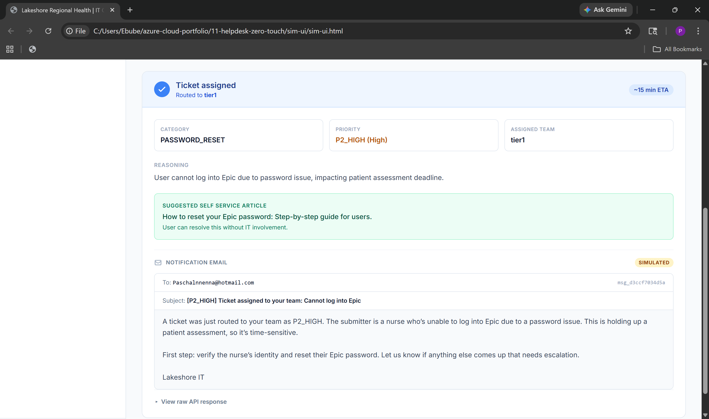
*Ticket classified as PASSWORD_RESET, priority P2_HIGH, routed to tier1, ETA approximately 5 minutes. KB article suggestion offered for self service. Notification email already dispatched.*

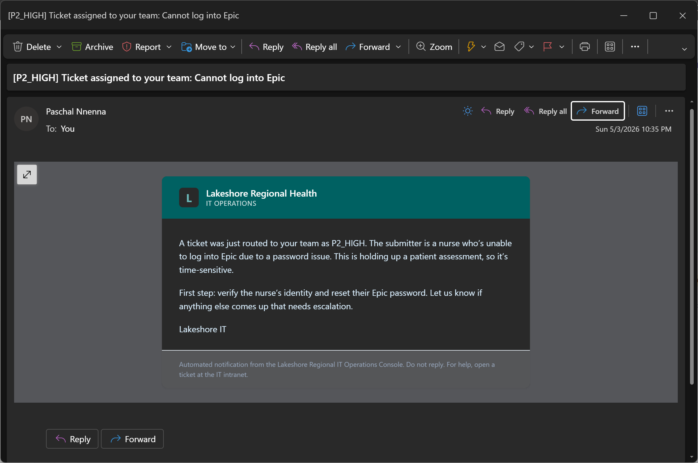
*The on call lead gets a one paragraph briefing: what the ticket is, who submitted it, why it matters, and what to try first. Three to four sentences. No filler.*

## Track 3: Permission Drift in Action

This is the compliance officer workflow. The output is a compliance report ready to hand to an auditor, plus an alert email summarizing the worst findings.

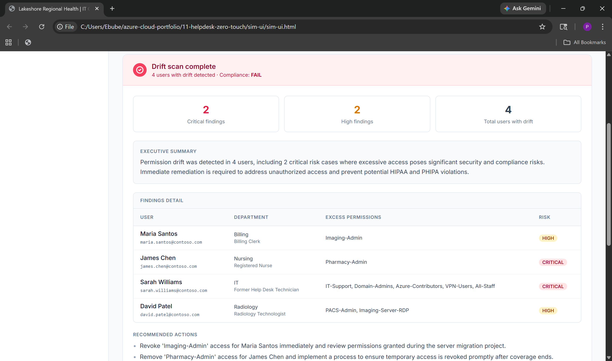
*Four findings on this scan. Three CRITICAL, one HIGH. Compliance status: FAIL. Executive summary explains the worst case (Sarah Williams, ex IT employee, still has Domain Admin) in language a non technical CISO can act on. Recommendations are concrete: disable, remove, audit.*

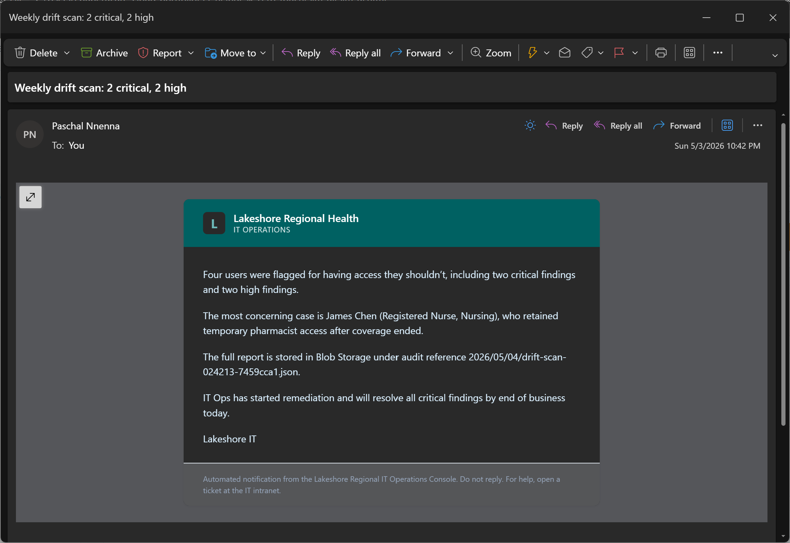
*The weekly drift alert email. Headline number first, the worst specific case in one sentence, where the full report lives, and what IT Operations is doing about it today.*

The findings on this scan are realistic healthcare access drift scenarios I curated for the demo (a nurse with leftover Pharmacy Admin, a billing clerk with leftover Imaging Admin, a departed IT employee with active Domain Admin, a radiology tech with leftover PACS Admin). In a production deployment this dataset would be replaced with a Microsoft Graph API call enumerating Entra ID users and their group memberships, compared against a department based access baseline. The classification and reporting pipeline downstream is identical.

## Compliance Dashboard

The dashboard endpoint reads every blob across the three audit containers and aggregates them into KPIs and a recent activity feed. This is what an IT director or compliance officer sees on Monday morning to understand what the system did all weekend.

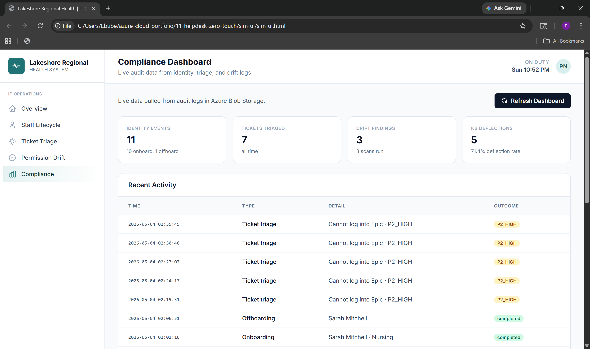
*Live KPIs: 11 identity events (10 onboards, 1 offboard), 7 tickets triaged, 3 drift scans run, 71.4% knowledge base deflection rate. Recent activity table shows the timestamped audit trail with color coded outcomes. Every row corresponds to a JSON blob in storage.*

## Audit Trail

Every action writes a JSON blob to one of three append only containers (identity logs, triage logs, drift reports). The blob name encodes the date and a short UUID so audit logs can be retrieved chronologically or by event ID. Nothing is ever overwritten. Nothing is ever deleted.

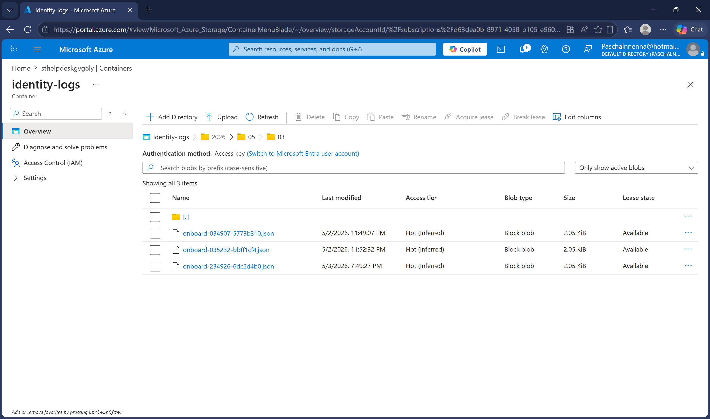
*The identity-logs container shows the JSON blobs from every onboarding and offboarding run. Each blob contains the user, department, role, tasks attempted, tasks completed, summary, and timestamps. This is the file an auditor pulls during a HIPAA inspection.*

## Logic App Run History

Every email send is a Logic App run. The run history shows successful deliveries, failed runs, and the full JSON of each request and response. This is operational evidence that the notification layer is healthy.

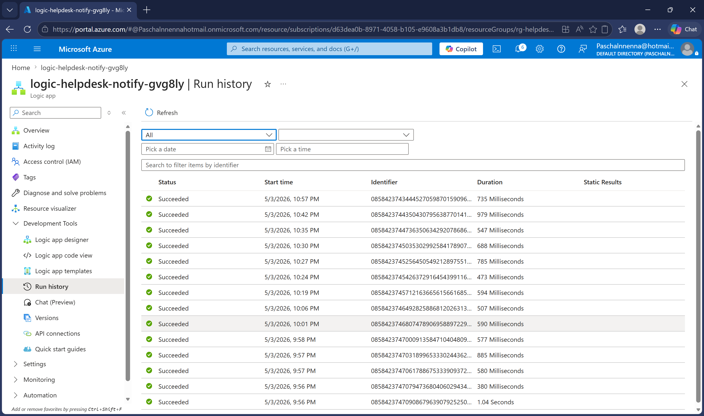
*Successful runs across the workflow. Each entry corresponds to one email delivered. Click any run to see the trigger payload, the connector input, and the connector response.*

## Tech Stack

| Layer | Technology |
|---|---|
| Infrastructure | Terraform (azurerm provider 3.x), Azure CLI |
| Compute | Azure Functions (Python 3.11, v2 programming model) |
| AI | Azure OpenAI (GPT 4o, deployment 2024-11-20) |
| Storage | Azure Blob Storage (LRS, immutable append only) |
| Secrets | Azure Key Vault (managed identity access from Function App) |
| Email | Azure Logic App + Outlook.com managed connector |
| UI | HTML, Tailwind via CDN, vanilla JavaScript (no build step) |

## Troubleshooting

A few things bit me along the way. Documenting them so the next person (probably future me) does not lose an hour.

### PowerShell mangles SAS signatures in URLs

When setting `LOGIC_APP_NOTIFY_URL` via `az functionapp config appsettings set`, PowerShell interprets the `&` characters in the URL query string as command separators. The signature gets truncated and Logic App calls fail with HTTP 401.

The fix is to write the value to a JSON file and pass it with `--settings "@filename.json"`. The double quotes around `@filename.json` matter. Without them PowerShell tries to interpret `@filename` as its splatting operator and crashes.

```powershell
@'
[
  {
    "name": "LOGIC_APP_NOTIFY_URL",
    "value": "https://prod-42.eastus2.logic.azure.com:443/...full URL with sig...",
    "slotSetting": false
  }
]
'@ | Out-File -FilePath .\appsetting.json -Encoding utf8

az functionapp config appsettings set `
  --name fn-helpdesk-gvg8ly `
  --resource-group rg-helpdesk-dev-gvg8ly `
  --settings "@appsetting.json"
```

### Office 365 Outlook connector does not work with Hotmail accounts

Microsoft has two connectors that look identical in the designer: `office365` (work or school accounts on M365 tenants) and `outlook` (personal `@hotmail.com` and `@outlook.com` accounts). They are not interchangeable. The OAuth sign in succeeds for both, but `office365` rejects calls from a Hotmail account at execution time with an Unauthorized error.

The fix is to use the Outlook.com connector instead. In Terraform this means `data "azurerm_managed_api"` with `name = "outlook"` (not `office365`), and the workflow action references `parameters('$connections')['outlook']`. The send email path is `/Mail`.

For this project I built the workflow visually in the designer rather than through Terraform's `azurerm_logic_app_action_custom`, because the designer handles the OAuth dance for personal Microsoft accounts cleanly while the API connection level Authorize button often fails with "Test connection failed."

### Recovering Terraform state when the .tfstate file is missing

I lost my local state file partway through this project. The infrastructure was alive in Azure but Terraform thought everything was missing and wanted to create it all from scratch. The fix was to import every resource one by one, then remove the `random_string.suffix` from state and replace it with a hardcoded local value matching the suffix already baked into resource names.

The full sequence:

```powershell
terraform import azurerm_resource_group.main "/subscriptions/<sub>/resourceGroups/rg-helpdesk-dev-gvg8ly"
terraform import azurerm_storage_account.main "/subscriptions/<sub>/.../sthelpdeskgvg8ly"
# ...continue for every resource
terraform state rm random_string.suffix
# Replace random_string with a local in main.tf:
#   locals { suffix = "gvg8ly" }
# Then find/replace random_string.suffix.result -> local.suffix in all .tf files
terraform plan
```

Target plan output is "0 to destroy." If anything wants to be destroyed, an import did not take and you need to investigate before applying.

For future projects I will use a remote backend (Azure Storage container for state) so this cannot happen again.

### GPT leaking the word "AI" into email bodies

The first version of the triage email prompt told the model that "the ticket was AI triaged just now and assigned to their team." The generated emails then started with "A new P2_HIGH ticket was just triaged by the AI system..." which sounds like a marketing bot, not a senior dispatcher.

Adding a negative rule to the prompt ("do NOT mention AI, automation, or the bot") did not work. Negative instructions are weak in LLMs because the model has to think about the forbidden concept to suppress it, which means it leaks anyway.

The fix that worked was removing the AI context from the prompt entirely. The model is told "you are a senior IT coordinator forwarding a ticket; here are the ticket details." The mechanism is invisible to the model. With nothing to suppress, nothing leaks. Same trick applied to the drift alert prompt.

This is a generally useful pattern for any AI generated user-facing content: do not tell the model the content is AI generated. Just give it the facts and the role.

### Field name mismatches between UI and Function App

The first version of the Sim UI sent `subject` and `body` as separate fields to the triage endpoint, but the function expects a single `ticket` field. The fix was to concatenate subject and body in the UI before sending. Same lesson applies for any UI to API integration: align on the request schema first, then build the form. I now treat the function code as the source of truth and the UI adapts to it.

## Cross References

This project is part of a healthcare and enterprise IT series exploring how AI changes specific operational workflows.

[**Project 10: Prompt Guardian**](../10-prompt-guardian/) intercepts AI prompts at the browser level before sensitive PHI reaches a public LLM. Same architecture pattern: Azure Function plus GPT 4o classification, Logic App notifications, Blob Storage audit trail. Where Prompt Guardian protects clinicians from leaking patient data into ChatGPT, HelpDesk Zero Touch automates the support workflows around those clinicians.

[**Project 12: Microsoft 365 Tenant Deployment (Small Business)**](../12-m365-tenant-deployment/) provisions the small business Microsoft 365 environment (Business Standard or Premium tier) that this helpdesk would run against in a 25 to 50 user clinic or specialty practice. Same identity model, lighter compliance surface.

[**Project 13: Microsoft 365 Enterprise Deployment**](../13-m365-enterprise-deployment/) is the same exercise scaled to 300 users on the Microsoft 365 E5 plan, with Defender for Office 365, Purview Insider Risk, DLP, audit, and Power Automate driven monthly reporting. The onboarding tasks listed here (create Entra ID user, assign E5 license, add to department group, provision Exchange mailbox) are exactly the operations that Project 13 prepares the tenant to handle at scale.

The four projects together cover the spine of healthcare and enterprise IT operations: tenant deployment at two scales, AI guardrails on user behaviour, and automated support.

## What Production Deployment Would Look Like

A real hospital deploying this would change three things.

The Function App would call **Microsoft Graph API** for actual identity operations against a live Entra ID tenant. The current build simulates the seven onboarding tasks with realistic timing and audit output. In production, each task is a `POST` to Graph (create user, assign license, add to group, provision mailbox, etc.) with retry logic and rollback on partial failure.

The drift scan would replace simulated users with **a real Graph API call** enumerating users, their group memberships, and their last sign in time. The expected access baseline would live in a dedicated container in the same storage account, keyed by department and role. The classification and reporting pipeline downstream is unchanged.

The notification layer would route through the **hospital's own Exchange Online tenant** rather than a personal Outlook.com account. The Office 365 connector (not the Outlook.com one) is what production tenants use, and the same Logic App architecture handles it. Service account, mailbox permissions, and DKIM/SPF records are the operational concerns there.

## Repo Layout

```
11-helpdesk-zero-touch/
├── function/                    Azure Function App code (Python v2 model)
│   ├── function_app.py          Four endpoints plus dashboard
│   ├── notifications.py         GPT 4o email body generator + Logic App dispatch
│   ├── requirements.txt
│   └── host.json
├── sim-ui/
│   └── sim-ui.html              Single file Tailwind UI, no build step
├── terraform/                   All infrastructure as code
│   ├── main.tf                  Provider config, hardcoded suffix local
│   ├── functionapp.tf           App service plan, Function App, app settings
│   ├── openai.tf                Cognitive account plus GPT 4o deployment
│   ├── keyvault.tf              Vault plus three secrets
│   ├── storage.tf               Two storage accounts plus four containers
│   ├── logicapp.tf              Logic App workflow shell (designer builds the rest)
│   ├── automation.tf            Reserved for future runbooks
│   ├── variables.tf
│   └── outputs.tf
├── screenshots/                 18 captures, ordered by phase
└── README.md                    This file
```

## Status

Project complete. All three workflows tested live. All emails delivered. Audit trail intact. Dashboard reading real data.

Ready to be torn down when no longer needed: `terraform destroy` removes everything except the Storage account containers (which are explicitly preserved by the soft delete configuration). For full removal: `az group delete --name rg-helpdesk-dev-gvg8ly --yes`.

---

Built by MEEK as part of an Azure cloud portfolio targeting healthcare IT, MSP, and Microsoft partner roles in Toronto, Newfoundland, and Ohio.
