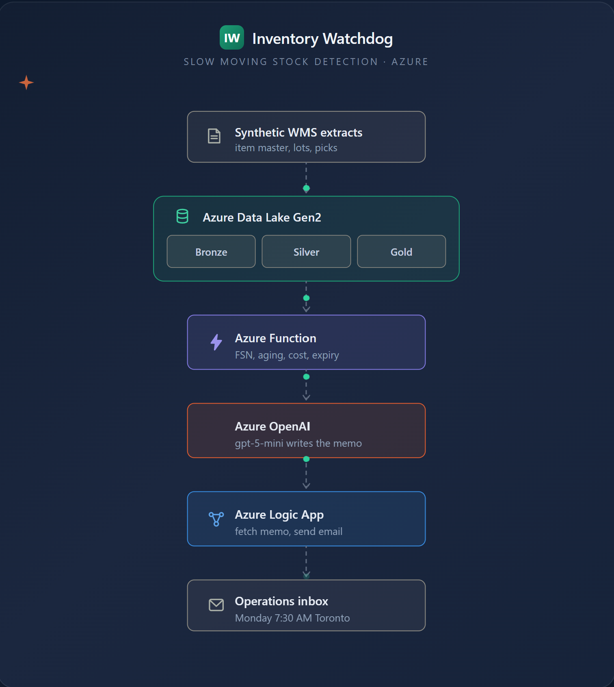
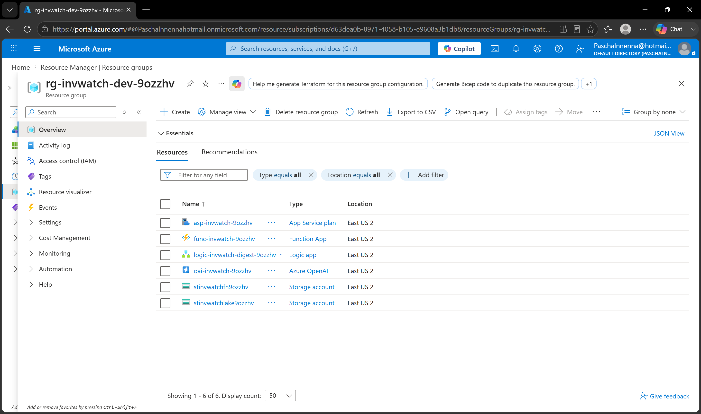
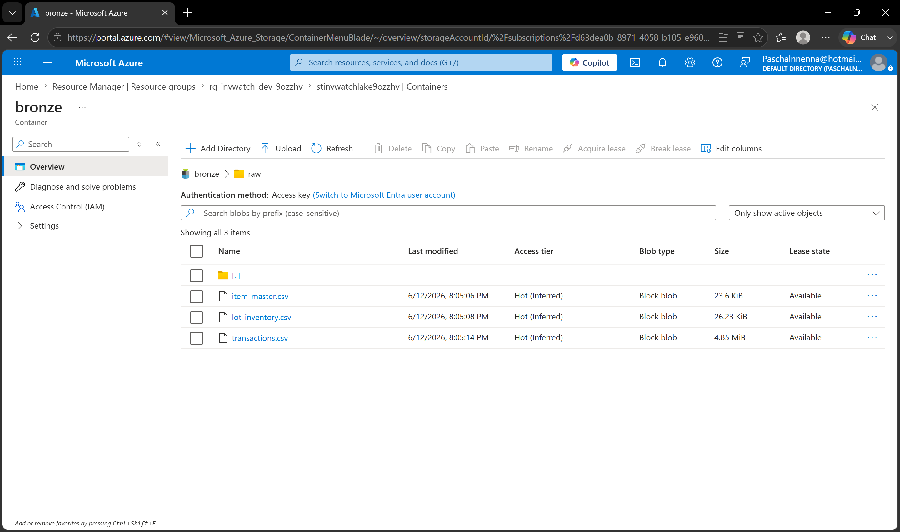
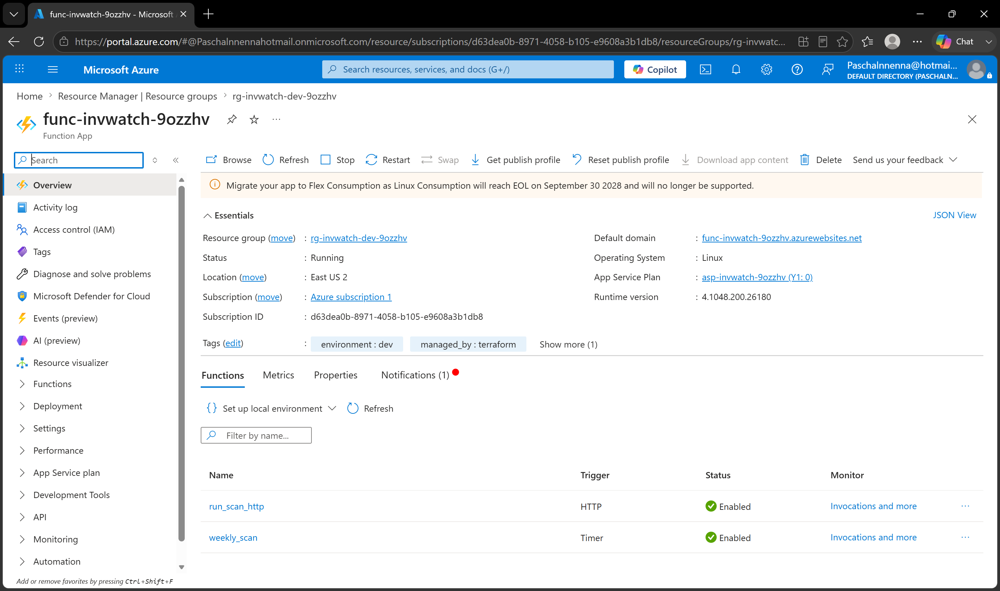
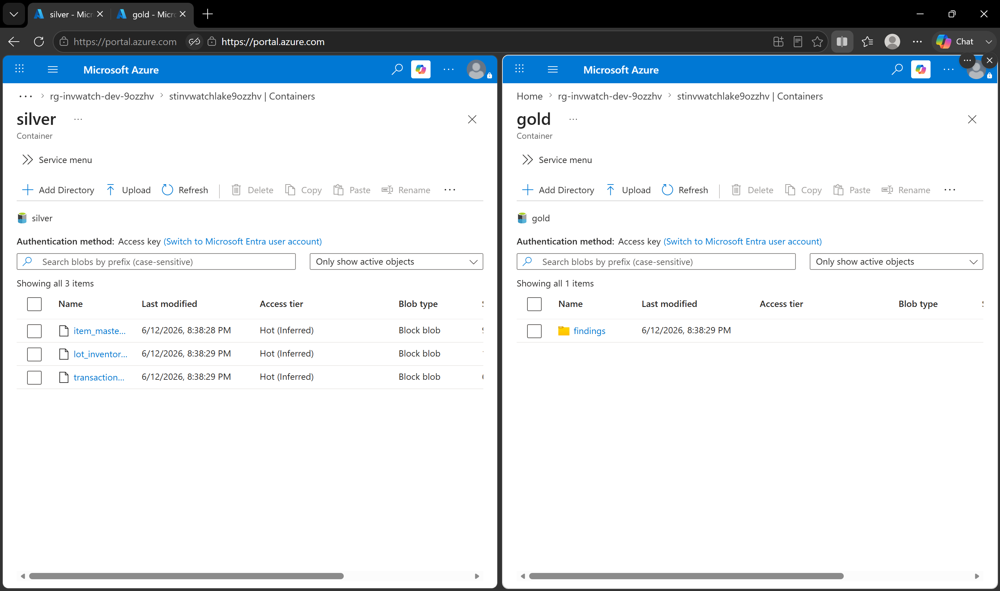
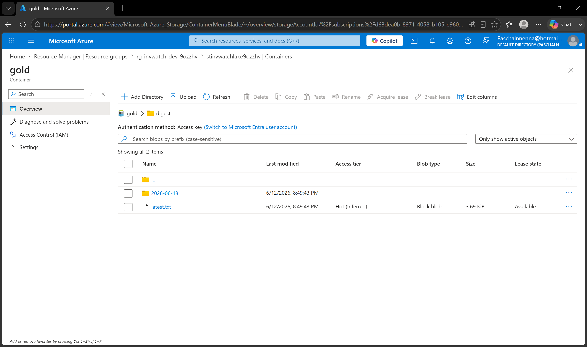
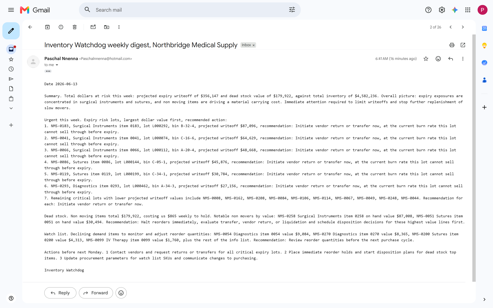
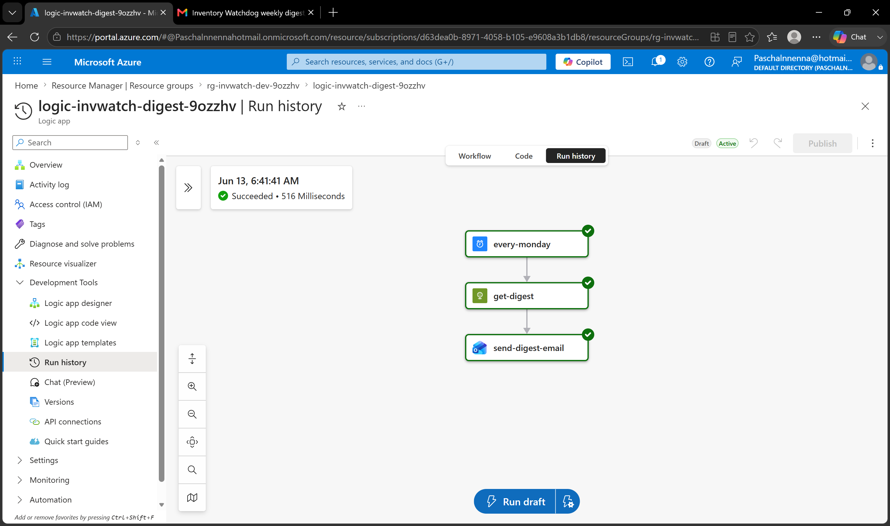

# Project 14: Inventory Watchdog

Inventory Watchdog scans warehouse inventory weekly to identify expiry risk, dead stock, carrying cost exposure, and declining demand. It produces a ranked action report and delivers a narrated digest to the operations team before stock becomes a write-off.

It is the second project in a deliberate pattern. Project 08 was a watchdog for cloud waste, scanning an Azure subscription for idle resources nobody remembers leaving on. This applies the same ideology to a warehouse: scan continuously, quantify the cost, recommend action, never auto execute.

All data is synthetic. The distributor, Northbridge Medical Supply, and every hospital it serves are fictional, generated by a script in this repository. No real employer data appears anywhere.

## Business Context

It is 8:05 AM on the last Monday of the quarter at Northbridge Medical Supply, a medical surgical distribution center in Vaughan serving hospitals and clinics across the GTA. Three things are happening at once, and none of them had to.

In the finance office, the controller, Janet Cole, is closing the quarter and staring at a write-off she did not see coming. A full lot of surgical staplers, just under ninety thousand dollars, reached its expiry date last week with most of the lot still on the shelf. It cannot be sold. It cannot be returned. It is now disposal cost. Six weeks ago there was still time to transfer it to a busier site. Nobody was watching the clock on that lot.

Two aisles over, a buyer named Priya Sharma is about to approve a routine replenishment order. One of the line items is a wound care product that, unknown to her, has not been picked in over five months. The reorder point fired automatically. She is about to spend money deepening a pile of stock that is already not moving, because nothing on her screen tells her it stopped selling.

In the operations manager's office, Marcus Bennett is being asked by his director a simple question he cannot answer: how much of our working capital is tied up in stock that is not turning. The honest answer is that nobody knows, because the last time anyone ran an aging report was the annual count, and that was eight months ago.

This is not unusual. This is quarter end at every mid-sized distributor that does not have a watchdog running.

## What Slow Moving Stock Actually Costs

The numbers behind that morning are well documented across the industry:

| Metric | Real world value |
|---|---|
| Inventory carrying cost per year | 20 to 30 percent of inventory value |
| Share of inventory that is dead or obsolete, even in well run companies | 20 to 30 percent |
| Healthy dead stock level, yearly average | 5 to 10 percent |
| Expired medical or pharmaceutical product | Total loss, written off immediately under GAAP |
| Recommended dead stock review cadence | Monthly, not quarterly |
| Aging report thresholds in common use | 90, 180, and 365 days |

A distribution center holds thousands of pallets. Carrying cost alone, the rent and insurance and tied up cash on stock that never sells, runs a quarter of that stock's value every year. Layer on the medical specific risk that dated product becomes a guaranteed total loss the day it expires, and the cost of not watching slow movers stops being abstract. The industry guidance is blunt about the fix: identify dead stock monthly, run aging reports, act before the expiry date arrives. That is precisely what a person cannot do by eye across a 300 line catalog, and precisely what this project automates.

The same design is portable. A distributor in Toronto and one in Ohio run the same FSN math, the same aging buckets, and the same expiry logic, because slow moving stock behaves the same way on both sides of the border.

## What I Built

A scheduled watchdog that takes the three failures from that Monday morning and turns them into a single email that arrives before any of them can happen. It scans the full catalog, runs four standard warehouse checks, and emails the operations team a plain English memo naming the exact lots to act on this week, ranked by dollars at stake. The watchdog recommends. A human decides.

Every figure is computed with a textbook method, not an invented one, so the output speaks the language a supply chain professional already knows.

### Check 1: Expiry runway, the Janet Cole problem

The write-off that surprised the controller is the failure this check exists to prevent. For every lot on hand it asks one question: at the current sales pace, will this stock sell out before its expiry date. It computes the genuinely unsellable portion, the quantity the recent burn rate cannot possibly consume in time, and values that as a forming write-off. Any lot inside a 180 day expiry horizon with stock it cannot clear becomes a CRITICAL alert, ranked by dollars at risk. This follows FEFO logic, First Expired First Out, the standard for any dated inventory. It is the highest severity tier because in medical distribution, an expired lot is a total loss.

### Check 2: FSN classification, the Priya Sharma problem

The buyer about to reorder a dead item needs the system to flag it before she approves the order. FSN analysis classifies every SKU as Fast moving, Slow moving, or Non moving using the inventory turnover ratio, which is simply how many times a year the stock sells through. The standard thresholds: more than three turns a year is Fast, one to three is Slow, fewer than one is Non moving. A Non moving item with no pick in over 90 days becomes a WARNING with its weekly carrying cost attached, the signal to halt the reorder rather than deepen the pile.

### Check 3: Carrying cost, the Marcus Bennett problem

The operations manager who cannot say how much capital is frozen needs a number. This check values all idle stock at the 25 percent annual benchmark, the midpoint of the accepted range, and converts it into a weekly burn figure. It is the line that turns "this pallet has not moved" into "this dead stock costs us X dollars every week to hold," the number a director can act on and the answer Marcus did not have.

### Check 4: Aging and decline, the early warning

Two supporting checks catch problems before they harden. Aging buckets group every SKU by days since last pick, 0 to 30, 31 to 60, 61 to 90, and 90 plus, the same idea as an accounts receivable aging report but for boxes on a shelf. A decline check flags items whose recent 30 day pace has dropped sharply against their 90 day pace, surfacing fading demand as an INFO item for a reorder review while there is still time to adjust.

Each flagged item carries a recommended action drawn from the standard disposition hierarchy, ordered by value recovered: stop the reorder, transfer to a busier site, return to vendor, substitute or promote, donate, write off.

## Architecture

The system is a data lakehouse pipeline. Everything is deployed with Terraform. The portal is used once, only to authorize the email connector.


*Synthetic extracts land in the data lake, the scan engine computes findings across the medallion zones, gpt-5-mini writes the memo, and the Logic App delivers it to the operations inbox.*

The lake is Azure Data Lake Storage Gen2, which is Blob Storage with hierarchical namespace switched on, giving it real folders like a file system. It is organized using the medallion architecture, the industry standard lakehouse layout: bronze for raw extracts as they would arrive from a warehouse management system, silver for cleaned and validated data in Parquet, gold for the finished findings and the narrated memo. Authentication across the whole pipeline uses the Function's managed identity, an Azure built in passwordless identity. There are no storage keys and no API keys anywhere in the code or configuration.

## Live Infrastructure

Every resource below was deployed by Terraform. Suffix `9ozzhv` is generated once and reused across resource names.

| Resource | Name | Purpose |
|---|---|---|
| Resource Group | rg-invwatch-dev-9ozzhv | All project resources, East US 2 |
| Data Lake | stinvwatchlake9ozzhv | ADLS Gen2 with bronze, silver, gold zones |
| Function App | func-invwatch-9ozzhv | Scan engine: weekly timer plus on demand HTTP trigger |
| Service Plan | asp-invwatch-9ozzhv | Linux Consumption plan, pay per run |
| Azure OpenAI | oai-invwatch-9ozzhv | gpt-5-mini for narrating findings into a memo |
| Storage, function | stinvwatchfn9ozzhv | Function App runtime storage, separate from business data |
| Logic App | logic-invwatch-digest-9ozzhv | Weekly recurrence, fetch the memo, send the email |


*All Terraform deployed resources in rg-invwatch-dev-9ozzhv: the ADLS Gen2 data lake, the Python Function App, Azure OpenAI, and the Logic App.*

## Phase 1: The Data Foundation

Before any analysis, a generator script builds three synthetic extracts shaped like a real warehouse management system export and lands them in the bronze zone. The dataset covers 300 SKUs across eight medical surgical categories for the fictional distributor, with lot level expiry dates and a full year of daily pick history. A fixed random seed makes every run reproducible, so the findings in this README match what anyone gets by rerunning the script. The generator deliberately plants the problems the watchdog should catch, which is the only rigorous way to prove a detector actually detects.


*Raw extracts for Northbridge Medical Supply in the bronze zone: an item master, lot inventory with expiry dates, and twelve months of pick history.*

## Phase 2: The Scan Engine

The engine is a Python Azure Function on the Consumption plan, which costs money only in the seconds it actually runs, like a taxi meter rather than a monthly lease. A timer fires it every Monday, and an HTTP trigger allows on demand runs for testing. It reads bronze, validates and writes silver, runs the four checks, and writes findings to gold.


*The deployed scan engine with both the weekly timer and the on demand HTTP trigger live.*

## Phase 3: The Medallion Flow

One scan run moves data through all three zones. The raw CSVs in bronze are validated, bad rows dropped and counted, and written to silver as Parquet, the standard columnar analytics format. The findings then land in gold as structured JSON.


*One scan run populating the full medallion flow: validated Parquet in silver, watchdog findings in gold.*

## Phase 4: The Narrated Memo

The findings JSON is exact but not readable by a busy operations lead. The narration layer sends it to gpt-5-mini with a tightly scoped instruction to write the weekly memo, lead with dollars at risk, group by severity, and use only the numbers provided. The memo is written to gold beside the JSON it came from.


*The narrated memo written to gold beside the JSON audit trail it was generated from.*

## Phase 5: Delivery

A Logic App runs every Monday at 7:30 AM Toronto time, thirty minutes after the scan. It fetches the memo from the Function over HTTP and emails it. Giving the Logic App a fetch endpoint rather than its own storage credentials keeps the Function as the single doorway to the lake and the workflow free of keys.


*The memo as the operations team receives it, written by the model from computed findings, delivered with no human in the loop.*


*The delivery pipeline in one successful run: trigger, fetch the memo, send the email.*

## The Principle: Code Calculates, AI Communicates

The most important design decision in this project is that the AI never does the math. It only tells the story.

Think of a hospital lab. The blood analyzer produces the numbers. The doctor reads those numbers and explains in plain English what they mean and what to do. You would never want the doctor guessing your cholesterol value from intuition.

Here it works the same way. The Python engine computes every figure deterministically: the FSN classes, the aging buckets, the carrying cost dollars, the expiry runway dates. These numbers are exact and reproduce identically on every run. Only then do the finished results go to the model, with one hard rule: use these numbers, never recalculate.

This split is what makes the output trustworthy. If the model were allowed to calculate, two runs might disagree and no figure could be audited. Because the raw findings are archived as JSON in gold right beside the memo, every dollar in the memo can be traced back to its source. The JSON is the audit trail. The memo is what humans read.

## What the Watchdog Found

Run against the synthetic Northbridge catalog of 300 SKUs worth roughly 4.6 million dollars, the watchdog surfaced this in a single scan:

| Finding | Count | Dollars |
|---|---|---|
| Critical expiry risks | 16 lots | About 356,000 in forming write-offs |
| Non moving dead stock | 18 items | About 180,000 in frozen capital |
| Declining demand | 15 items | Flagged early for reorder review |

The dead stock alone burns roughly 865 dollars every week in carrying cost. The watchdog turned a 300 line catalog into a one screen memo naming the exact lots to act on this week, ranked by dollars at stake, with every figure traceable to its source.

## Tech Stack

| Layer | Technology |
|---|---|
| Infrastructure | Terraform, azurerm provider 3.x, Azure CLI |
| Compute | Azure Functions, Python 3.11, v2 programming model |
| Data lake | Azure Data Lake Storage Gen2, medallion zones, Parquet |
| AI | Azure OpenAI, gpt-5-mini, version 2025-08-07 |
| Email | Azure Logic App plus Outlook managed connector |
| Identity | System assigned managed identity, no keys in code |

## Troubleshooting

A few things bit me along the way. Documenting them so the next person, probably future me, does not lose an hour.

### The Azure OpenAI deployment block changed names between provider versions

On the azurerm 3.x provider the deployment sizing block is called `scale`. It became `sku` in the 4.x provider. Since this portfolio pins the 3.x provider for consistency, the fix was using `scale`. Pinning the provider version is what saves you from a confusing mismatch.

### Model versions get retired on a rolling schedule

The whole gpt-4o family entered its deprecation window with a retirement date only months out, and Azure blocks new deployments of a deprecating model. The fix was to query the account for currently deployable models with `az cognitiveservices account list-models` and choose one with real runway. gpt-5-mini was the right pick: generally available, inexpensive, strong at summarization, with a comfortable retirement horizon.

### Reasoning models spend hidden thinking tokens from the same budget as the answer

This was the most subtle bug in the build. The narration call returned a perfectly valid response with an empty memo inside it, because the model's internal reasoning consumed the entire token budget before it wrote a single visible word. The symptom looked like the same stale memo appearing twice. The fix was twofold: budget tokens generously and set reasoning effort to low for what is a formatting task, and add a guard that raises a loud error on empty content rather than silently writing nothing. Silent failure is the worst failure.

### A publish does not always swap every worker instantly

On the Linux Consumption plan, two scans run right after a code change still ran the old code. Following each publish with an explicit `az functionapp restart`, plus a code version stamp in the HTTP response, made the deployed version provable instead of a guess.

### Terraform cannot see dependencies hidden inside opaque JSON

The Logic App email action references the fetch action by name, but that reference lives inside a JSON string Terraform treats as a black box. It tried to create both actions at once and the email action failed validation against an action that did not exist yet. An explicit `depends_on` forced the correct order.

### Owning a subscription is not the same as having data access

Being subscription Owner lets you manage the storage account but does not by itself let you read or write the data inside it. That is a separate role, Storage Blob Data Contributor, granted explicitly. Like owning the building versus holding a key to a specific room.

## Cross References

This project is part of a portfolio exploring how cloud automation and AI change specific operational workflows.

[**Project 08: Cloud Cost Watchdog**](../08-cloud-cost-watchdog/) is the direct ancestor of this project. It scans an Azure subscription for idle and orphaned resources quietly costing money, quantifies the waste, and recommends action without ever deleting anything on its own. Inventory Watchdog is the same ideology, the scheduled scan and the dollar quantification and the recommend but never auto act discipline, pointed at a warehouse instead of a cloud bill.

[**Project 09: AI Ops Intelligence**](../09-ai-ops-intelligence/) shares the alerting and severity tier pattern used here, classifying operational signals into CRITICAL, WARNING, and INFO and routing the urgent ones. Where AI Ops watches infrastructure health, Inventory Watchdog watches inventory health, with the same Azure OpenAI plus Logic App delivery backbone.

## What Production Deployment Would Look Like

A real distributor deploying this would change three things.

The bronze zone would be fed by a scheduled export from the live warehouse management system or ERP rather than a generator script. The item master, lot inventory, and transaction history are standard tables in any WMS, so the silver and gold pipeline downstream is unchanged.

At Northbridge's modest scale of a few hundred SKUs, a single Python Function with pandas does the medallion processing comfortably. At a Fortune 20 distributor's scale, the silver to gold transformation would run on a platform built for it such as Databricks or BigQuery. Using one of those here would be renting a freight train to deliver a pizza. The pattern is identical either way, which is the point.

The notification layer would route through the distributor's own Exchange Online tenant rather than a personal Outlook account, with a service account and the appropriate mail records, the same Logic App architecture handling it.

## Repo Layout

```
14-inventory-watchdog/
├── generate_data.py             Synthetic WMS data generator, fixed seed
├── function/                    Azure Function App code, Python v2 model
│   ├── function_app.py          Timer and HTTP triggers, medallion pipeline
│   ├── engine.py                FSN, aging, carrying cost, expiry runway
│   ├── narrator.py              gpt-5-mini narration of computed findings
│   ├── requirements.txt
│   └── host.json
├── terraform/                   All infrastructure as code
│   ├── main.tf                  Resource group and naming suffix
│   ├── storage.tf               ADLS Gen2 lake with medallion zones
│   ├── function.tf              Consumption plan and Function App
│   ├── openai.tf                Cognitive account plus gpt-5-mini deployment
│   ├── rbac.tf                  Least privilege roles for the managed identity
│   ├── logicapp.tf              Recurrence, fetch, and email actions
│   ├── providers.tf
│   ├── variables.tf
│   └── outputs.tf
├── screenshots/                 7 captures, ordered by phase
└── README.md                    This file
```

## Status

Project complete. The pipeline runs end to end: timer fires, the scan engine computes findings on the medallion lake, gpt-5-mini narrates the memo, the Logic App emails it, and it lands in the inbox with a proper subject. No human touches it.

Ready to be torn down when no longer needed: `terraform destroy` removes everything. The generated data is not committed because the generator reproduces it exactly from a fixed seed, so a fresh clone plus one script run recreates the identical dataset and the identical findings.

---

Built by MEEK as part of an Azure cloud portfolio targeting cloud infrastructure, healthcare IT, and MSP and Microsoft partner roles.
